## 発生する症状
exo出力後、YMM4側で指定したフォントがAviUtl側に反映されない

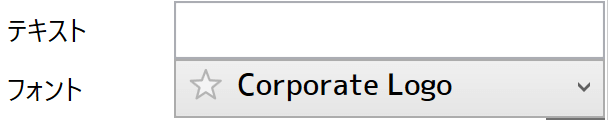
YMM4側の設定

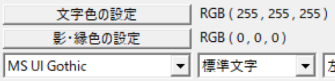
AviUtlへ出力した後の状態。
YMM4側で指定したフォントが別のフォントになっている

 
## 原因
YMM4とAviUtlとでフォントの名前が異なるため
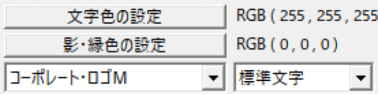
YMM4上では「Corporate Logo」だが、AviUtl上では「コーポレート・ロゴＭ」になっている

## 対策
1. AviUtlを起動する
1. タイムラインを右クリック → メディアオブジェクトの追加 → テキスト を選択する
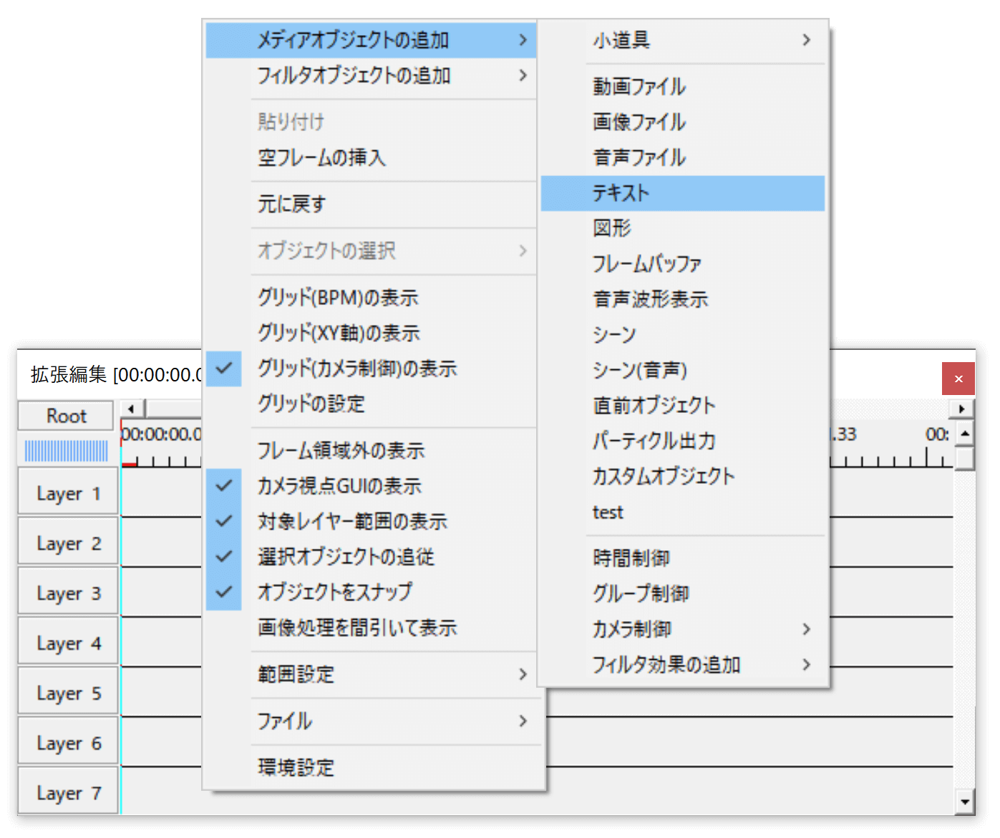
1. テキストアイテムの編集ウィンドウを開き、使用したいフォントを指定する
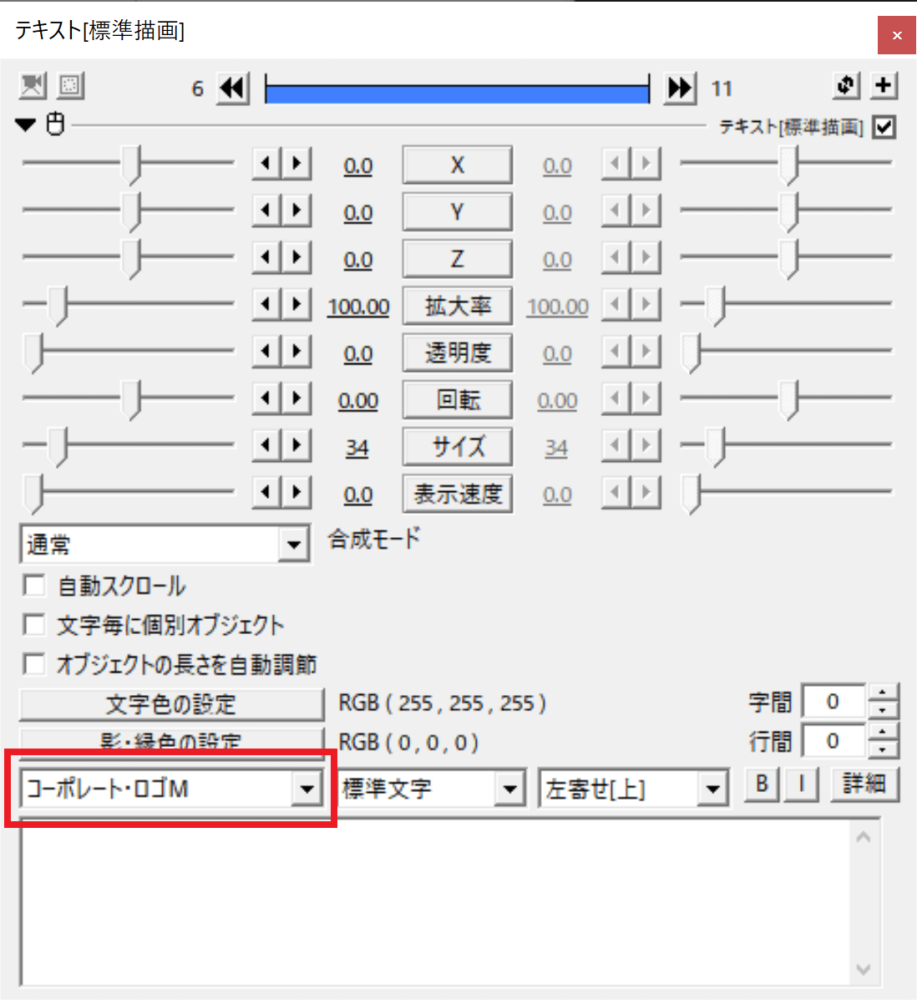
1. タイムラインを右クリック → ファイル → オブジェクトファイルのエクスポート を選択する
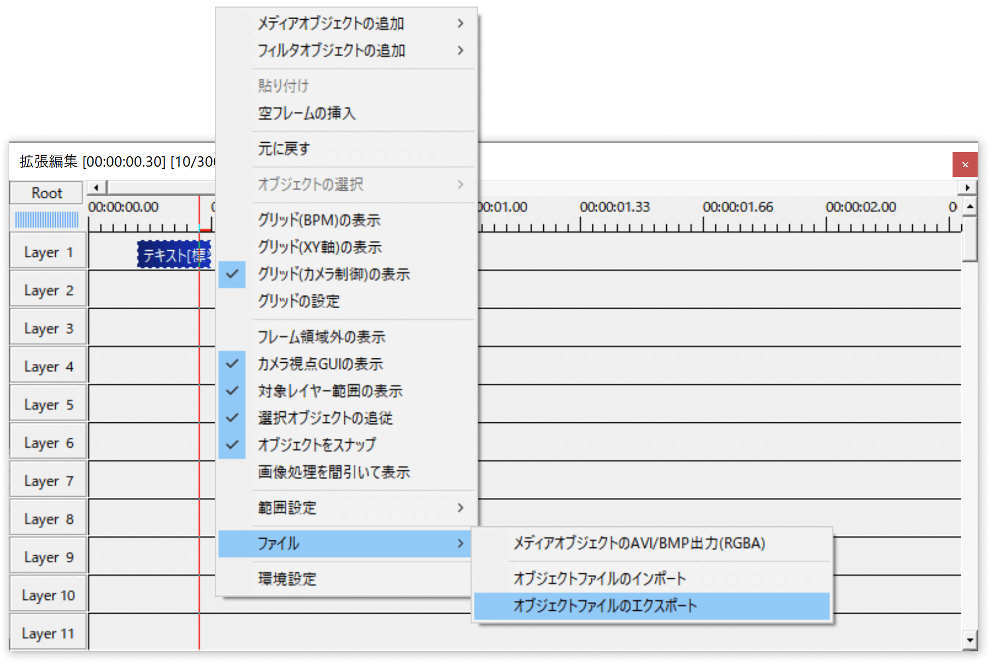
1. わかりやすい位置にファイルを保存する
1. AviUtlを終了させる
1. Windowsの検索欄に「メモ帳」と入力し、ヒットしたアプリを開く
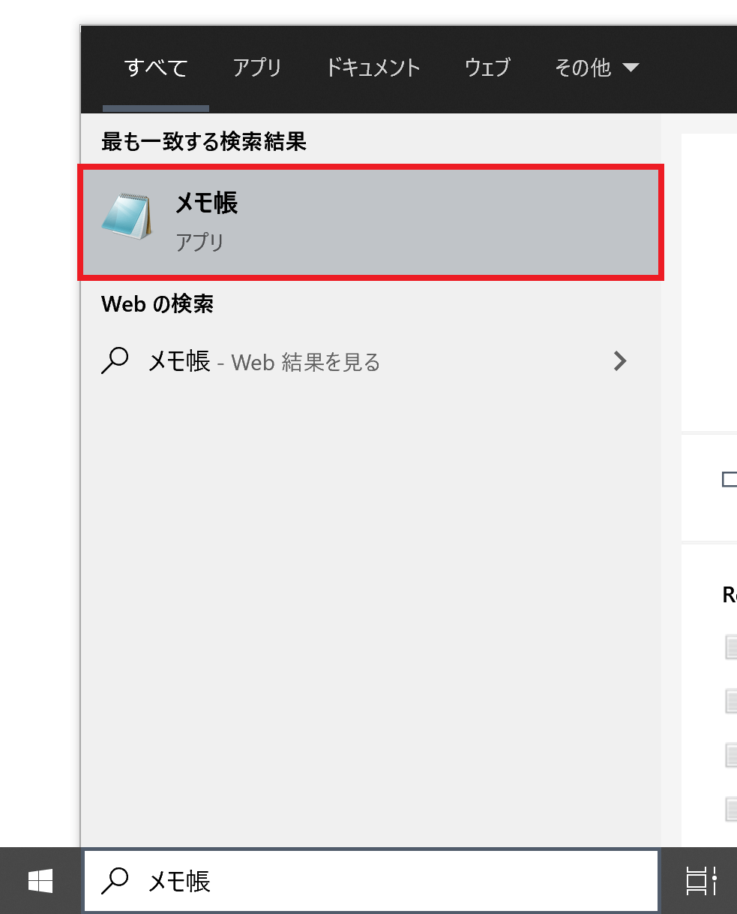
1. ファイル(F) → 開く(O) を選択し、「5」で保存したファイルを開く
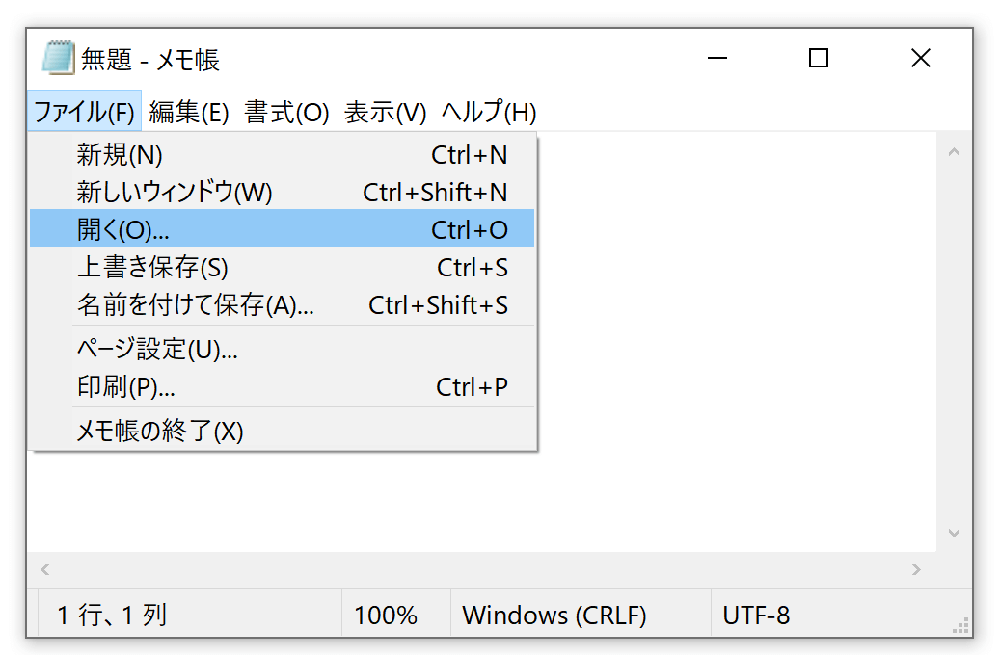
1. ファイルを一番下までスクロールし、「font=フォント名」となっている行を見つける
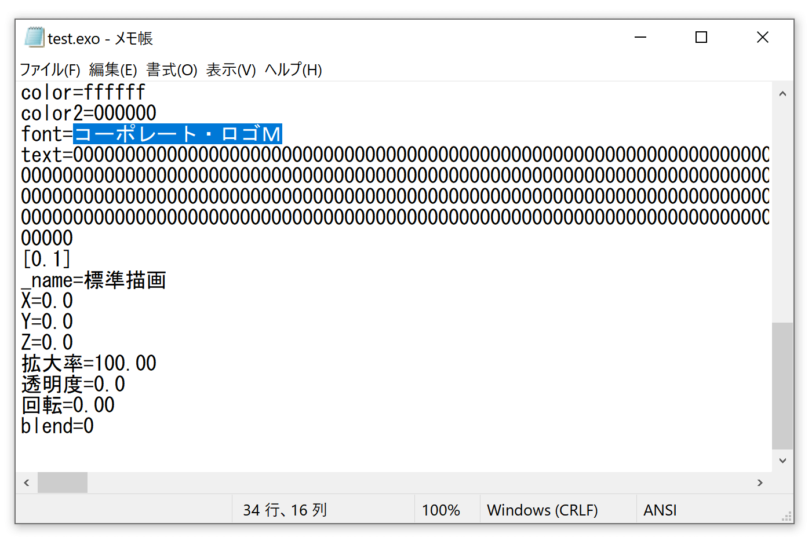
1. フォント名をコピーする（上の画像の青色部分。今回の例だと「コーポレート・ロゴＭ」）
1. YMM4を起動する
1. ファイル(F) → 設定 を選択する
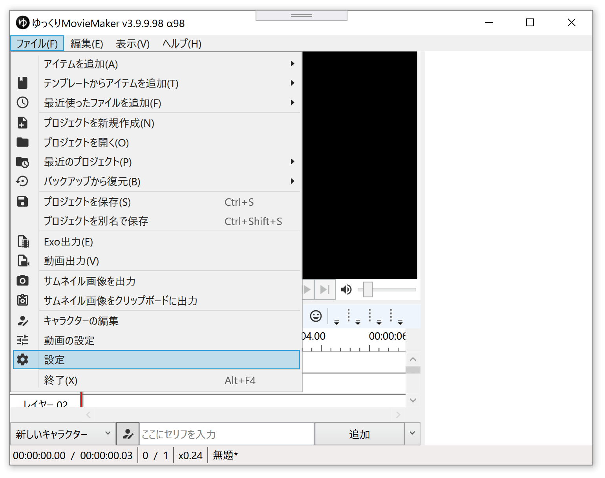
1. フォント を選択する
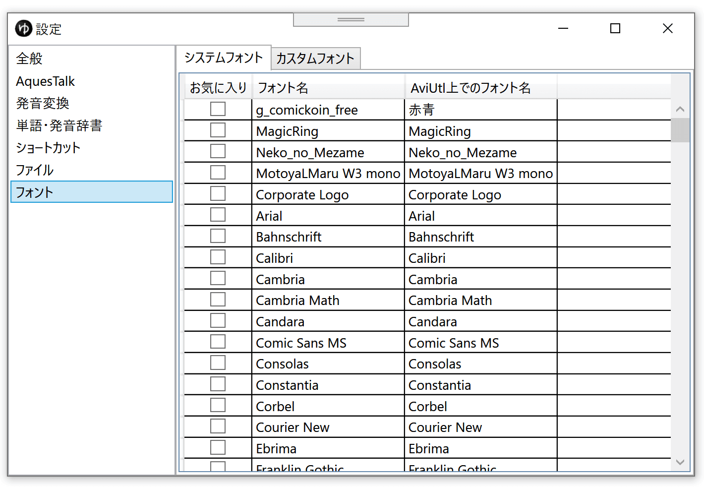
1. 問題の発生しているフォントを選択し、「AviUtl上でのフォント名」に、「9」でコピーした文字列を貼り付ける
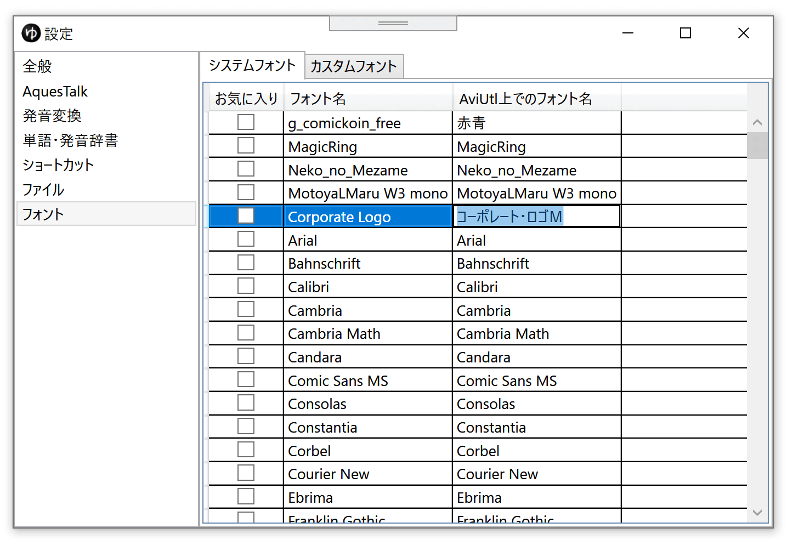
1. Enterキーを押して入力を確定する
1. Exo出力する
