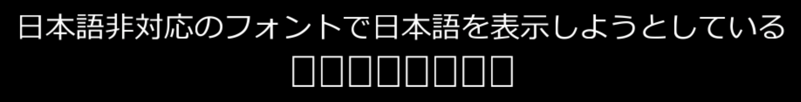
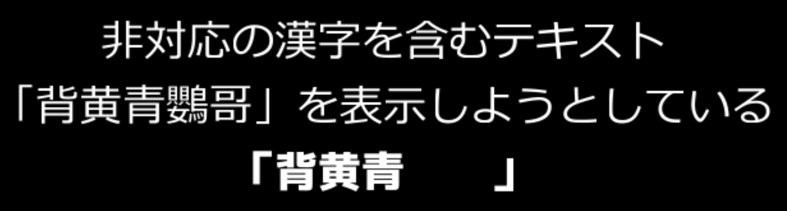

## 発生する症状
- 文字が「□」や「・・」に置き換えられて表示される。文字化けしている。
- 一部の文字が空白に置き換わり、表示されない。

## 原因と対策
### 日本語非対応のフォントで日本語を使用している

日本語が正常に表示されない場合、日本語非対応のフォントを使用している可能性があります。  
日本語対応のフォントを使用することで症状が改善します。

### 日本語非対応のフォントの場合でも、非対応の漢字を表示しようとしている

使用しているフォントがその文字に対応していないことが原因です。  
ひらがなや別の表記に置き換えるか、別のフォントを使用することを検討してください。

### 異体字を表示しようとしている

 一部の異体字（吉の異体字「𠮷」など）はAviUtlでは表示できません。

 
