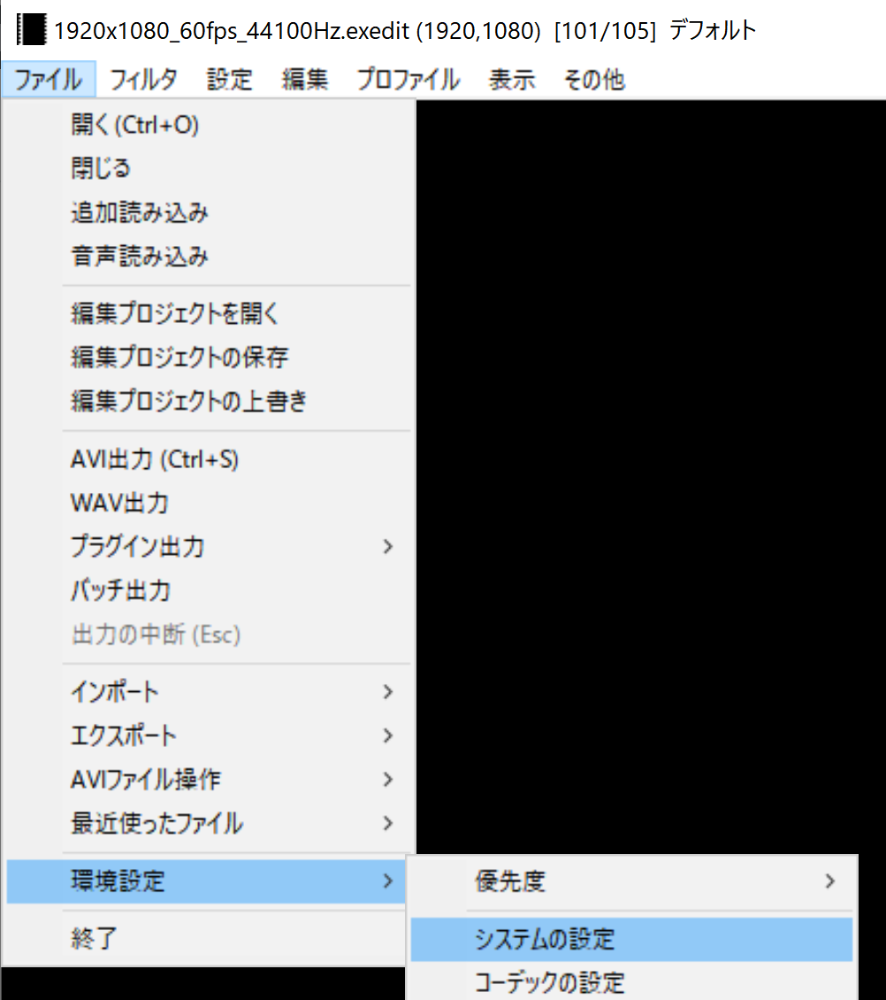
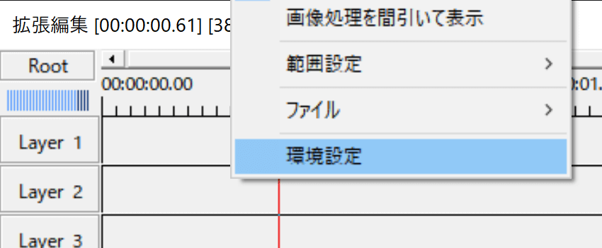
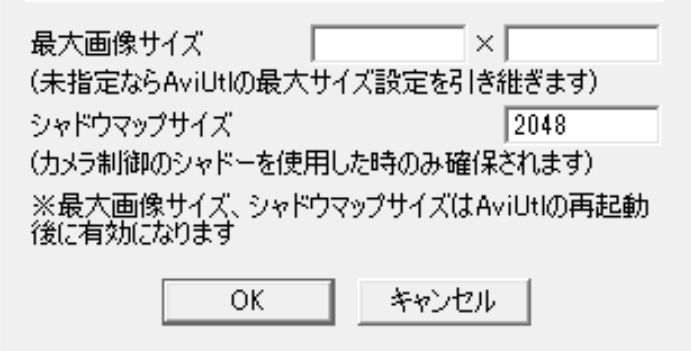

## 発生する症状

クリッピング処理をしていないにもかかわらず、画像や字幕がクリッピングされ、一部しか表示されない

## 原因
AviUtlの最大画像サイズが、読み込もうとしている画像や字幕の大きさよりも小さい

## 対策
### 対策1：AviUtlの最大画像サイズを大きくする
1. ファイル → 環境設定 → システムの設定 を開く

1. 「最大画像サイズ」に、読み込もうとしている画像や字幕の大きさよりも大きな数値を指定する

1. OKボタンを押す
1. 拡張編集ウィンドウを右クリック → 環境設定 を開く

1. 「最大画像サイズ」に数値が設定されている場合は削除する

1. OKボタンを押す
1. AviUtlを再起動する
1. exoファイルを読み込む

なお、「最大画像サイズ」を大きくしすぎると、AviUtlが正常に起動しなくなる場合があります。

### 対策2：画像のサイズを小さくする
「最大画像サイズ」を画像の大きさよりも大きくできない場合、画像編集ソフトなどを使用し、画像の大きさを小さくする必要があります。

### 対策3：字幕のサイズを小さくする
「最大画像サイズ」を字幕の大きさよりも大きくできない場合、「字幕のフォントサイズを小さくする」「横長の字幕の場合は改行する」などして字幕の大きさを小さくする必要があります。