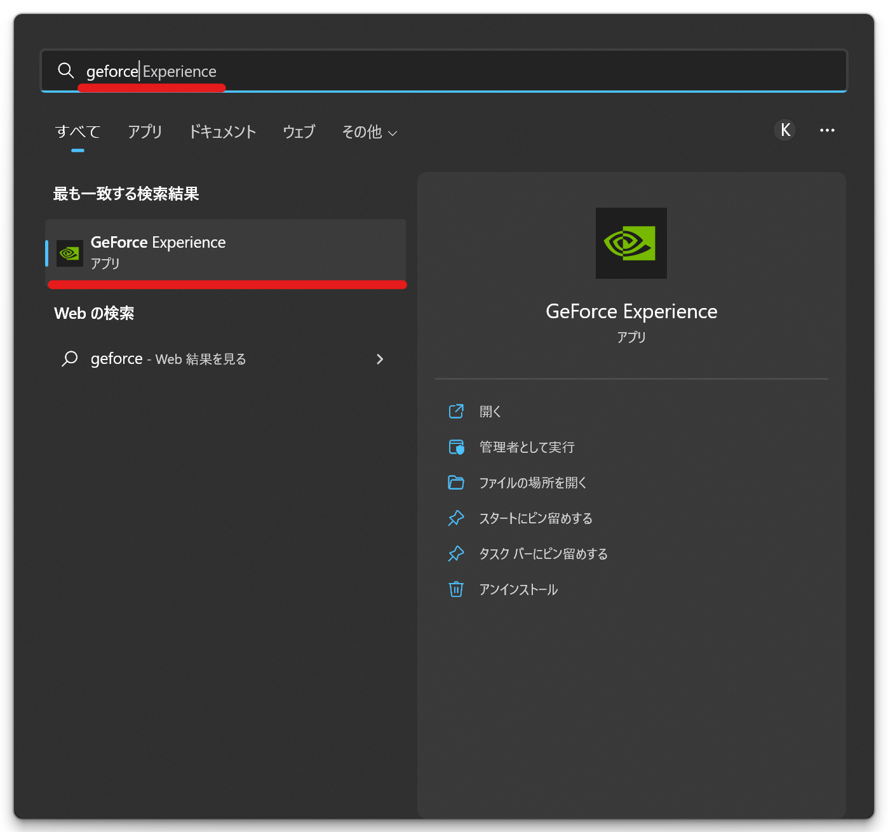
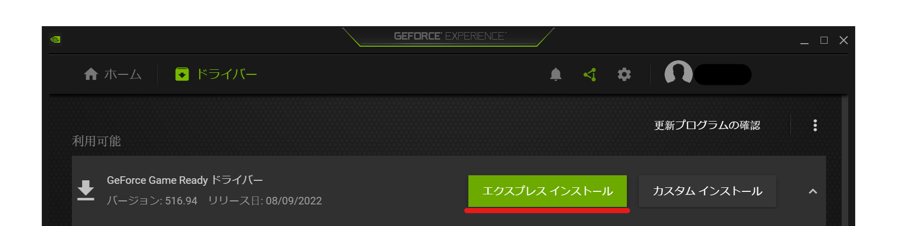
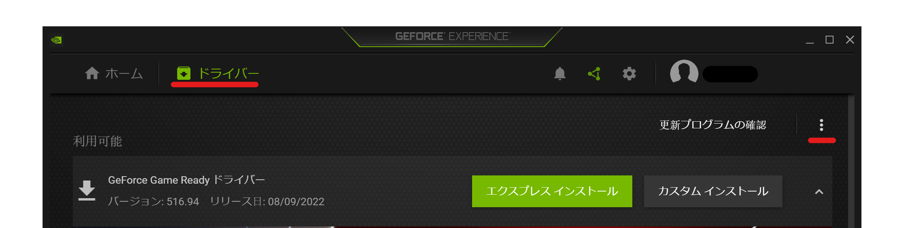
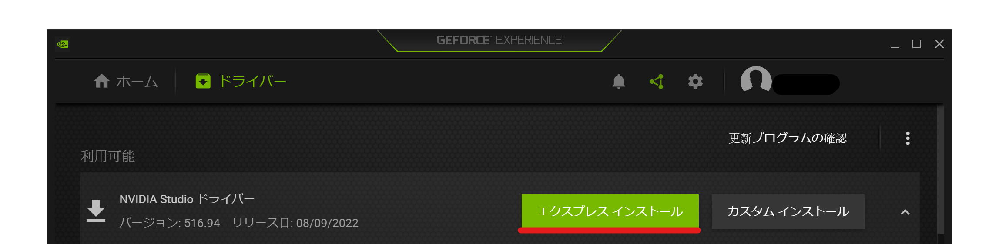

## 発生する症状
- 画面に黒い点が表示される
- エンコード時、映像にノイズが発生する

## 対策
グラフィックドライバーのバージョンの更新をお試しください。  
また、NVIDIA製GPUを使用している場合、デフォルトのゲーミング用ドライバーではなく、映像編集用のスタジオドライバーをインストールすると症状が改善する可能性があります。

### グラフィックドライバーのバージョンを更新する場合
1. Geforce Experienceを起動する

1. *ドライバー*タブを開き、ドライバーの更新が利用可能な場合は*エクスプレス インストール*ボタンをクリックする

### スタジオドライバーをインストールする場合
ドライバーの更新で症状が改善しない場合、スタジオドライバーへの切り替えを検討してください。

1. Geforce Experienceを起動する

1. *ドライバー*タブを開き、右上の*︙*をクリックする

1. *Studio ドライバ*を選択する

1. *エクスプレス インストール*ボタンをクリックする
