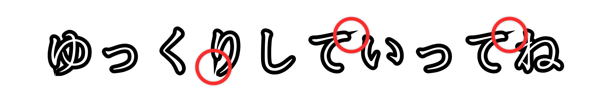
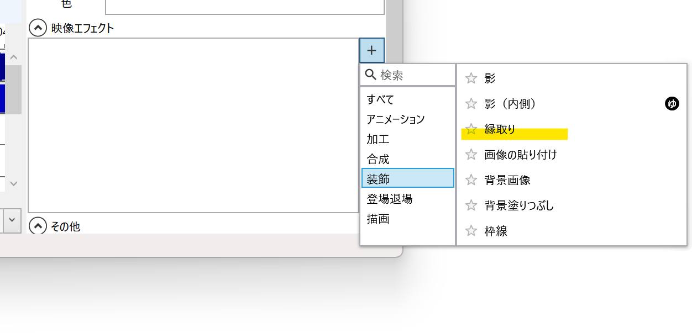

## 発生する症状

字幕やテキストに縁取りすると、縁取り部分にトゲが表示される

## 原因
Macのエミュレーター環境上で動作させているか、使用しているPCに搭載されているGPUが古い

## 対策
### 縁取りエフェクトを利用する

*映像エフェクト*→*+*ボタン→*装飾*→*縁取り*から縁取りできます。

### 実行環境を変更する（Macのエミュレーター環境上で動作させている場合）
- 別のエミュレーターに変更する
- [BootCampを利用する](https://support.apple.com/ja-jp/HT201468)
- WindowsPC上でYMM4を実行する