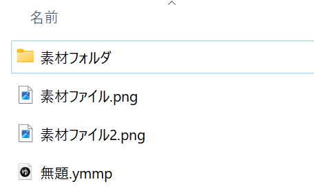
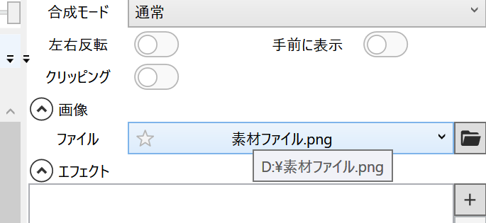
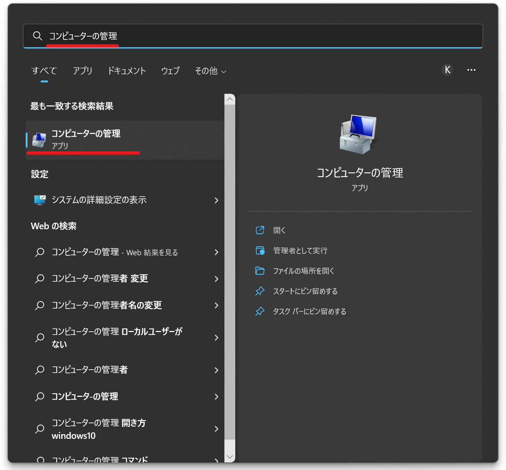
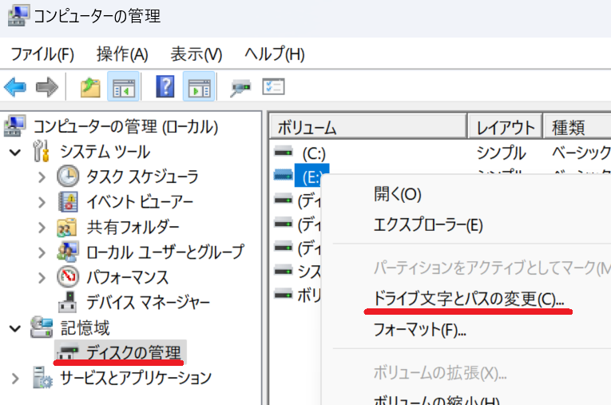
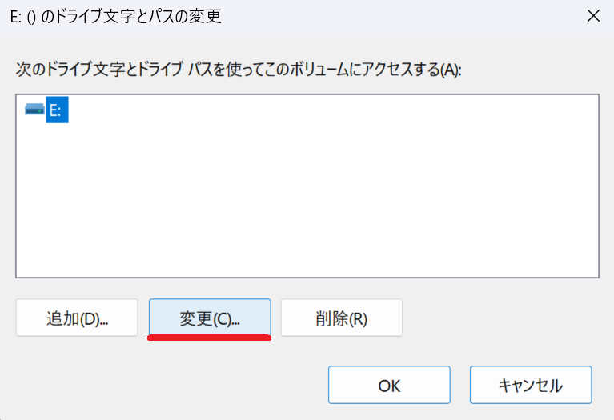
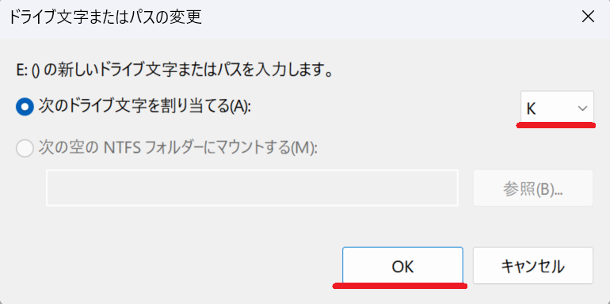

## プロジェクトファイルを新規作成する場合

1. プロジェクトファイルを新規作成する
1. 素材ファイルをプロジェクトファイルと同じフォルダか、サブフォルダに配置する
1. タイムラインに*2.*に保存した素材ファイルを配置する
1. プロジェクトファイルを保存する
1. プロジェクトファイルと素材ファイルを別PCにコピーする

## 既存のプロジェクトファイルを共有する場合
1. プロジェクトファイルを別PCにコピーする
1. 素材ファイルを元のPCと同じ場所にコピーする
   - 例：元のPCで*D:\素材フォルダ\素材ファイル.mp4*に保存しているファイルは、共有先のPCでも*D:\素材フォルダ\素材ファイル.mp4*に保存する

## 素材ファイルをコピーしたはずなのに表示されない
### 素材ファイルを正しくコピーできているかどうかを確認する
素材のサムネイルが表示されていない場合、ファイルを正しくコピーできていない可能性があります。  
ファイル選択欄にマウスカーソルを乗せてしばらくすると、ファイルの保存場所が表示されます。  
表示された場所に素材ファイルをコピーすると、正しく表示されるようになります。  

### 外付けドライブにプロジェクトファイルや素材ファイルを保存している場合
元のPCと共有先PCとでドライブのドライブレターが異なる場合、ファイルを正しく読み込めない可能性があります。  
（元のPCではEドライブだったが、共有先PCではFドライブになっている等）  
ドライブレターを元のPCと同じものに変更すると、正しく表示されるようになります。

#### ドライブレターの変更方法
1. タスクバーの検索欄に「コンピューターの管理」と入力する

1. 「コンピューターの管理」アプリを起動する
1. *記憶域*→*ディスクの管理*→ドライブレターを変更したいドライブを右クリック→*ドライブ文字とパスの変更*を選択する

1. *変更*ボタンをクリックする

1. ドライブレターを変更して*OK*ボタンをクリックする
