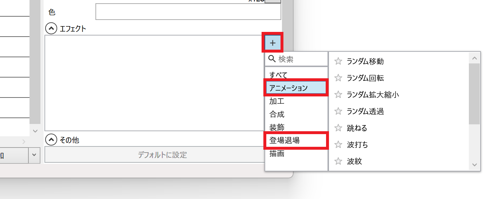
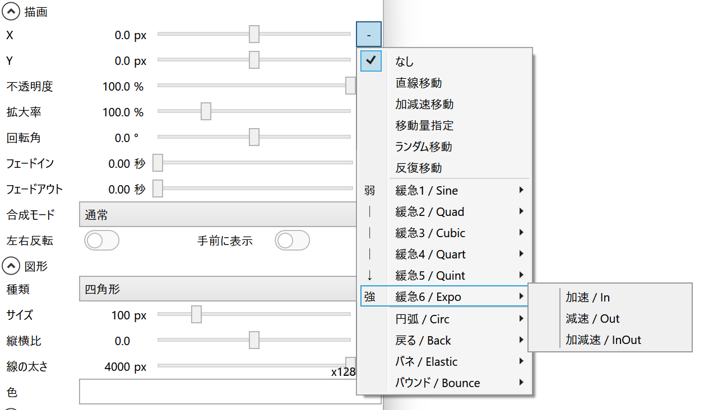
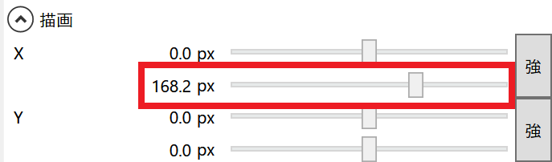
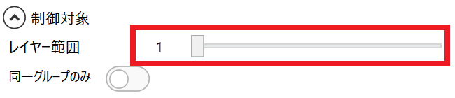
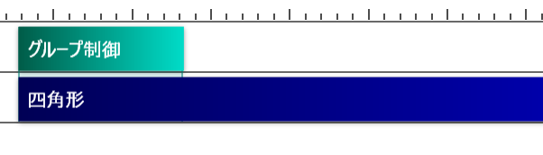

## アニメーション系エフェクトを使用する方法
1. 編集したいアイテムを選択する
1. *エフェクト*欄右側の*+*ボタンをクリックする
1. エフェクトカテゴリから*アニメーション*または*登場退場*を選択する
1. 一覧から使用したいエフェクトを選択する

1. エフェクトの設定を変更する

## アニメーションスライダーを使用する方法
1. アニメーションさせたい項目右側の*-*ボタンをクリックする
1. アニメーションの種類を選択する

1. 2つ目のスライダーでアニメーション後の数値を指定する

## グループ制御を使用する方法
グループ制御を使用すると、アイテムの一部の期間にのみエフェクトやアニメーションを適用できます。
1. タイムラインにグループ制御アイテムを追加する

1. エフェクトを適用したいアイテムの上にグループ制御アイテムを移動させる
1. グループ制御アイテムを選択し、*レイヤー範囲*を1に変更する

1. グループ制御アイテムに対して、「[アニメーション系エフェクトを使用する方法](#アニメーション系エフェクトを使用する方法)」「[アニメーションスライダーを使用する方法](#アニメーションスライダーを使用する方法)」と同様にアニメーション編集をする