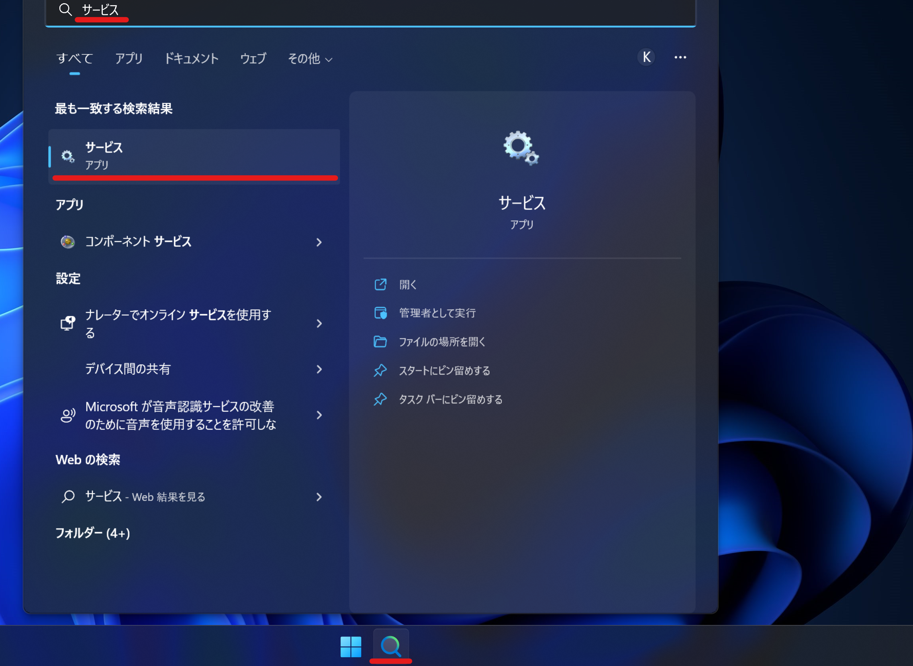
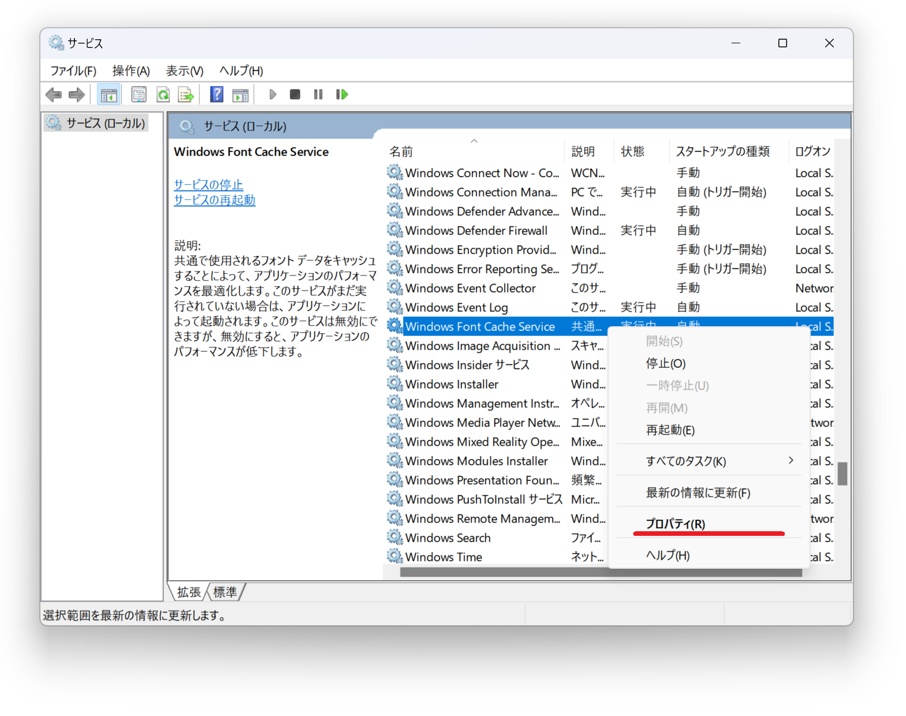
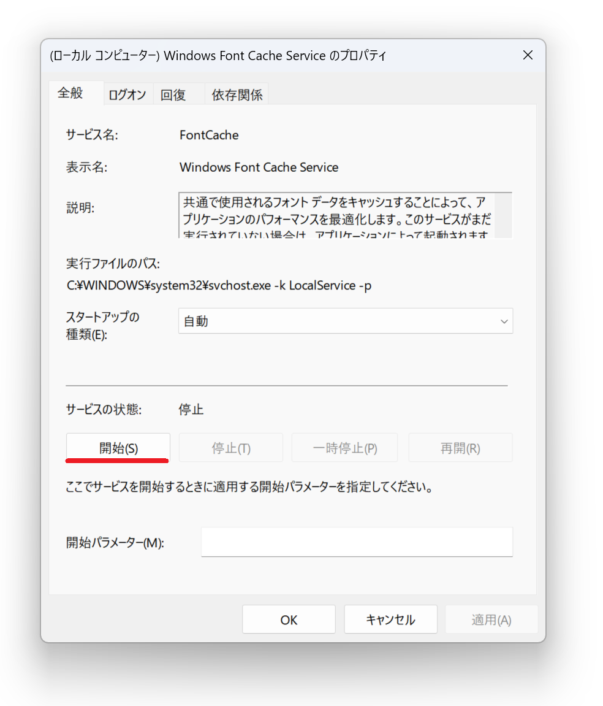

## 発生する症状
- Nexus Fontでインストールしたフォントがフォント一覧に表示されない
- mojimoでインストールしたフォントがフォント一覧に表示されない

## 解決策
Windows Font Cache Serviceが実行されていない事が原因です。

1. タスクバーの検索欄に*サービス*と入力し、ヒットしたサービス・アプリをクリックする

1. *Windows Font Cache Service*を右クリック→*プロパティ(R)*をクリックする

1. *スタートアップの種類(E)*で*自動*を選択し、*適用*ボタンをクリックする

1. *開始*ボタンをクリックする
