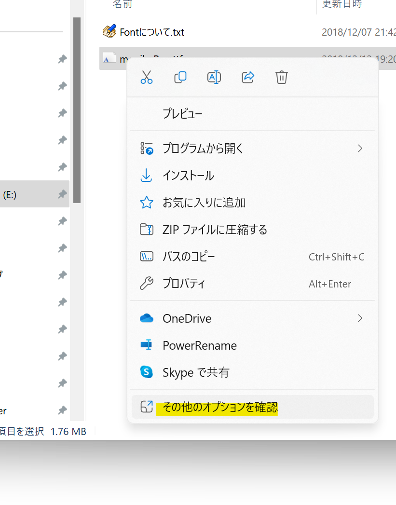
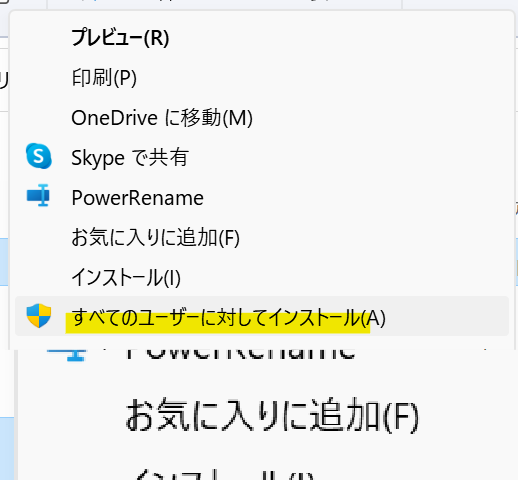

## 発生する症状
- インストールしたフォントが一覧に表示されない
- Nexus Fontでインストールしたフォントがフォント一覧に表示されない
- mojimoでインストールしたフォントがフォント一覧に表示されない

## 解決策1 Windows Font Cache Serviceを起動する
Windows Font Cache Serviceが実行されていない事が原因です。

1. タスクバーの検索欄に*サービス*と入力し、ヒットしたサービス・アプリをクリックする

1. *Windows Font Cache Service*を右クリック→*プロパティ(R)*をクリックする

1. *スタートアップの種類(E)*で*自動*を選択し、*適用*ボタンをクリックする

1. *開始*ボタンをクリックする

## 解決策2 フォントキャッシュを削除する

1. `C:\Windows\System32`を開く
1. `FNTCACHE.DAT`を削除する
1. `C:\Windows\ServiceProfiles\LocalService\AppData\Local\FontCache` を開く
1. フォルダ内のファイルを全て削除する
1. PCを再起動する

## 解決策3 すべてのユーザーに対してフォントをインストールする

1. フォントファイルを右クリックする
1. *その他のオプションを確認*をクリックする

1. *すべてのユーザーに対してインストール*をクリックする

