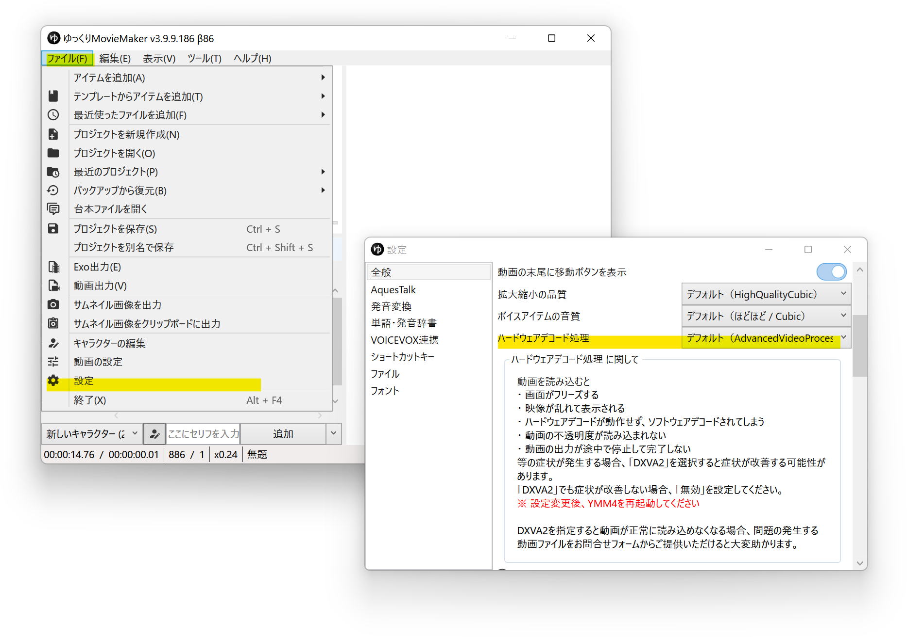

## 発生する症状
- プレビュー画面がフリーズする
- 映像が乱れる
- 動画の出力が途中で停止する
- 動画の色味が変わる。映像が暗くなる。

## ハードウェアデコード処理を変更する
1. *ファイル(F)*→*設定*から設定ウィンドウを開く
1. *全般*→*プレビュー*→*ハードウェアデコード処理*で*DXVA2*を選択する
1. YMM4を再起動する

## ハードウェアデコード処理を無効化する
ハードウェアデコード処理の変更で症状が改善しない場合、ハードウェアデコード処理の無効化で症状が改善する可能性があります。

1. *ファイル(F)*→*設定*から設定ウィンドウを開く
1. *全般*→*プレビュー*→*ハードウェアデコード処理*で*無効*を選択する
1. YMM4を再起動する

## .h264で動画を録画する
.h265動画を読み込んでいる場合、動画を.h264に変換してから読み込むことで症状が改善する可能性があります。

### iPhone(iOS)で動画を録画している場合
1. 設定アプリを開く
1. *カメラ*→*フォーマット*で*互換性優先*を選択する