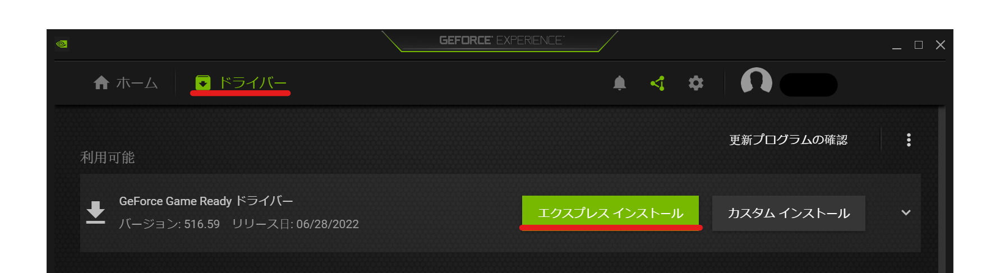

## 発生する症状
- プレビュー画面がフリーズする
- 映像が乱れる
- 動画の出力が途中で停止する

## グラフィックドライバーのバージョンを更新する
GPUのドライバーのバージョンを更新すると症状が改善する可能性があります。

### NVIDIA製GPU（Geforce）を使用している場合
1. Geforce Experienceをインストールする（インストールしていない場合）
1. *ドライバー*→*エクスプレス インストール*をクリックする

### AMD製GPU（Radeon）を使用している場合
- [AMDのドライバー＆サポート](https://www.amd.com/ja/support)

## ハードウェアデコード処理を変更する
1. *ファイル(F)*→*設定*から設定ウィンドウを開く
1. *全般*→*プレビュー*→*ハードウェアデコード処理*で*DXVA2*を選択する
1. YMM4を再起動する

## ハードウェアデコード処理を無効化する
ハードウェアデコード処理の変更で症状が改善しない場合、ハードウェアデコード処理の無効化で症状が改善する可能性があります。

1. *ファイル(F)*→*設定*から設定ウィンドウを開く
1. *全般*→*プレビュー*→*ハードウェアデコード処理*で*無効*を選択する
1. YMM4を再起動する
