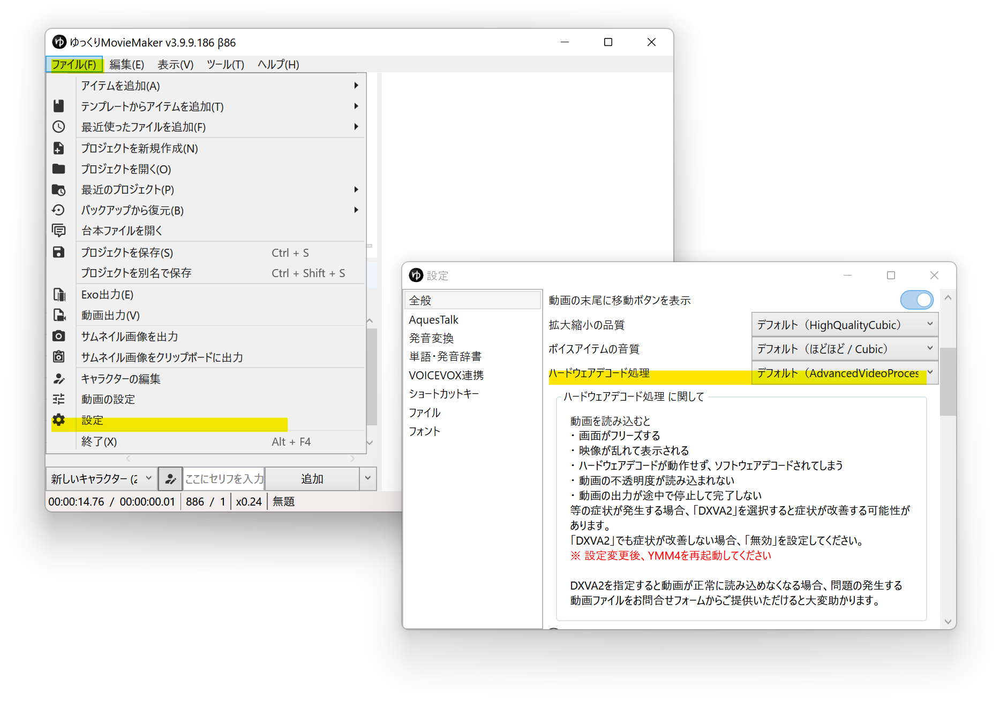

## 発生する症状
- プレビュー画面がフリーズする
- 映像が乱れる
- 動画の出力が途中で停止する
- 動画の色味が変わる。映像が暗くなる。

## 読み込みプラグインの優先度を変更する
特定の動画・音声・画像ファイルでフリーズや乱れが発生する場合、ファイルの読み込みに使用されているプラグインを切り替えることで症状が改善する可能性があります。

1. *ファイル(F)*→*設定*から設定ウィンドウを開く
1. *プラグイン*→*動画読み込みプラグイン*（音声ファイルの場合は*音声読み込みプラグイン*、画像ファイルの場合は*画像読み込みプラグイン*）を開く
1. *プラグイン一覧（上のものほど優先）*から優先度を変更したいプラグインを選択する
1. 右側の上下ボタンで*優先度を上げる*／*優先度を下げる*を操作する
1. YMM4を再起動する

## ハードウェアデコード処理を変更する
1. *ファイル(F)*→*設定*から設定ウィンドウを開く
1. *全般*→*プレビュー*→*ハードウェアデコード処理*で*DXVA2*を選択する
1. YMM4を再起動する

## ハードウェアデコード処理を無効化する
ハードウェアデコード処理の変更で症状が改善しない場合、ハードウェアデコード処理の無効化で症状が改善する可能性があります。

1. *ファイル(F)*→*設定*から設定ウィンドウを開く
1. *全般*→*プレビュー*→*ハードウェアデコード処理*で*無効*を選択する
1. YMM4を再起動する

## .h264で動画を録画する
.h265動画を読み込んでいる場合、動画を.h264に変換してから読み込むことで症状が改善する可能性があります。

### iPhone(iOS)で動画を録画している場合
1. 設定アプリを開く
1. *カメラ*→*フォーマット*で*互換性優先*を選択する

