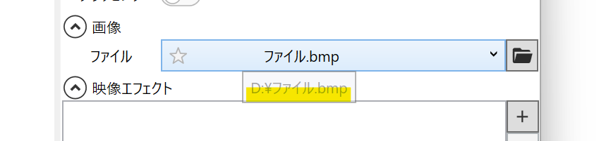

## 発生する症状
プロジェクトファイル保存時は正常に読み込めていたが、プロジェクトファイルを読み込むと動画や画像ファイルが表示されなくなった

## 原因
動画や画像ファイルが削除されている。別の位置に移動している。  
以下の場合、YMM4がファイルを見つけることができなくなり、動画や画像が表示できなくなります。
- ファイルを削除している
- ファイルを別のフォルダに移動している
- ファイルを別名に変更している

また、ファイルをUSBドライブや外付けHDDに保存している場合、ドライブレター（Eドライブ、Fドライブ等）が変わった場合にも同様にファイルを読み込めなくなります。  
接続するUSBポートを変更し、もとのドライブレターに戻すと正常にファイルを読み込めるようになります。

## 確認方法
1. 表示されない画像アイテムを選択する
1. ファイル欄にカーソルを合わせると、ファイルのパスが表示されます

1. 表示されたファイルパスを確認し、ファイルが存在するかどうかを確認します
1. ファイルが存在しない場合、読み込みたいファイルをその場所に移動させます