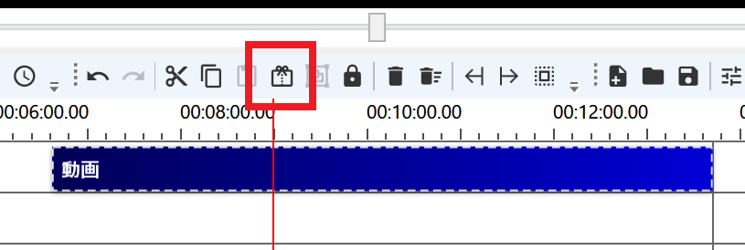
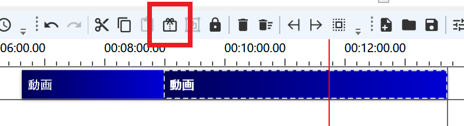
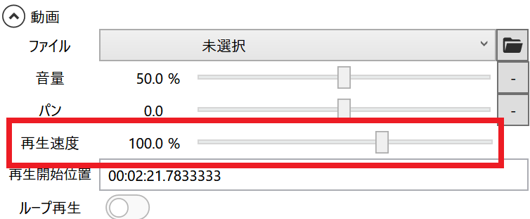

## 倍速編集する
1. タイムラインに動画または音声アイテムを追加する
1. 倍速を開始したい位置までシークする
1. `再生位置で分割`ボタンをクリックする

1. 倍速を終了したい位置までシークする
1. `再生位置で分割`ボタンをクリックする

1. 3分割されたアイテムのうち、真ん中のアイテムをクリックする
1. 再生速度欄の数値を変更する

## 逆再生編集する
再生速度欄の数値をマイナスに設定すると逆再生可能です。  
現在、動画ファイルのみ対応しています。  
逆再生した場合、音声再生されず無音になります。  

