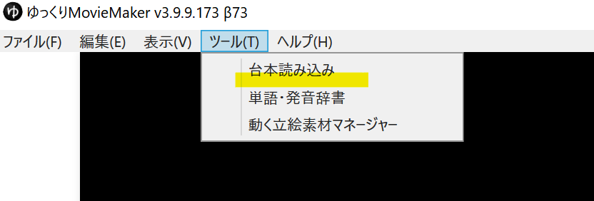
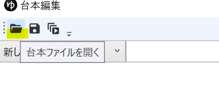

## ゆっくりMovieMaker4の台本作成機能を使用する方法
1. *ツール*→*台本読み込み*から*台本編集*ウィンドウを表示する

1. キャラクターを選択、セリフの入力を繰り返し、台本を作成する
1. *タイムラインに追加*ボタンをクリックする
- 以下のショートカットキーが利用できます
    - `Enter`：新しい行を追加して移動する
    - `Shift+Enter`：改行
    - `Tab`：次の行へ移動
    - `Shift+Tab`：前の行へ移動
    - `Ctrl+D`：キャラクターを変更
    - `Ctrl+S`：台本ファイルを保存

## 台本形式ファイルを作成する方法
### 台本形式テキストファイルの作り方

<Download url="https://object-storage.tyo1.conoha.io/v1/nc_4fac3ef0e6d843249e0ab2f1fc3e8f85/public/%E5%8F%B0%E6%9C%AC%E3%83%95%E3%82%A1%E3%82%A4%E3%83%AB%E3%82%B5%E3%83%B3%E3%83%97%E3%83%AB.txt">台本形式テキストファイルのサンプルをダウンロード</Download>

`キャラクター名「セリフ内容」`形式で記述したテキストファイルを作成します。 
```txt
キャラクター1「セリフ」
キャラクター2「セリフ」
```

行頭に`#`をつけるとコメントを記述できます
```txt
# コメントを記述できます
キャラクター1「セリフ」
```

セリフ内でカギ括弧`「」`を使用したい場合はそれぞれの記号の前に`\`を付け、`\「\」`と記述してください。  
```txt
キャラクター1「セリフ内で\「カギ括弧\」を使用する」
```

セリフ内で改行したい場合はそのまま改行してください。  
```txt
キャラクター2「セリフを途中で
改行する」
```

### 台本形式csvファイルの作り方

<Download url="https://object-storage.tyo1.conoha.io/v1/nc_4fac3ef0e6d843249e0ab2f1fc3e8f85/public/%E5%8F%B0%E6%9C%AC%E3%83%95%E3%82%A1%E3%82%A4%E3%83%AB%E3%82%B5%E3%83%B3%E3%83%97%E3%83%AB%20.csv">台本形式csvファイルのサンプルをダウンロード</Download>

`キャラクター名,セリフ内容`形式で記述したcsvファイルを作成します。
```csv
キャラクター1,セリフ
キャラクター2,セリフ
```

行頭に`#`をつけるとコメントを記述できます
```csv
# コメントを記述できます
キャラクター1,セリフ
```

セリフ内でコンマ`,`や`改行`を使用したい場合はセリフを`"`で囲ってください。  
```csv
キャラクター1,"セリフ内でコンマ「,」を使用する"
キャラクター1,"セリフ内で
改行する"
```

`"`で囲んだセリフ内で`"`を使用したい場合は`""`と記載してください。
```csv
キャラクター1,"セリフ内でダブルクオーテーション「""」を使用する"
```

### 台本形式ファイルの読み込み方
1. *ツール*→*台本読み込み*から*台本編集*ウィンドウを表示する

1. 読み込みボタンをクリックし、台本ファイルを読み込む

1. *タイムラインに追加*ボタンをクリックする