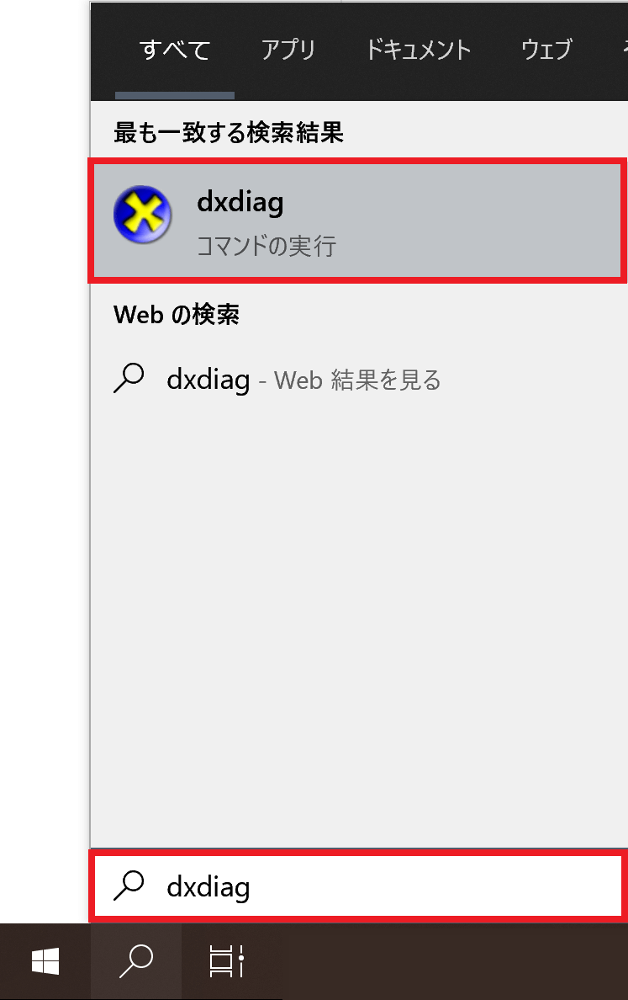
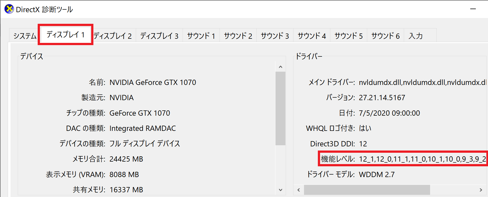

## 発生する症状
エフェクトを適用しても表示が変わらない

## 原因
DirectX10世代の古いGPUを使用している

## DirectX10世代の古いGPUを使用しているかどうかを確認する
1. タスクバーの検索欄に「dxdiag」を入力し、ヒットしたアプリを起動する

1. ディスプレイ1 タブ → 機能レベル 欄に「12_1」「12_0」「11_1」「11_0」等、11以上の数値があるかどうか確認する

機能レベル欄に11以上の数値がない場合、「縁取り」「モザイク」等のエフェクトは使用できません
