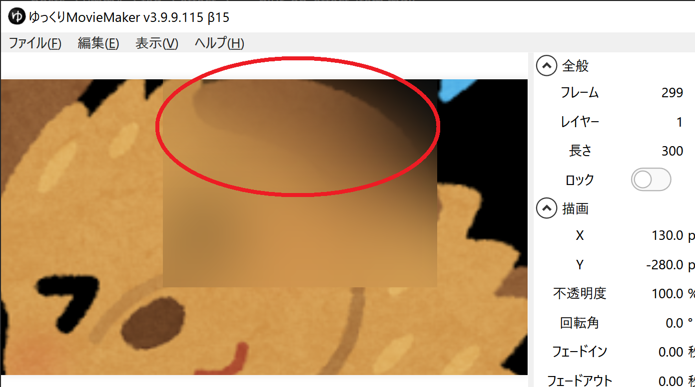
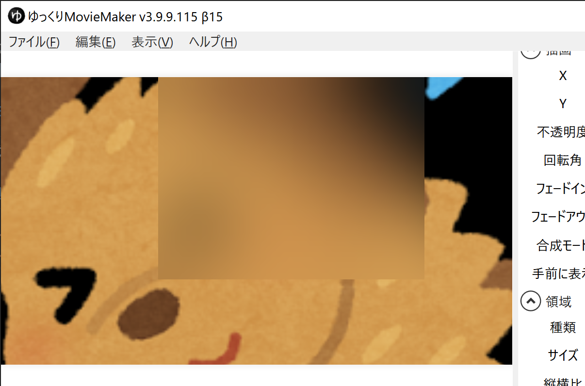

## 発生する問題

エフェクトアイテムに「ぼかし」「方向ブラー」エフェクトを適用した際、画面端でエフェクトのかかり具合が薄くなる。

## 対処法
1. タイムラインから、問題の発生しているエフェクトアイテムを選択する
1. `アイテム編集エリア`→`エフェクト`で、問題の発生しているエフェクトを選択する（`ぼかし`エフェクト等）
1. `サイズを固定`を有効にする

`サイズを固定`を有効にすると、以下のようにエフェクトが透過することなく適用されます。

