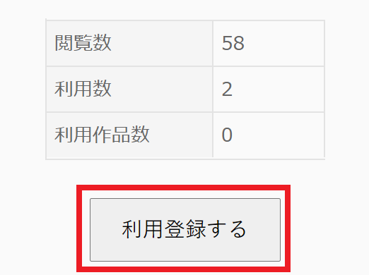
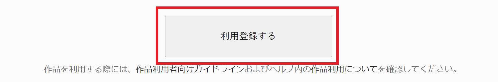
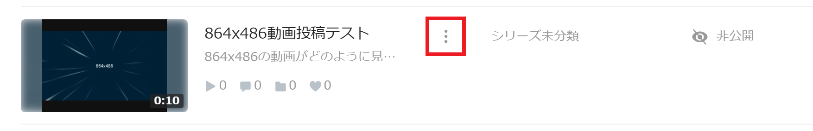
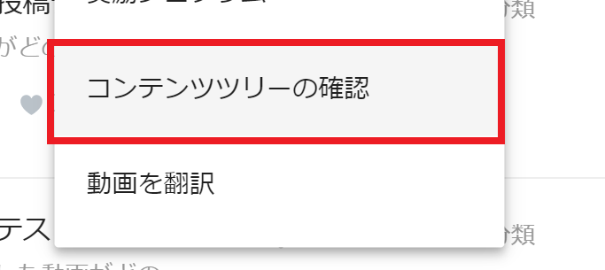
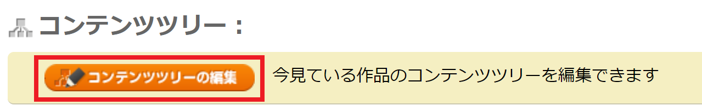
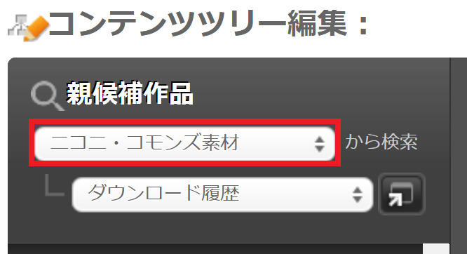
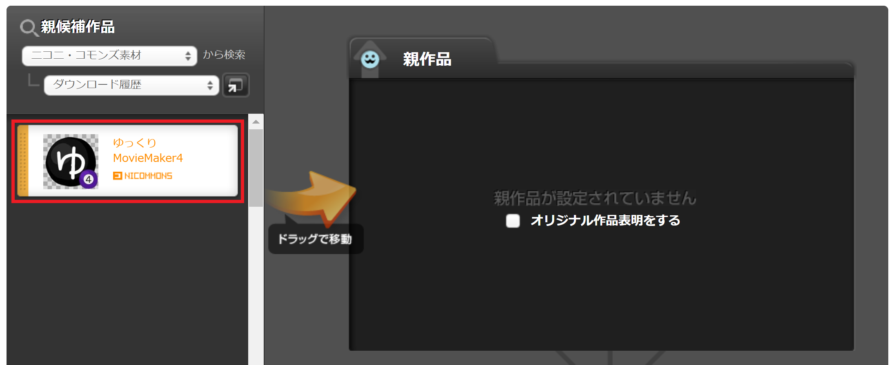

ニコニコ動画に動画を投稿する場合、動画のコンテンツツリーの親作品に「[nc236011](https://commons.nicovideo.jp/material/nc236011)」を指定してください。

## 設定方法
1. [ゆっくりMovieMaker4 - ニコニ・コモンズ](https://commons.nicovideo.jp/material/nc236011) へアクセスする
1. `利用登録する` をクリックする

1. `利用登録する`をクリックする

1. [投稿動画一覧ページ](https://www.upload.nicovideo.jp/garage/videos)を開く
1. 動画右側の`︙`をクリックする

1. `コンテンツツリーの確認`をクリックする 

1. `コンテンツツリーの編集`をクリックする

1. 親候補作品欄で`ニコニ・コモンズ素材`を選択する

1. ゆっくりMovieMaker4を親作品欄にドラッグして移動させる

1. 画面下部の`この内容でコンテンツツリーを作成する`をクリックする

