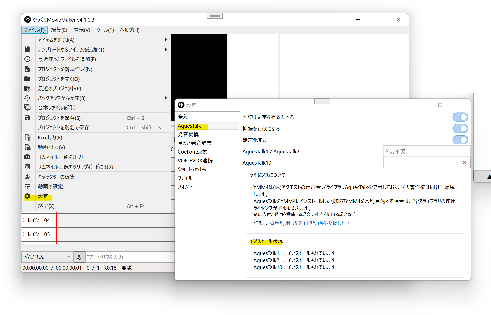

## ゆっくりMovieMaker4
[個人利用ライセンス](https://www.a-quest.com/licence_free.html)の対象外となる使い方（収益化、業務委託、法人利用、学校の授業や部活での利用等）をする場合、
「[AquesTalk使用ライセンス 商用コンテンツ向け](https://store.a-quest.com/items/7413986)」
または
「[AquesTalk1使用ライセンス](https://store.a-quest.com/items/7905423)」
「[AquesTalk2使用ライセンス](https://store.a-quest.com/items/7905447)」
「[AquesTalk10使用ライセンス](https://store.a-quest.com/items/8529902)」
の3つを購入する必要があります。  

<small>
※ AquesTalkの音声を全く使用しない場合でも、ライセンスの購入が必要になります。
</small>

AquesTalk10のみ、ライセンス購入後  
*設定* → *AquesTalk* → *AquesTalk10使用ライセンスキー*  
から、ライセンスキーを登録する必要があります。

- [個人利用 ライセンス | 株式会社アクエスト](https://www.a-quest.com/licence_free.html)
- [音声合成ライセンスの種類・購入 | 株式会社アクエスト](https://www.a-quest.com/licence.html)
- [よくある質問 | 株式会社アクエスト](https://www.a-quest.com/faq.html)

## ゆっくりMovieMaker4 Lite
利用状況によって異なります。
### YMM4LiteにAquesTalkがインストールされているかどうかを確認する
*ファイル(F)*→*設定*→*AquesTalk*→*インストール状況*から、インストールされているAquesTalkを確認できます。

### AquesTalkがインストールされていない場合
YMM4Lite本体は商用・非商用問わず無料でご利用いただけます。  
サードパーティー製音声合成エンジンを利用する場合、別途ライセンスを取得する必要がある場合があります。

### AquesTalkがインストールされている場合
[個人利用ライセンス](https://www.a-quest.com/licence_free.html)の対象外となる使い方（収益化、業務委託、法人利用、学校の授業や部活での利用等）をする場合、
[AquesTalk使用ライブラリ（商用コンテンツ向け）](https://store.a-quest.com/items/7413986)または
インストールしているライブラリの使用ライセンス
（[AquesTalk1用](https://store.a-quest.com/items/7905423)、[AquesTalk2用](https://store.a-quest.com/items/7905447)、[AquesTalk10用](https://store.a-quest.com/items/8529902)）
を購入する必要があります。

<small>
※ AquesTalkの音声を全く使用しない場合でも、ライセンスの購入が必要になります。
</small>

- [個人利用 ライセンス | 株式会社アクエスト](https://www.a-quest.com/licence_free.html)
- [音声合成ライセンスの種類・購入 | 株式会社アクエスト](https://www.a-quest.com/licence.html)
- [よくある質問 | 株式会社アクエスト](https://www.a-quest.com/faq.html)

サードパーティー製音声合成エンジンを利用する場合、別途ライセンスを取得する必要がある場合があります。

## サードパーティー製音声合成エンジンを利用する場合
各音声合成ソフトに同梱されている使用許諾契約書に沿ってご利用下さい。  
以下、主要な音声合成ソフトのライセンスページへのリンクを記載します。  

### A.I.VOICE
- [A.I.VOICEの利用条件等について](/ymm4/faq/ゆっくりボイス/AIVOICE/#利用条件等)

<Flex>
    <AmazonCard item="B09HKF33KJ"/>
    <AmazonCard item="B09MZ6HLLJ"/>
    <AmazonCard item="B093WNVYLL"/>
    <AmazonCard item="B099NLWYWP"/>
</Flex>

### CeVIO AI / CeVIO CS
- [CeVIO AI / CeVIO CS の利用条件等について](/ymm4/faq/ゆっくりボイス/CeVIOを使用する/#利用条件等)

<Flex>
    <AmazonCard item="B09L51TBV1"/>
    <AmazonCard item="B0BFHPGZ2M"/>
    <AmazonCard item="B09P5FM4JS"/>
    <AmazonCard item="B0B176B4GY"/>
</Flex>

### CoeAvatar
- [CoeAvatarの利用条件等について](/ymm4/faq/ゆっくりボイス/CoeAvatar/#利用条件等)
<Flex>
    <AmazonCard item="B0B1SH3Y34"/>
    <AmazonCard item="B0B4CY1TX7"/>
    <AmazonCard item="B0B6NRF1XJ"/>
</Flex>

### CoeFont
- [CoeFontの利用条件等について](/ymm4/faq/ゆっくりボイス/CoeFontを利用する/#利用条件等)

### COEIROINK
- [COEIROINKの利用条件等について](/ymm4/faq/ゆっくりボイス/COEIROINK/#利用条件等)

### ITVOICE
- [ITVOICEの利用条件等について](/ymm4/faq/ゆっくりボイス/ITVOICE/#利用条件等)

### LMROID
- [LMROIDの利用条件等について](/ymm4/faq/ゆっくりボイス/LMROID/#利用条件等)

### SHAREVOX
- [SHAREVOXの利用条件等について](/ymm4/faq/ゆっくりボイス/SHAREVOX/#利用条件等)

### VOICEPEAK
- [VOICEPEAKの利用条件等について](/ymm4/faq/ゆっくりボイス/VOICEPEAK/#利用条件等)
<Flex>
    <AmazonCard item="B09TW18HS7"/>
    <AmazonCard item="B09QWVL5WS"/>
    <AmazonCard item="B0BPL2FT1L"/>
    <AmazonCard item="B0BPKYXK18"/>
</Flex>

### VOICEVOX
- [VOICEVOXの利用条件等について](/ymm4/faq/ゆっくりボイス/VOICEVOXを使用する/#利用条件等)

### VOICEROID
生成したwav&txtファイルをカスタムボイスとして利用可能です。
- [外部の音声合成エンジンで作成した音声ファイルを使用したい](../ゆっくりボイス/%E5%A4%96%E9%83%A8%E3%81%AE%E9%9F%B3%E5%A3%B0%E5%90%88%E6%88%90%E3%82%A8%E3%83%B3%E3%82%B8%E3%83%B3%E3%81%A7%E4%BD%9C%E6%88%90%E3%81%97%E3%81%9F%E9%9F%B3%E5%A3%B0%E3%83%95%E3%82%A1%E3%82%A4%E3%83%AB%E3%82%92%E4%BD%BF%E7%94%A8%E3%81%97%E3%81%9F%E3%81%84.md)

商用利用する場合、商用ライセンスの購入が必要です。  
個人が広告付き動画を投稿する場合等、利用状況によってはライセンス購入が免除されます。

- [VOICEROIDライセンス｜製品情報｜AHS(AH-Software)](https://www.ah-soft.com/voiceroid/license/license.html)

キャラクターを使用する場合、別途キャラクター使用ガイドラインに従う必要があります。
- [結月ゆかり](https://www.ah-soft.com/vocaloid/yukari/charactor_guide.html)
- [琴葉 茜・葵](https://www.ai-j.jp/kotonoha/)
- [東北ずん子](https://zunko.jp/guideline.html)

<Flex>
    <AmazonCard item="B072LN3WM8"/>
    <AmazonCard item="B078213JVP"/>
    <AmazonCard item="B071LJJG9H"/>
    <AmazonCard item="B01MF9A8SM"/>
</Flex>

## その他の素材
素材の利用規約に沿ってお使い下さい。
