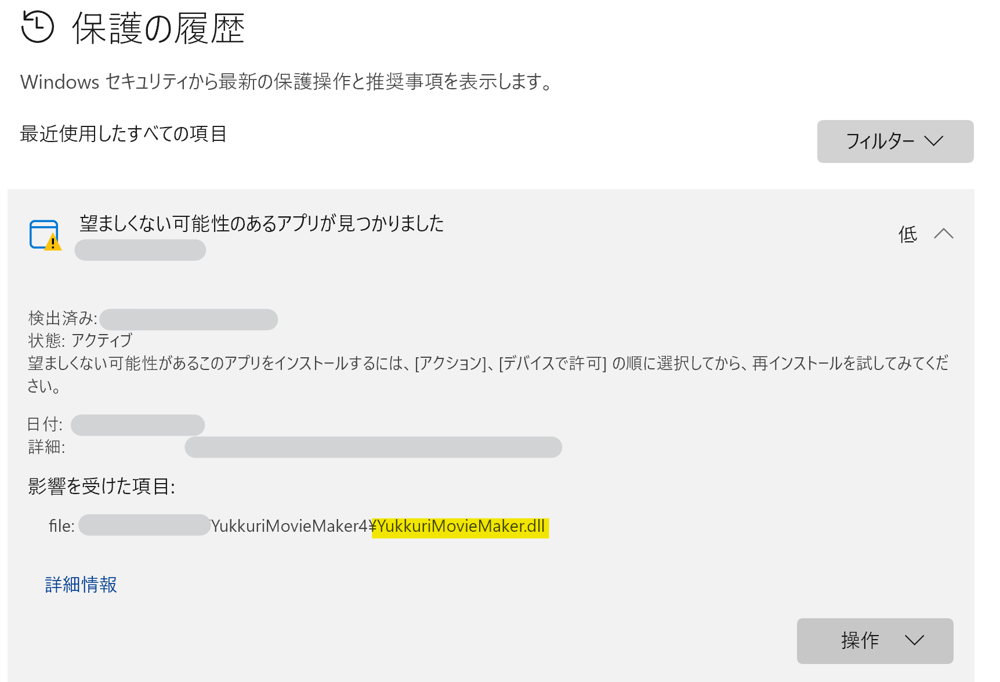

## 発生する症状
- YMM4を起動しようとすると、WindowsOS標準のセキュリティ機能によってYMM4の起動がブロックされる

> **Note**
> 2025年3月12日頃から16日にかけて、*YukkuriMovieMaker.dll*が*Win32/GameHack*として誤検出される問題が発生していました。  
> Microsoftにこの問題を報告したところ、誤検出であることが認められ、2025年3月16日の定義ファイル更新によって修正されました。  
> 現在も問題が発生している場合は、WindowsUpdateを実行して最新の定義ファイルを適用してください。

## 原因
WindowsOS標準のセキュリティ機能によって、YMM4がウイルスやマルウェアと誤検知されている可能性があります。

## 対策
### 方法1: WindowsUpdateを実行する
WindowsUpdateを実行し、Windowsセキュリティの定義ファイルを更新することでYMM4が起動できるようになる可能性があります。
1. Windowsの設定アプリを起動する
1. *Windows Update*をクリックする
1. *更新プログラムのチェック*をクリックする

### 方法2: 将来のWindowsUpdateまでYMM4の利用を一時的に控える
Windowsセキュリティの検知結果を信用する場合、一時的にYMM4の利用をお控えください。  
将来のWindowsUpdateによってWindowsセキュリティの定義ファイルが更新された段階で、YMM4が正常に起動するようになる可能性があります。  

### 方法3: 誤検知されたファイルを個別にWindowsセキュリティ機能の例外に設定する
1. Windowsの設定アプリを起動する
1. *プライバシーとセキュリティ*→*Windows セキュリティ*をクリックする

1. *ウイルスの脅威と防止*をクリックする

1. 現在の脅威の*保護の履歴*をクリックする

1. *望ましくない可能性のアプリが見つかりました*と表示されている項目をクリックする
1. 影響を受けた項目欄にYMM4フォルダ内のファイル（今回の例では*YukkuriMovieMaker.dll*）が表示されていることを確認する

1. *操作*ボタンをクリックする
1. *デバイスで許可*をクリックする

方法3を実行しても起動できない場合、Windowsのセキュリティ機能によってYMM4の動作に必要なファイルが削除されている可能性があります。  
以下のページの内容を参考にし、YMM4の再インストールをお試しください。  
- [手動アップデート（再インストール）する](manualupdate.md)

### 方法4: YMM4フォルダをWindowsセキュリティ機能の例外に設定する
1. Windowsの設定アプリを起動する
1. *プライバシーとセキュリティ*→*Windows セキュリティ*をクリックする

1. *ウイルスの脅威と防止*をクリックする

1. ウイルスと脅威の防止の設定の*設定の管理*をクリックする

1. *除外の追加または削除*をクリックする

1. 除外の追加 → フォルダー をクリックする

1. YMM4フォルダを指定する

方法4を実行しても起動できない場合、Windowsのセキュリティ機能によってYMM4の動作に必要なファイルが削除されている可能性があります。  
以下のページの内容を参考にし、YMM4の再インストールをお試しください。  
- [手動アップデート（再インストール）する](manualupdate.md)