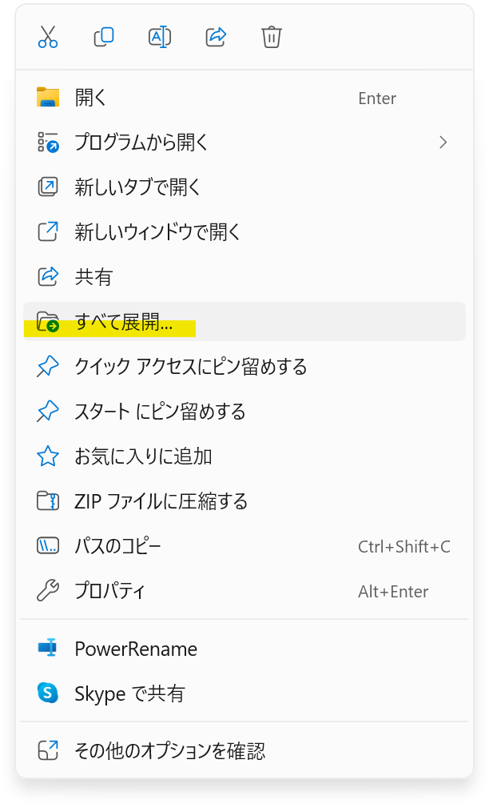
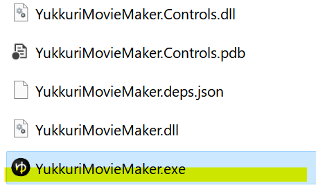

## YMM4のインストール方法
1. YMM4またはYMM4Liteをダウンロードします。  
   - 参考: [YMM4とYMM4Liteの違い](../etc/YMM4Lite.md)
<Download url="https://object-storage.tyo1.conoha.io/v1/nc_4fac3ef0e6d843249e0ab2f1fc3e8f85/public/YukkuriMovieMaker_v4.zip">ゆっくりMovieMaker4をダウンロード</Download>
<Download url="https://object-storage.tyo1.conoha.io/v1/nc_4fac3ef0e6d843249e0ab2f1fc3e8f85/public/YukkuriMovieMaker_v4_Lite.zip">ゆっくりMovieMaker4 Liteをダウンロード</Download>
1. ダウンロードしたzipファイルを右クリックし、*すべて展開*を選択します。

1. 展開したフォルダをお好みの場所に移動させます。
1. 展開したフォルダ内の`YukkuriMovieMaker.exe`を実行します。
