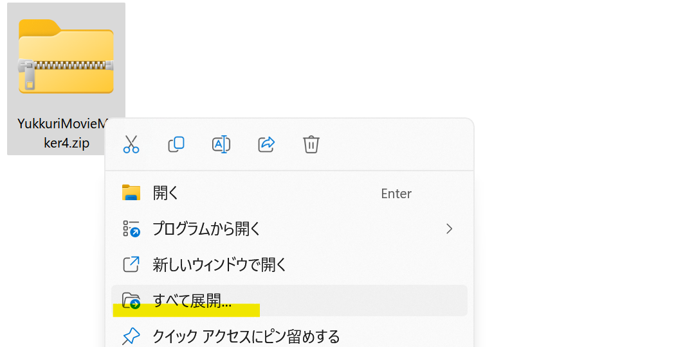
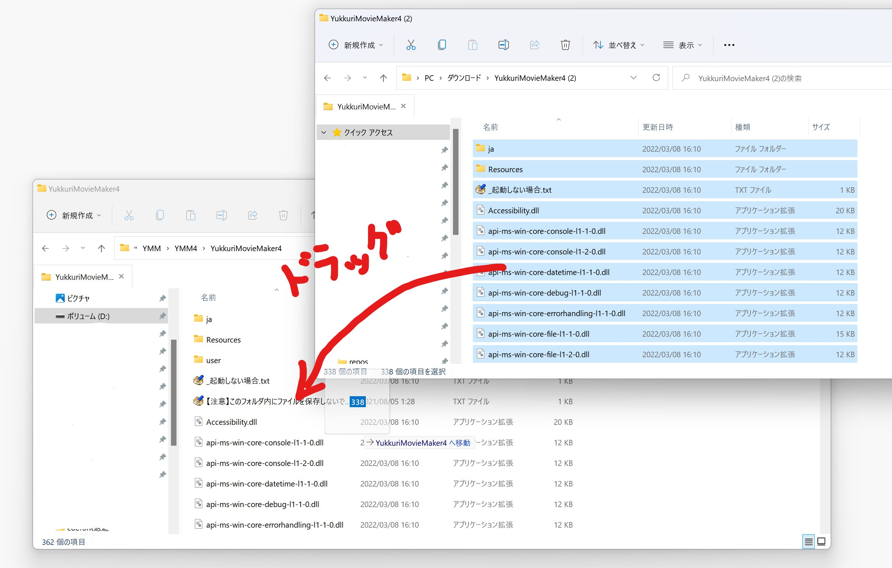
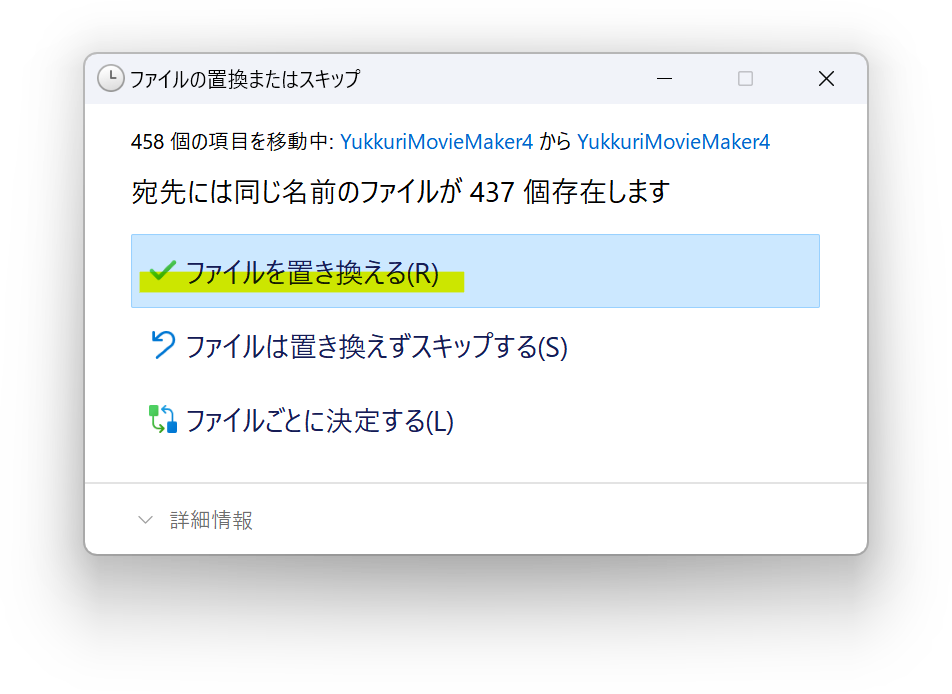

## 症状
- 自動アップデートに失敗する
- YMM4が起動しない
- Unable to load one or more of the requested types. Could not load file or assembly '<アセンブリ名>'. Format of the executable (.exe) or library (.dll) is invalid.と表示される

## 手動アップデート（再インストール）手順
> **Note**
> この方法を実行しても設定（キャラクター設定など）はリセットされません。

1. YMM4を終了させる
1. [ゆっくりMovieMaker4配布ページ](../../index.md)からYMM4を再ダウンロードする
1. ダウンロードしたzipファイルを展開（解凍）する

1. 展開したファイルを元のYMM4フォルダにコピーする

1. *ファイルを置き換える(R)*を選択する

1. コピー完了後、YMM4を起動する