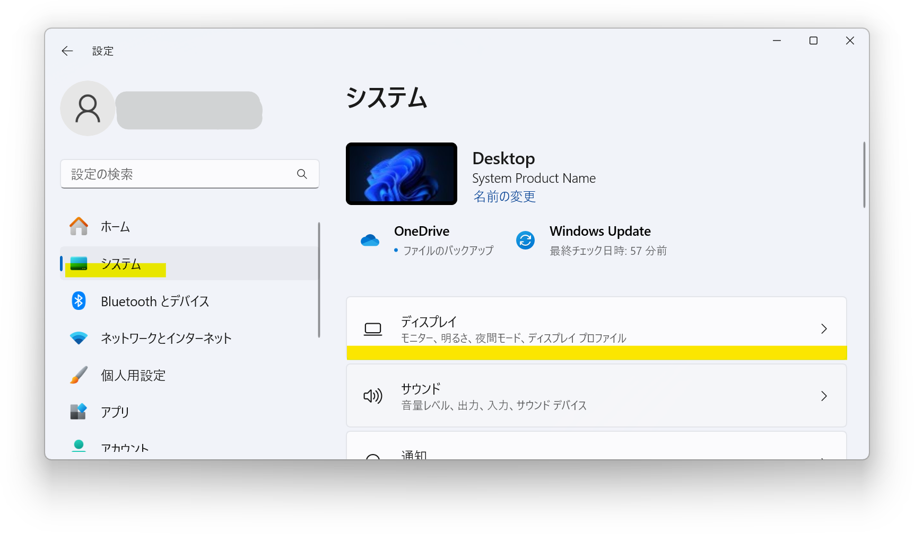

## 発生する症状
- 映像の生成やエンコードにCPU内臓GPUが使用され、グラフィックボードが使用されない

## 解消法
WindowsOSの設定を変更してください。

1. YMM4を起動している場合は終了させる
1. Windowsの設定アプリを起動する

1. *システム*→*ディスプレイ*をクリックする

1. 関連設定の*グラフィック*をクリックする

1. アプリのカスタム オプションで*デスクトップ アプリ*を選択し、*参照*ボタンをクリックする

1. ゆっくりMovieMaker4の実行ファイル*YukkuriMovieMaker.exe*を選択する
1. 画面下のアプリ一覧に追加された*YukkuriMovieMaker*をクリックし、表示される*オプション*ボタンをクリックする

1. *高パフォーマンス*のGPUを選択し、*保存*ボタンをクリックする

