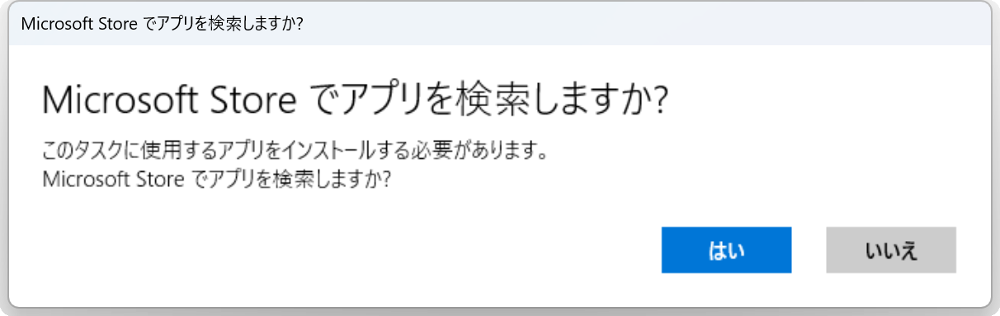
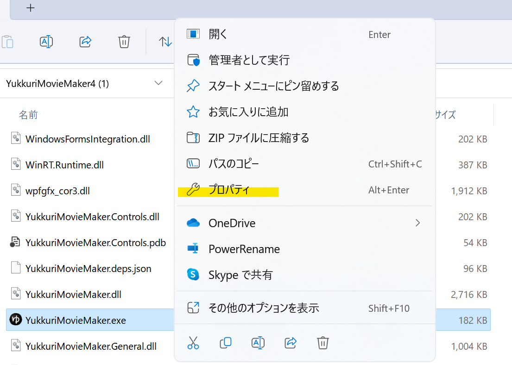
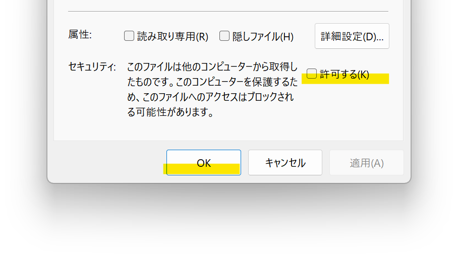

## 発生する症状

「Microsoft Store でアプリを検索しますか？」と表示される。  
「はい」や「いいえ」を選択しても起動しない

## 対策
1. *YukkuriMovieMaker.exe*を右クリックする
2. *プロパティ*をクリックする

1. *セキュリティ*欄右側の*許可する(K)*にチェックを入れ、*OK*ボタンをクリックする

1. *YukkuriMovieMaker.exe*を起動する