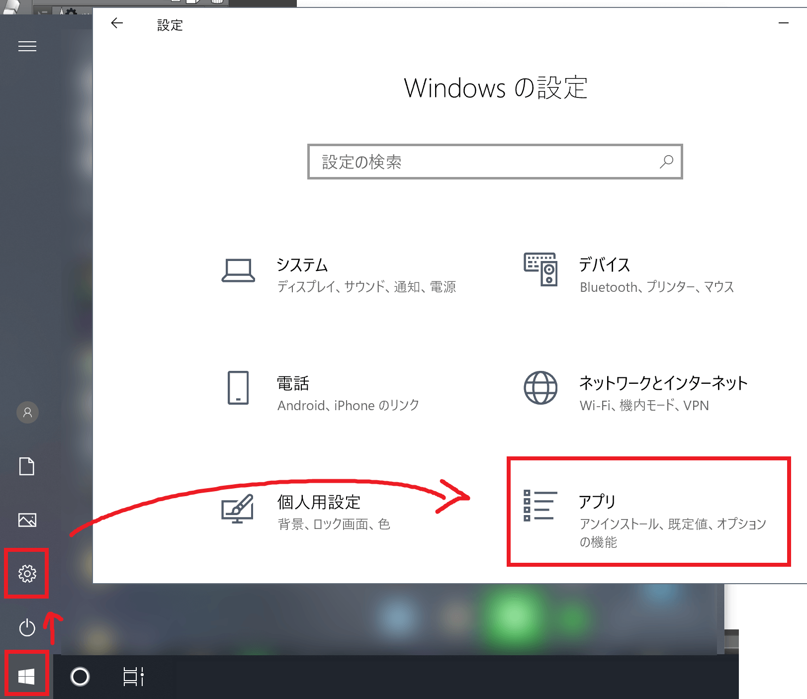
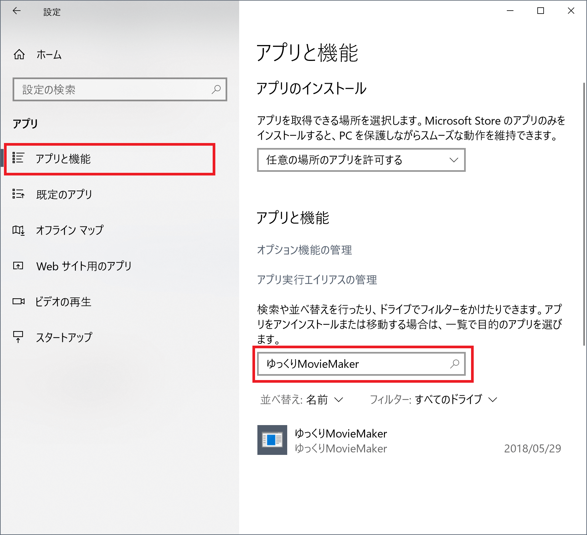
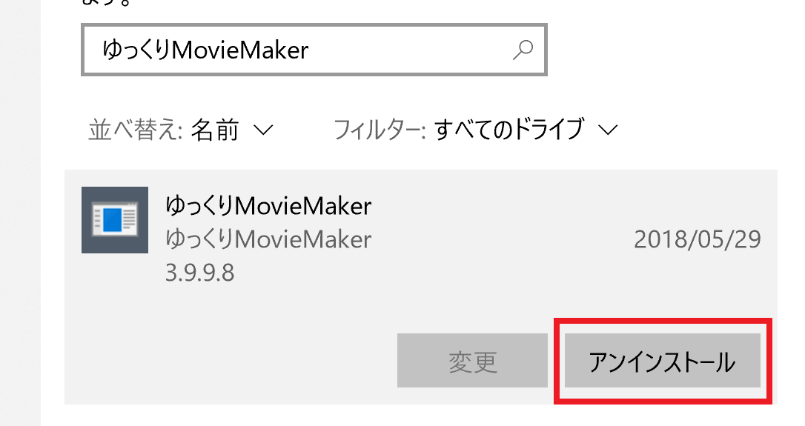
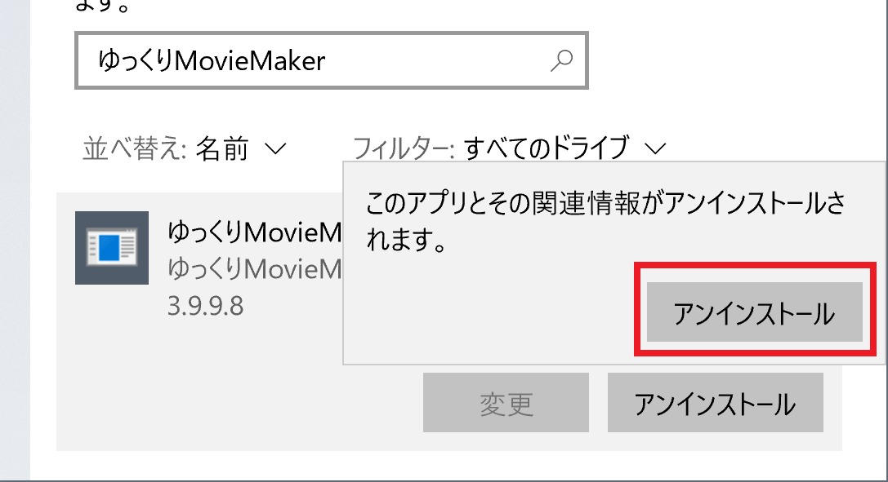
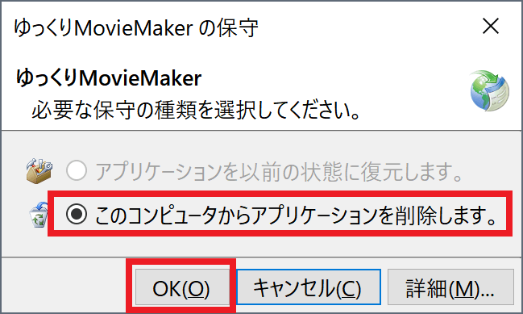

## ポータブル版を使用している場合
YMM4α74以降を利用している場合はこちらです。  
ゆっくりMovieMaker4を配置しているフォルダを削除してください。

## インストーラー版を使用している場合
1. *スタートメニュー*→*歯車アイコン*→*アプリ*を選択する

1. *このリストを検索*欄に*ゆっくりMovieMaker*と入力する

1. *ゆっくりMovieMaker*欄をクリックすると*アンインストール*ボタンが表示されるのでクリックする

1. 再度*アンインストール*ボタンをクリックする

1. *このコンピュータからアプリケーションを削除します*を選択し、*OK*ボタンをクリックする

 