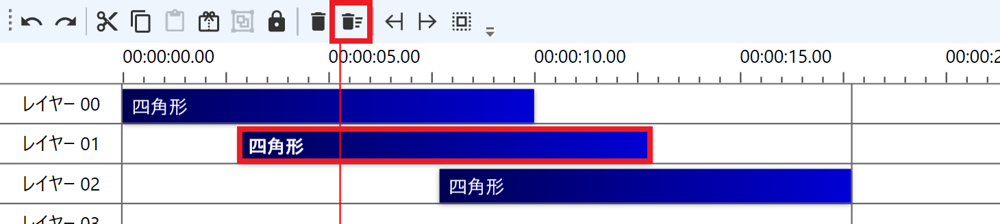
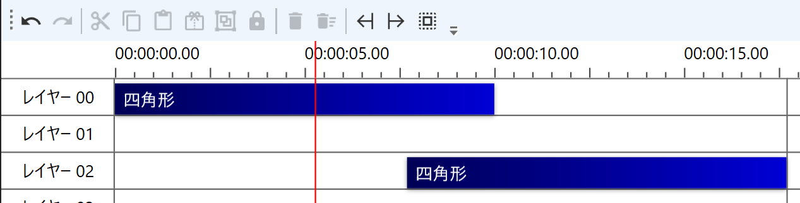
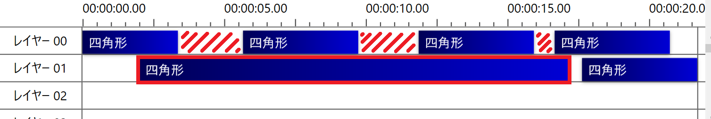
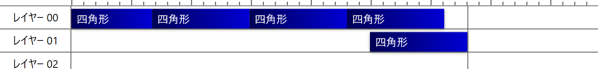
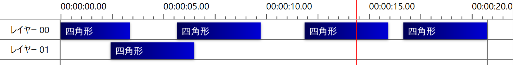

## 発生する症状
「削除して左寄せ」を実行しても、左寄せされない

## 原因
削除したアイテムの上下に他のアイテムが存在する場合、左寄せされない仕様となっています。  
下記画像の赤枠のアイテムを削除すると、上下にアイテムの存在しない赤斜線の区間が左寄せされます。

## Ctrl+Shift+Deleteでレイヤー単位の左寄せをする
`Ctrl+Shift+Delete`でレイヤー単位で「左寄せして削除」可能です。

