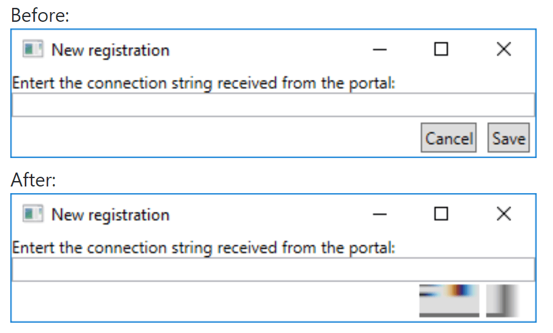
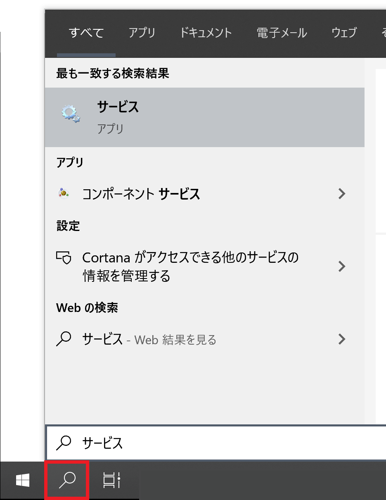

## 発生する症状

ボタン等の表示が崩れる  
[Button renders wrong after mouse leave #707・dotnet/wpf](https://github.com/dotnet/wpf/issues/707) より

 
## 原因と対策
バックグラウンドで実行されている

- [MSI Nahimic](https://jp.msi.com/page/nahimic)

または、上記ソフトウェアを内部的に使用している

- Dell Alienware Sound Center / Dell Alienware Command Center
- Asus Rog Phoebus Sonic studio

が原因です。  
この問題はMSI、Dell、ASUS製ゲーミングPCや、同社製マザーボード付属に付属しているユーティリティソフトをインストールしている環境で発生する可能性があります。

---

> **Note**
> 上記一覧に記載のあるメーカー製PCを使用していない場合や、ソフトウェアをインストールしていない環境でも、念の為以下の解決策をお試しください。  
> ここに記載のないソフトウェアにもNahimicが含まれている可能性があります。

### Nahimicを更新する
Nahimicのバージョンv1.4.1以降に更新すると症状が改善する可能性があります。  
アップデート方法に関しては、各メーカーのサポートへお問い合わせください。

### Nahimicの更新で症状が改善しない場合
「NahimicService」を停止させると症状が改善します。

1. **「NahimicService」を停止させる**
    1. タスクマネージャーを開く
    1. サービスタブを開く
    1. NahimicService を右クリックする
    1. 停止をクリックする
1. **「NahimicService」の起動を抑制する**
    1. タスクバーの検索欄に「サービス」と入力する
    
    1. 「サービス」アプリを起動する
    1. 「NahimicService」を右クリックする
    1. 「プロパティ」をクリックする
    1. 「スタートアップの種類」欄で「無効」を選択する
    1. OKボタンをクリックする

## 参考
- [Button renders wrong after mouse leave · Issue #707 · dotnet/wpf](https://github.com/dotnet/wpf/issues/707)
- [MSI製ノートPCでHoudiniがクラッシュしまくる](https://qiita.com/amagitakayosi/items/91650875f7dc513961b8)