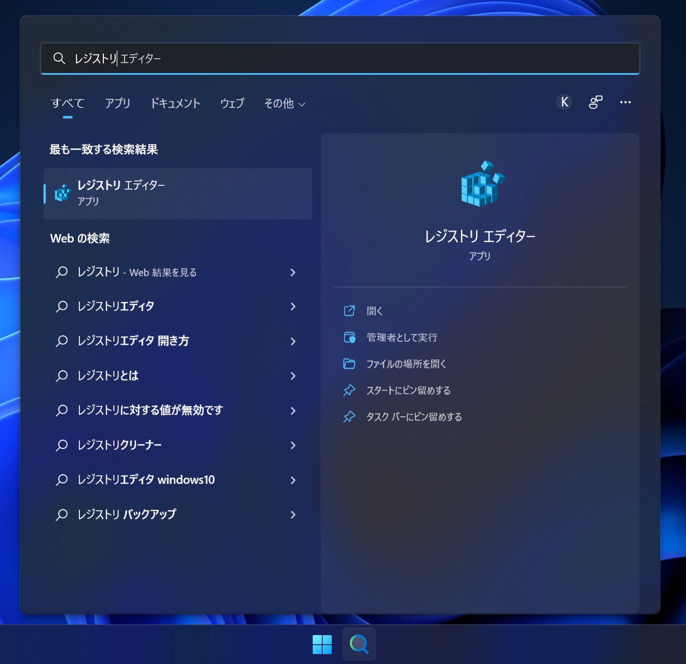
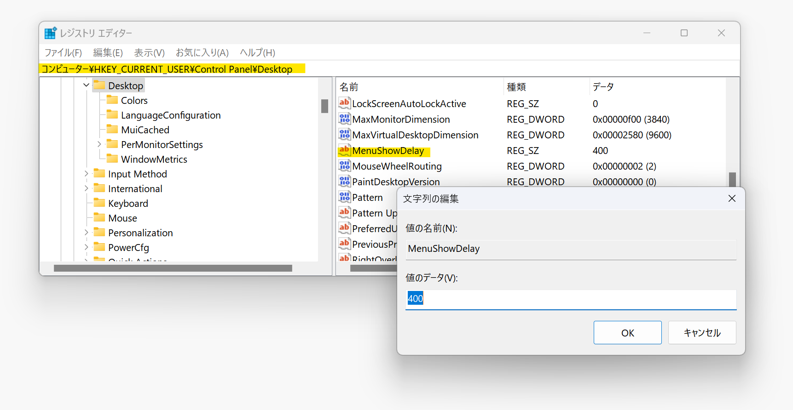

## 発生する問題
左側に表示されるサブメニューにカーソルを移動させると、サブメニューが閉じてしまう

## 原因
OSの設定でサブメニューの開閉猶予が極端に小さな数値に設定されていることが原因です。

## 対策
1. タスクバーの検索欄から*レジストリ*を検索し、*レジストリ エディター*を起動する

1. アドレス欄に*HKEY_CURRENT_USER\Control Panel\Desktop*を入力し、Enterキーを押す

1. *MenuShowDelay*欄をダブルクリックする
1. *生のデータ*欄に*400*等大きめの数値を入力し、*OK*ボタンをクリックする
1. PCを再起動する