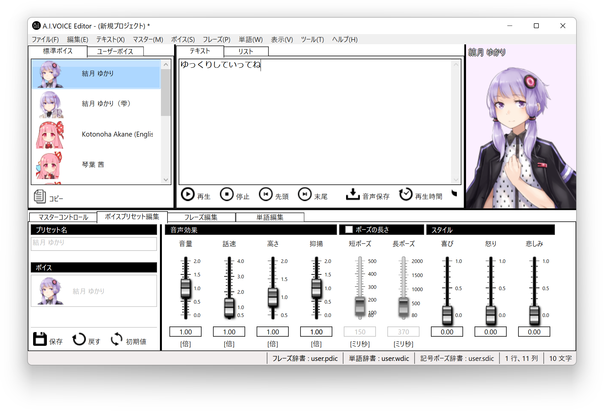
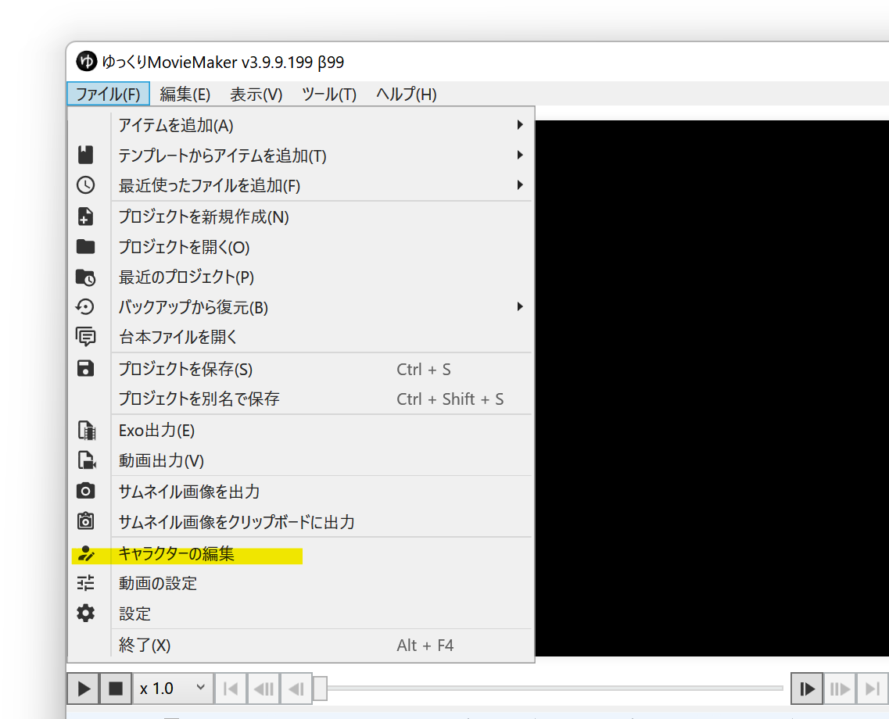
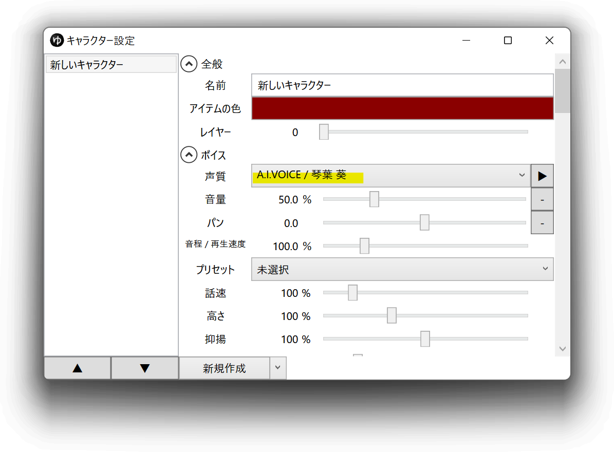
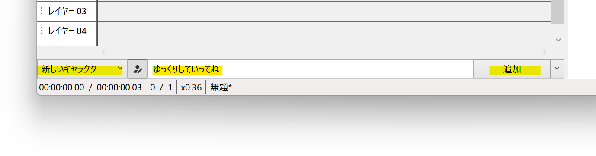
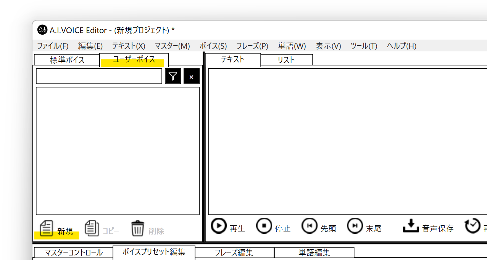
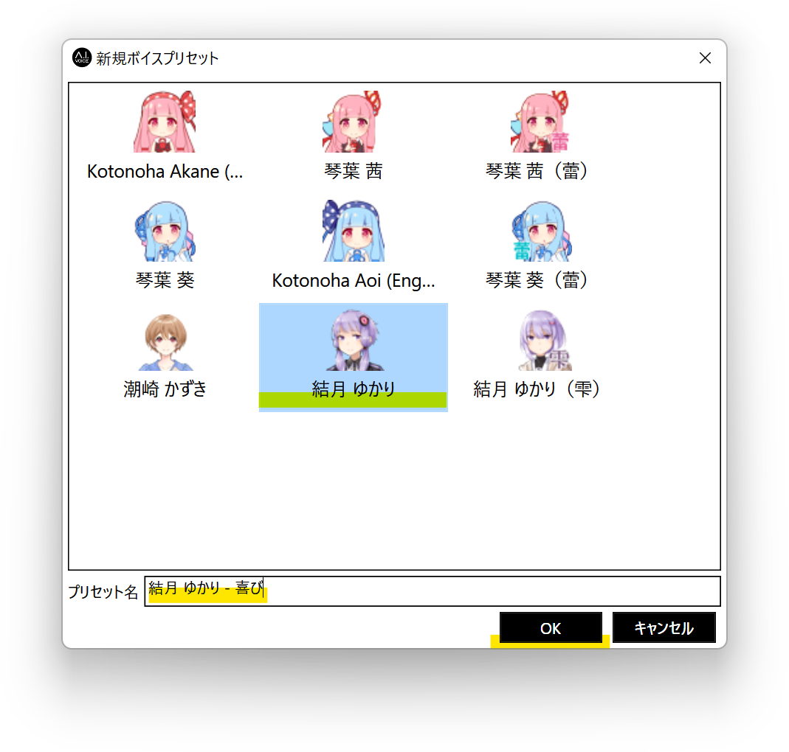
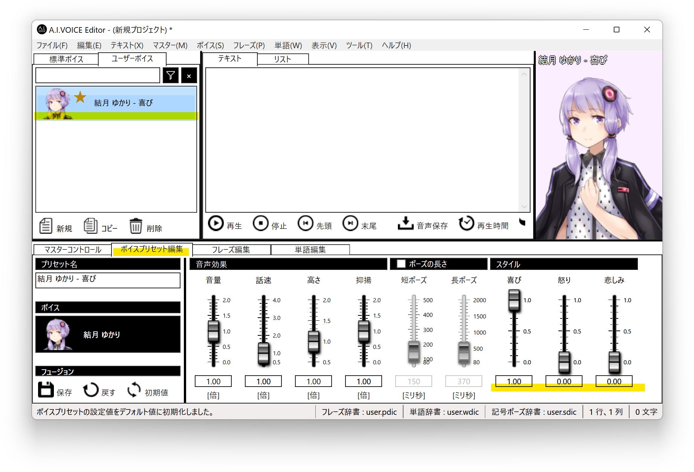
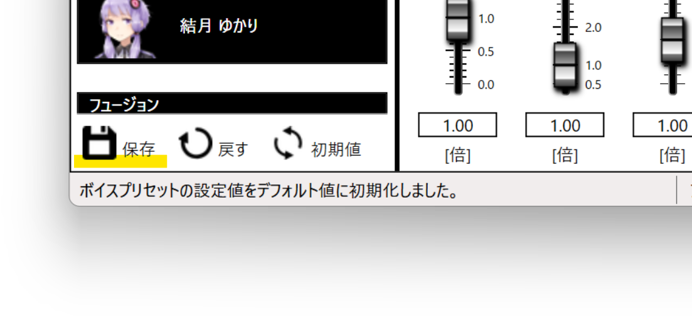
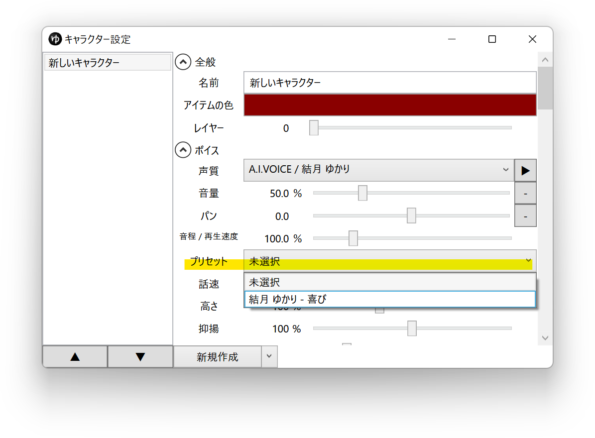

## A.I.VOICEとは

A.I.VOICE™は、音声合成AITalk®5 の技術を応用した個人利用者向けソフトです。  
外部連携APIを使用し、YMM4から直接音声を生成できます。  
- [個人向け音声合成ソフト A.I.VOICE™ | 公式サイト](https://aivoice.jp/)

> **Note**
> A.I.VOICEエディタのバージョンをv1.3.0以降に更新する必要があります

<AIVOICECards limit="10"/>

## 利用方法
1. A.I.VOICEを購入し、お使いのPCにインストールする
1. ゆっくりMovieMaker4を起動する
1. *ファイル(F)*→*キャラクターの編集*からキャラクター編集ウィンドウを表示する

1. *ボイス*→*声質*からA.I.VOICEの音声を選択する

1. タイムライン下のキャラクター一覧でキャラクターを選択後、セリフを入力し、追加ボタンをクリックする

## プリセット機能の使い方
A.I.VOICEで設定したプリセットをYMM4から利用することができます。
「喜び」「悲しみ」「怒り」等、YMM4から直接操作できない感情系パラメーターを利用したいときに使用します。

1. A.I.VOICEを起動する
1. *ユーザーボイス*タブ→*新規*ボタンをクリックする

1. 利用するキャラクターを選択し、*キャラクター名 - プリセット名*の形式でプリセット名を入力する

1. *OK*ボタンをクリックする
1. 保存したプリセットを選択し、*ボイスプリセット編集*タブから*スタイル*系パラメーターを変更する

1. *保存*ボタンをクリックし、変更内容を保存する

1. *キャラクター編集ウィンドウ*または*ボイスアイテムのアイテム編集欄*の*プリセット*欄から、保存したプリセットを選択する

## 利用条件等
- [ユースケース](https://aivoice.jp/usecase/)
- [エンドユーザー使用許諾契約書](https://aivoice.jp/usecase/#:~:text=A.I.VOICE%E3%82%A8%E3%83%B3%E3%83%89%E3%83%A6%E3%83%BC%E3%82%B6%E3%83%BC%E4%BD%BF%E7%94%A8%E8%A8%B1%E8%AB%BE%E5%A5%91%E7%B4%84%E6%9B%B8)
- [A.I.VOICE Editor API利用規約](https://aivoice.jp/manual/editor/api.html#termsandconditions)
- [FAQ](https://aivoice.jp/faq/)