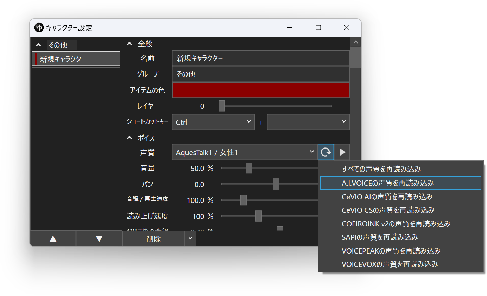

## 発生する症状
A.I.VOICEをインストールしているのにもかかわらず、YMM4の声質欄にA.I.VOICEキャラクターが表示されない

## 対策1: A.I.VOICEのバージョンを更新する
YMM4からA.I.VOICEの音声を利用するためには、A.I.VOICEエディタv1.3.0以降をインストールする必要があります。  

### A.I.VOICEエディタのバージョンの確認方法
1. *ヘルプ(H)*→*バージョン情報(A)*を選択する

1. Version 1.3.0以降になっているかどうかを確認する

## 対策2: 声質一覧を更新する
1. キャラクター編集ウィンドウを開く
1. 声質一覧右側の更新ボタンをクリックする
1. *A.I.VOICEの声質を再読み込み*をクリックする

> **NOTE**
> 声質一覧を更新してもA.I.VOICEのキャラクターが声質一覧に表示されない場合、A.I.VOICEを再インストールしてください。  
> 再インストール後、再度声質一覧を再読込するとキャラクターが声質一覧に表示されるようになります。