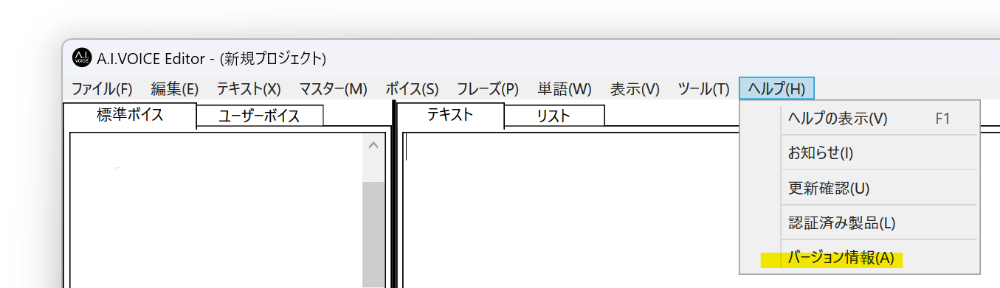
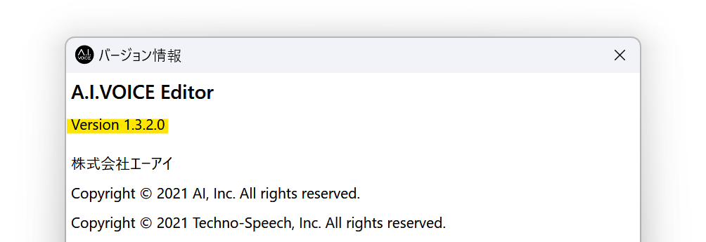

## 発生する症状
A.I.VOICEをインストールしているのにもかかわらず、YMM4の声質欄にA.I.VOICEキャラクターが表示されない

## 対策
YMM4からA.I.VOICEの音声を利用するためには、A.I.VOICEエディタv1.3.0以降をインストールする必要があります。  

### A.I.VOICEエディタのバージョンの確認方法
1. *ヘルプ(H)*→*バージョン情報(A)*を選択する

1. Version 1.3.0以降になっているかどうかを確認する
