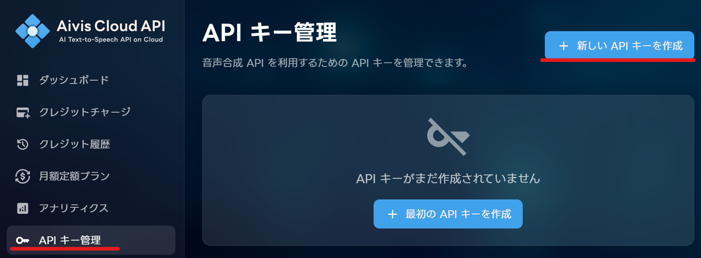
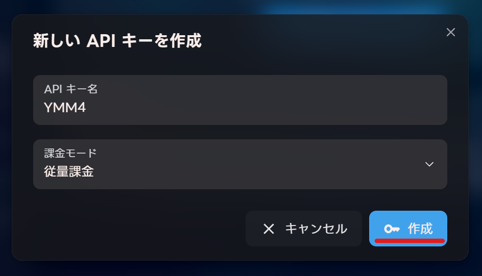
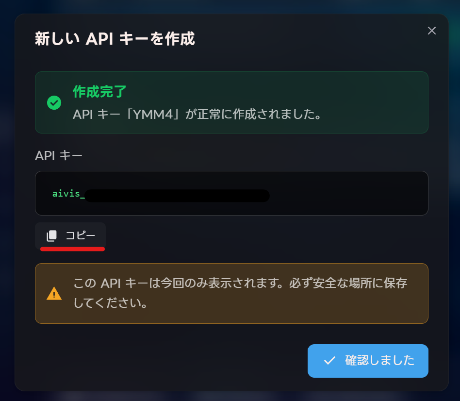
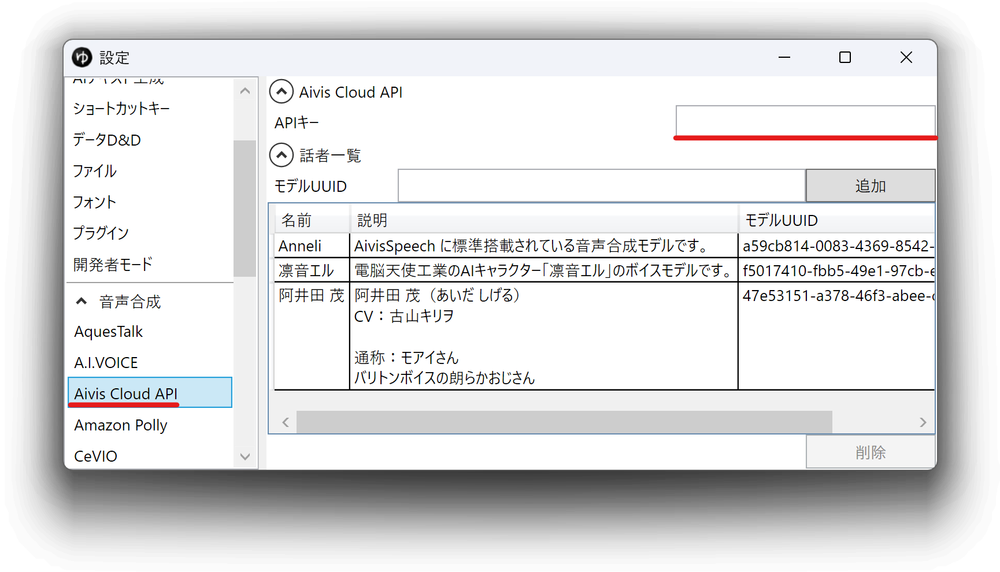
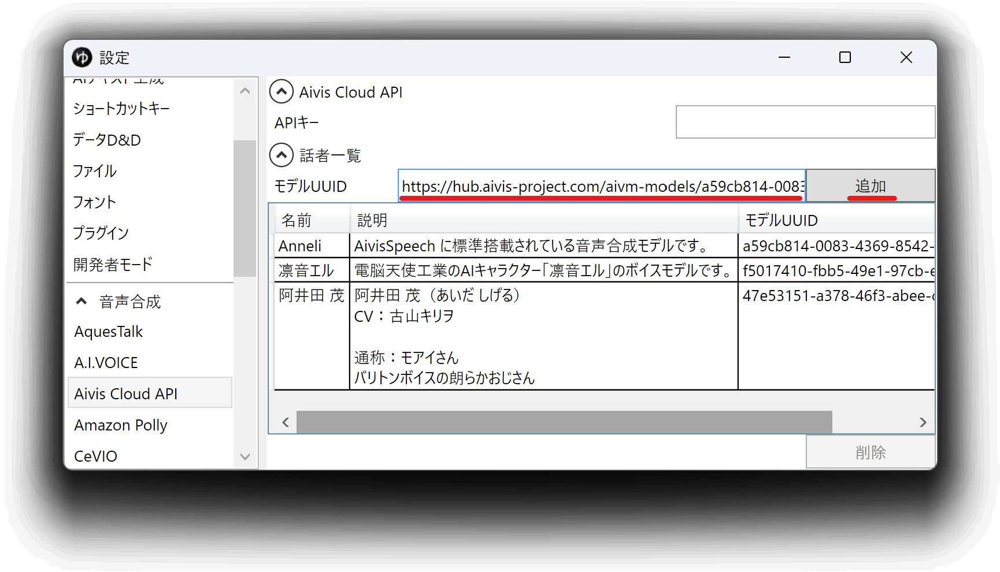

## AivisCloudAPIとは

[Aivis Cloud API](https://hub.aivis-project.com/cloud-api/dashboard)はJPchain株式会社によって開発されているクラウド音声合成サービスです。  
外部連携APIを使用し、YMM4から直接音声を生成できます。  
- [Aivis Cloud API](https://hub.aivis-project.com/cloud-api/dashboard)

## 利用方法
1. [AivisCloudAPI](https://hub.aivis-project.com/cloud-api/dashboard)のアカウントを作成する
1. APIキーを作成する
   1. *API キー管理*→*新しい API キーを作成*をクリックする
   
   1. API名、課金モードを選択し、APIキーを作成する
   
   1. *コピー*ボタンをクリックし、APIキーをコピーする
   
1. ゆっくりMovieMaker4を起動する
1. APIキーをYMM4に設定する  
   1. *ファイル(F)*→*設定*から設定ウィンドウを開く
   1. *音声合成*→*AivisCloudAPI*を選択する
   1. *APIキー*欄に、*2-3.*でコピーしたAPIキーを貼り付ける
   
1. 使用する話者を追加する
   1. [AivisHub](https://hub.aivis-project.com/)を開く
   1. 使用したい話者の詳細ページのURLをコピーする  
   （例: https://hub.aivis-project.com/aivm-models/a59cb814-0083-4369-8542-f51a29e72af7）
   1. *モデルUUID*欄に*5-2.*でコピーしたURLを貼り付け、*追加*ボタンをクリックする
   
1. *ファイル(F)*→*キャラクターの編集*からキャラクター編集ウィンドウを開く
1. *ボイス*→*声質*欄で、AivisCloudAPIの音声を選択する
1. キャラクターを選択後、*ここに台詞を入力*欄にセリフを入力し、*追加*ボタンをクリックする

## 関連リンク
- [Aivis Cloud API](https://hub.aivis-project.com/cloud-api/dashboard)