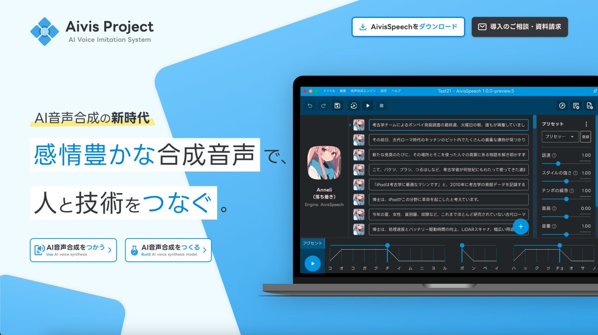

## AivisSpeechとは

[AivisSpeech](https://aivis-project.com/)はJPchain株式会社によって開発されているフリーの音声合成ソフトです。  
VOICEVOX互換の外部連携APIを使用し、YMM4から直接音声を生成できます。  
- [AivisProject](https://aivis-project.com/)

## 利用方法
1. [AivisSpeech](https://aivis-project.com/)をインストールする
1. ゆっくりMovieMaker4を起動する
1. AivisSpeechをYMM4に設定する  
   - ※ AivisSpeechをデフォルトのインストール場所にインストールしている場合、この設定は不要です。
   1. *ファイル(F)*→*設定*から設定ウィンドウを開く
   1. *VOICEVOX*→*アプリケーション一覧*から*AivisSpeech*を選択する
   1. *実行ファイル*欄右側のフォルダボタンをクリックし、*1.*でインストールしたフォルダ内にある*AivisSpeech.exe*を選択する  
1. *ファイル(F)*→*キャラクターの編集*からキャラクター編集ウィンドウを開く
1. *ボイス*→*声質*欄で、AivisSpeechの音声を選択する
1. キャラクターを選択後、*ここに台詞を入力*欄にセリフを入力し、*追加*ボタンをクリックする

## 声質一覧を再読み込みする
新しくキャラクターをインストールした場合、YMM4の声質一覧にキャラクターが表示されない場合があります。  
声質一覧を更新するとキャラクターが一覧に表示されるようになります。
1. キャラクター編集ウィンドウを開く
1. 声質一覧右側の更新ボタンをクリックする
1. *VOICEVOXの声質を再読み込み*をクリックする

## 関連リンク
- [AivisProject](https://aivis-project.com/)