## Amazon Pollyとは
Amazonの提供するクラウド音声合成サービスです。
利用にはクレジットカードの登録が必要です。

- [Amazon Polly](https://aws.amazon.com/jp/polly/)

## Amazon Pollyの利用方法
1. [AWSアカウントを作成する](https://aws.amazon.com/jp/)
1. AWSにサインインする
1. *サービス*→*セキュリティ、ID、およびコンプライアンス*→*IAM*をクリックする
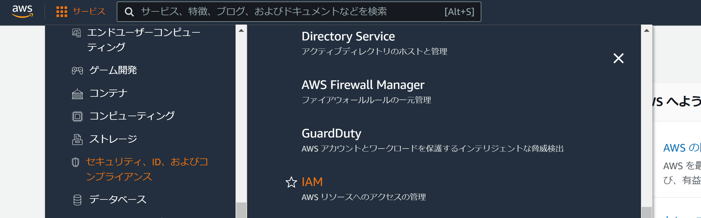
1. *User groups*をクリックする
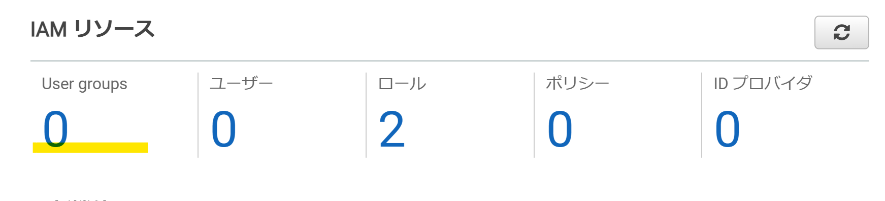
1. *グループを作成*をクリックする
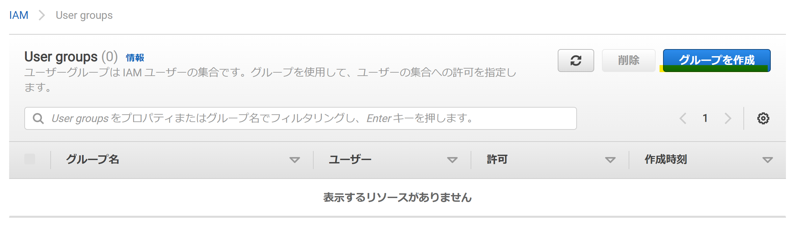
1. 任意のグループ名を入力する
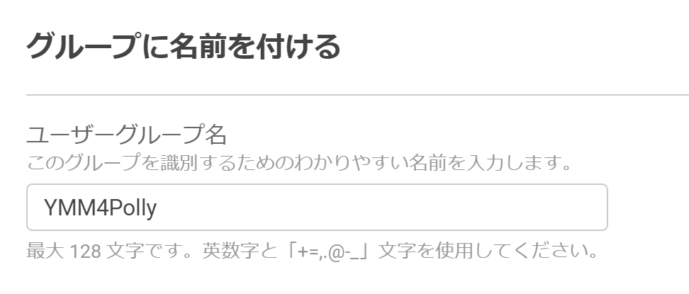
1. 検索欄に*Polly*と入力してから*Enter*キーを押した後、*AmazonPollyReadOnlyAccess*欄にチェックを入れる
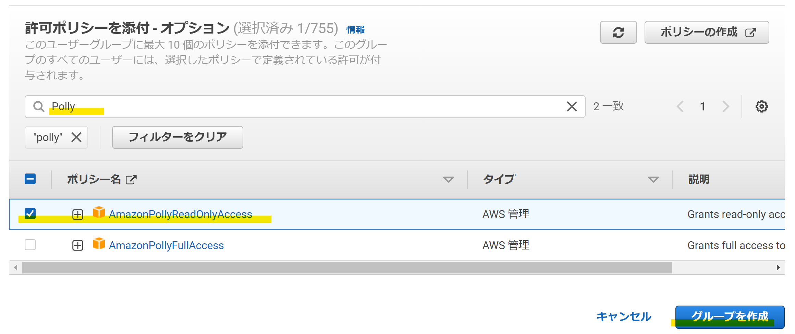
1. グループを作成ボタンをクリックする
1. IAMダッシュボードに戻る
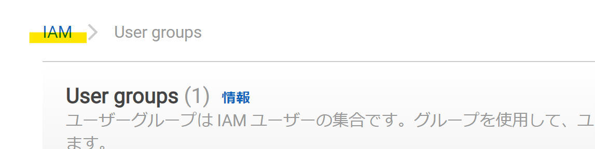
1. *ユーザー*をクリックする
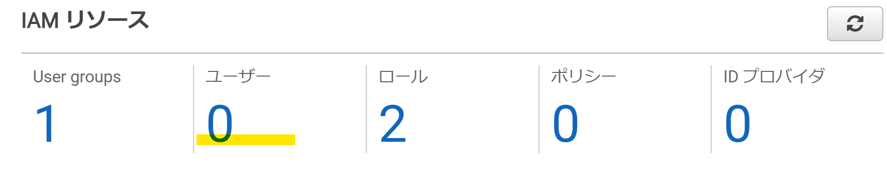
1. *ユーザーを追加*をクリックする
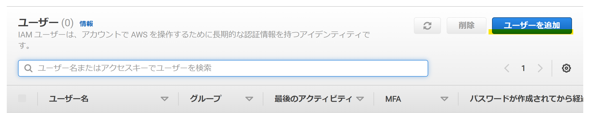
1. *ユーザー名*を入力し、*アクセスキー-プログラムによるアクセス*にチェックを入れる
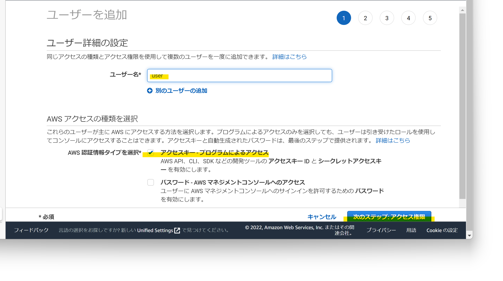
1. *次のステップ:アクセス権限*をクリックする
1. *ユーザーをグループに追加*を選択し、上で作成したグループにチェックを入れる
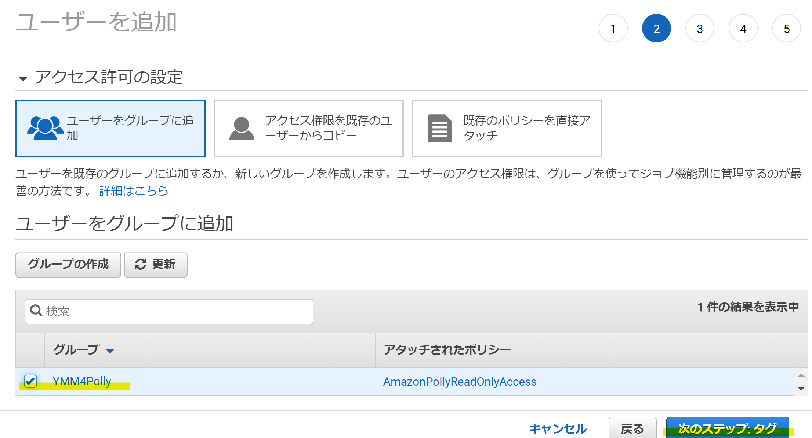
1. *次のステップ:タグ*をクリックする
1. 何も入力せず、*次のステップ:確認*をクリックする
1. *ユーザーの作成*をクリックする
1. *アクセスキーID*と*シークレットアクセスキー*をメモ帳に控えておく
   - このキーは第三者と共有しないでください
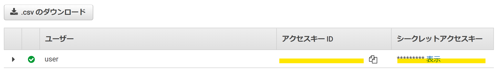
1. YMM4を起動する
1. *ファイル(F)*→*設定*→*Amazon Polly*をクリックし、上で控えた*アクセスキー*と*シークレットキー*を設定する
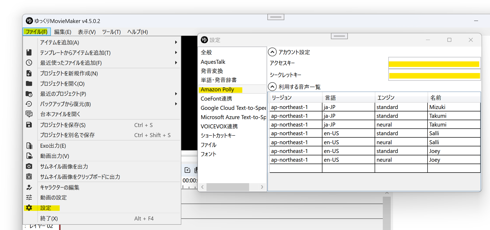
1. 必要に応じて、利用する音声を追加します。[利用可能な音声一覧はこちら。](https://docs.aws.amazon.com/polly/latest/dg/voicelist.html)
1. 設定が完了すると、キャラクター設定ウィンドウの声質欄に音声が表示されます。
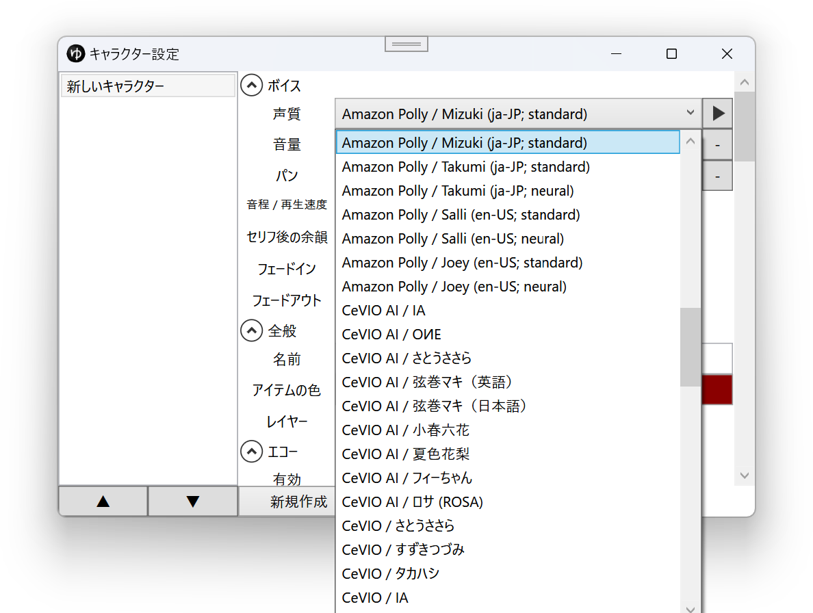