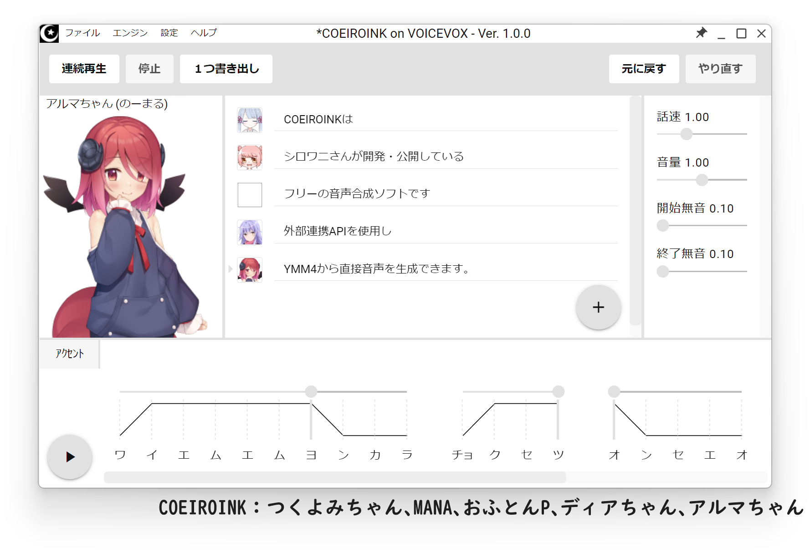
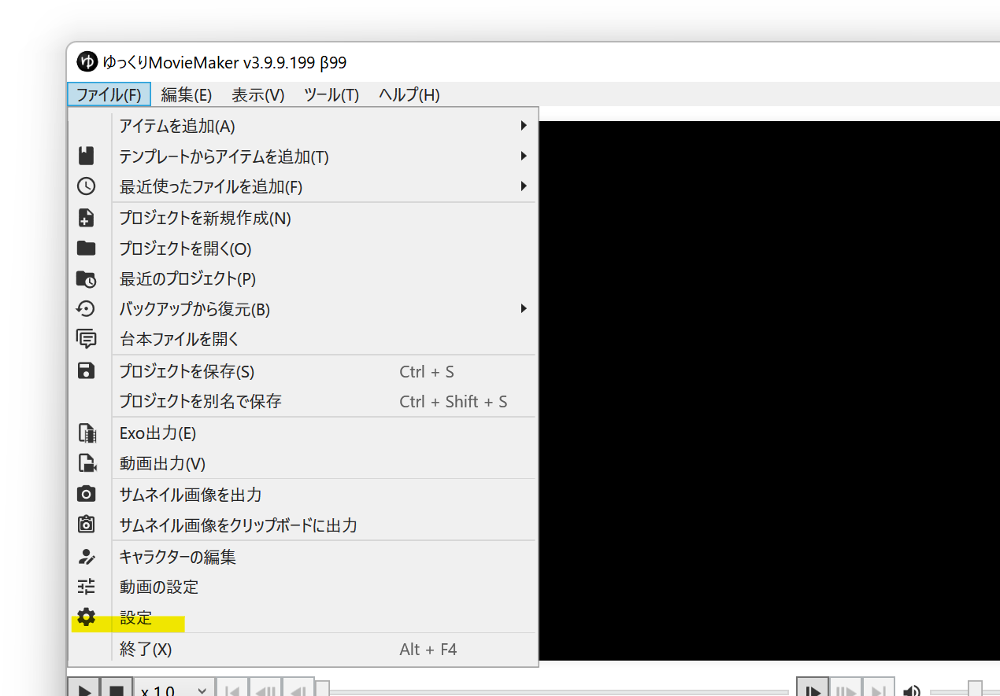
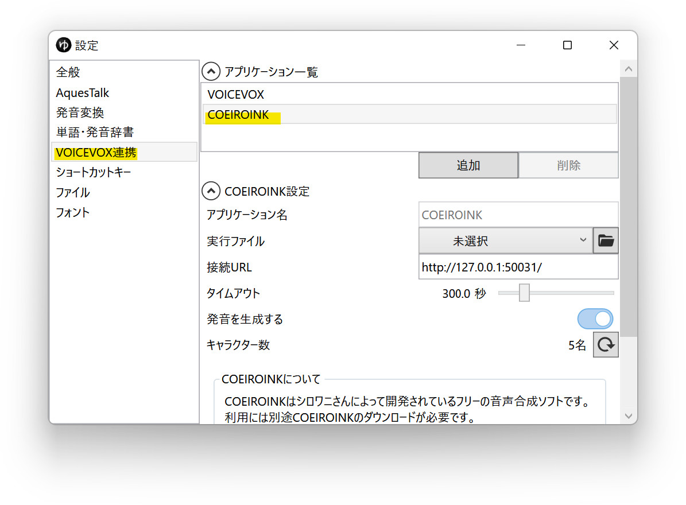
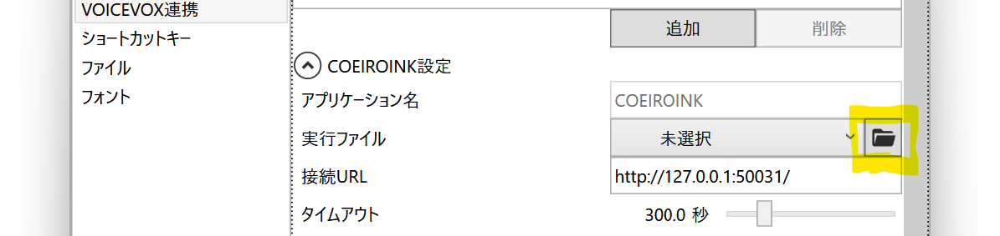
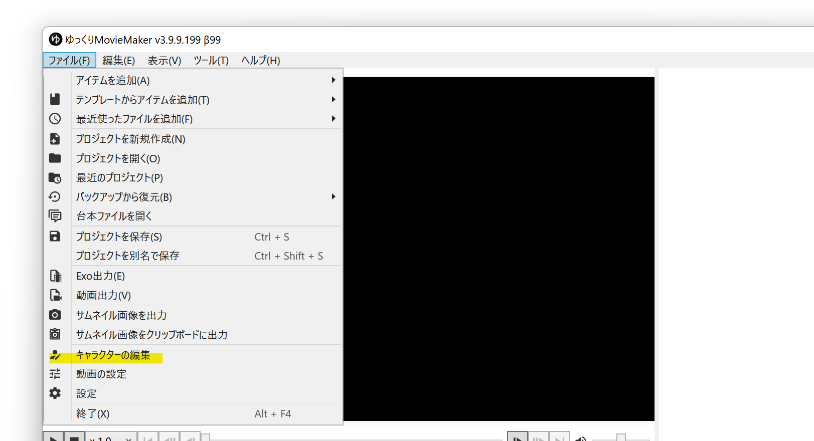
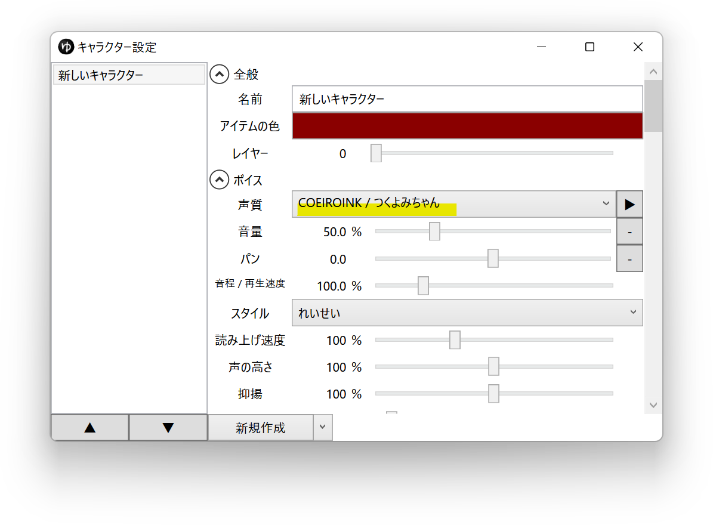
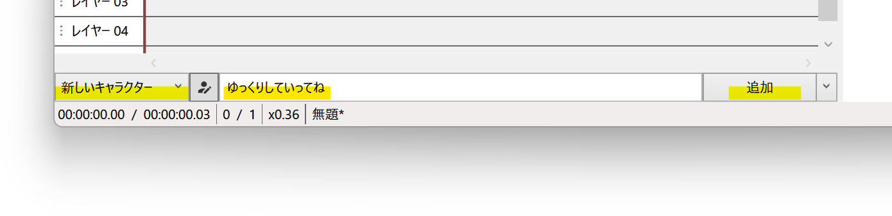

## COEIROINKとは

COEIROINKは、シロワニさんが開発・公開しているフリーの音声合成ソフトです。  
VOICEVOXのUIを利用して作成されています。  
外部連携APIを使用し、YMM4から直接音声を生成できます。  
※細かい利用規約は[COEIROINK公式サイト](https://coeiroink.com/terms)をご確認ください。
- [COEIROINK](https://coeiroink.com/)

## 使い方
1. [COEIROINK](https://coeiroink.com/)をダウンロードし、任意のフォルダに展開する
1. ゆっくりMovieMaker4を起動する
1. *ファイル(F)*→*設定*から設定ウィンドウ開く

1. *VOICEVOX*→*アプリケーション一覧*から*COEIROINK*を選択する

1. *実行ファイル*欄右側のフォルダボタンをクリックし、*1.*で保存したフォルダ内にある*COEIROINKonVOICEVOX.exe*を選択する

1. *ファイル(F)*→*キャラクターの編集*からキャラクター編集ウィンドウを開く

1. *ボイス*→*声質*欄で、COEIROINKの音声を選択する

1. キャラクターを選択後、*ここにセリフを入力*欄にセリフを入力し、*追加*ボタンをクリックする

## MYCOEIROINKを利用してユーザー音声を利用する
ユーザー音声ライブラリを作成したり、配布されている音声ライブラリをCOEIROINKに追加することが出来ます。
- [MYCOEIROINK](https://coeiroink.com/mycoeiroink)

## 利用条件等
- [共通利用規約](https://coeiroink.com/terms)
- [キャラクター別利用規約](https://coeiroink.com/character/list)
- [Q&A](https://coeiroink.com/q_and_a)
- [MYCOEIROINK](https://coeiroink.com/mycoeiroink)