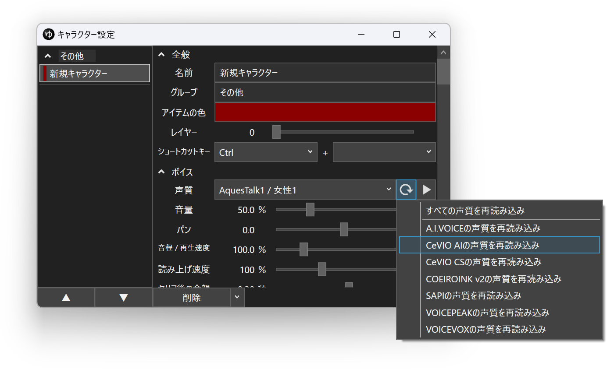

## CeVIO AI / CeVIO CS とは

有料の音声合成ソフトです。  
外部連携APIを使用し、YMM4から直接音声を生成できます。
### CeVIO AI
<CeVIOCards limit="10"/>

### CeVIO Creative Studio
<Flex>
    <AmazonCard item="B01N2JJ0DI"/>
    <AmazonCard item="B01MXNYBFM"/>
    <AmazonCard item="B01NB9XW1L"/>
</Flex>

## 利用方法
1. 利用したいCeVIO AI / CeVIO CS を購入し、インストールする
    - 初回購入はトークスターター、それ以降はトークボイスを購入します
1. CeVIO IA / CeVIO CSを起動する
1. *ヘルプ(H)*→*ライセンス認証(L)*をクリックする

1. ライセンス番号を入力し、*OK*ボタンをクリックする

1. ゆっくりMovieMaker4を起動する
1. セリフ入力欄左側のキャラクター設定ボタンをクリックする

1. *新規作成*ボタンをクリックし、キャラクターを追加する

1. *全般*→*名前*欄に任意の名前を入力する

1. *ボイス*→*声質*欄で、利用するCeVIOエンジンを選択する

1. タイムライン下のキャラクター一覧でキャラクターを選択後、セリフを入力し、追加ボタンをクリックする

## 声質一覧を再読み込みする
新しくキャラクターをインストールした場合、YMM4の声質一覧にキャラクターが表示されない場合があります。  
声質一覧を更新するとキャラクターが一覧に表示されるようになります。
1. キャラクター編集ウィンドウを開く
1. 声質一覧右側の更新ボタンをクリックする
1. *CeVIO AIの声質を再読み込み*または*CeVIO CSの声質を再読み込み*をクリックする

> **NOTE**
> 声質一覧を再読込してもCeVIOのキャラクターが声質一覧に表示されない場合、CeVIOを再インストールしてください。  
> 再インストール後、再度声質一覧を再読込するとキャラクターが声質一覧に表示されるようになります。

## 利用条件等
### さとうささら / すずきつづみ / タカハシ
- [音声データやキャラクターの利用について](https://cevio.jp/commercial/)
- [CeVIO キャラクターライセンス](https://cevio.jp/cevio_character_licence/)

### IA
- [1st PLACE ⼆次創作ガイドライン](https://1stplace.co.jp/contact/voice_character_rule.pdf)

### ONE
- [「CeVIO AI ONE TALK -ARIA ON THE PLANETES-」利用規約](https://www.techno-speech-products.com/cevio-ai-one-talk-terms)
- [音声利用のルール](https://1stplace.co.jp/original/software/cevio/voice_rule.pdf)
- [1st PLACE ⼆次創作ガイドライン](https://1stplace.co.jp/contact/voice_character_rule.pdf)

### 小春六花 / 夏色花梨 / 花隈千冬
- [CeVIO AIのライセンス種別](https://www.ah-soft.com/commercial/cevio/)
- [キャラクター使用ガイドライン - TOKYO6 ENTERTAINMENT 公式サイト](https://tokyo6.tokyo/guidelines/)

### 弦巻マキ
- [CeVIO AIのライセンス種別](https://www.ah-soft.com/commercial/cevio/)
- [AH-Software 個人・同人サークル作品の配布・公開について](https://www.ah-soft.com/licensee/)

### フィーちゃん
- [「CeVIO AI フィーちゃん」利用規約](https://www.techno-speech-products.com/cevio-ai-fee-chan-talk-terms)
- [2次創作ガイドライン](http://info.u-stella.co.jp/fanfiction-guideline/)

### ロサ（ROSA）
- [使用許諾など](https://www.ssw.co.jp/products/talk/cevio_rosa/license.html)
- [キャラクター使用に関するガイドライン](https://www.ssw.co.jp/products/talk/cevio_rosa/c_guide.html)
