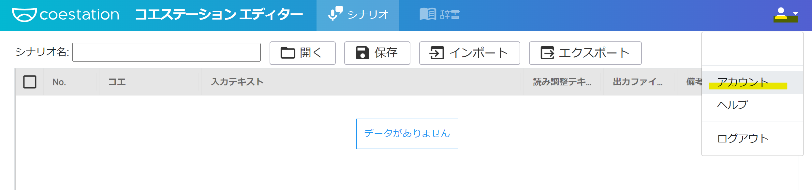
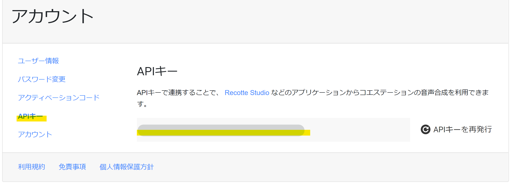
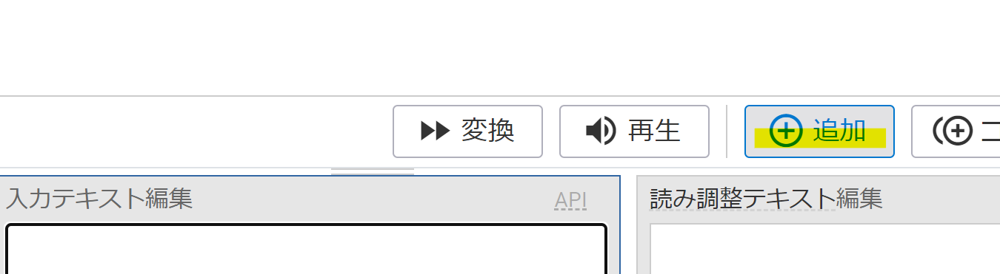
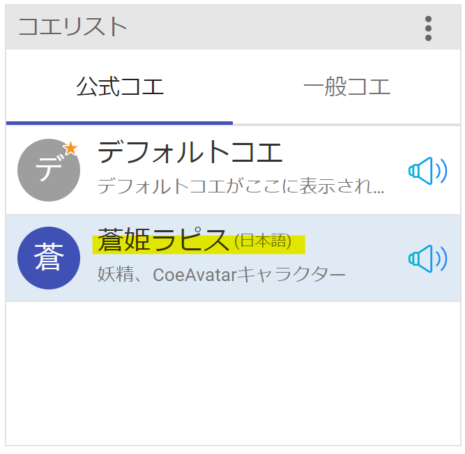
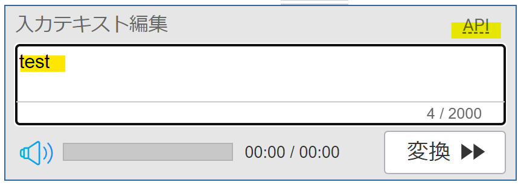
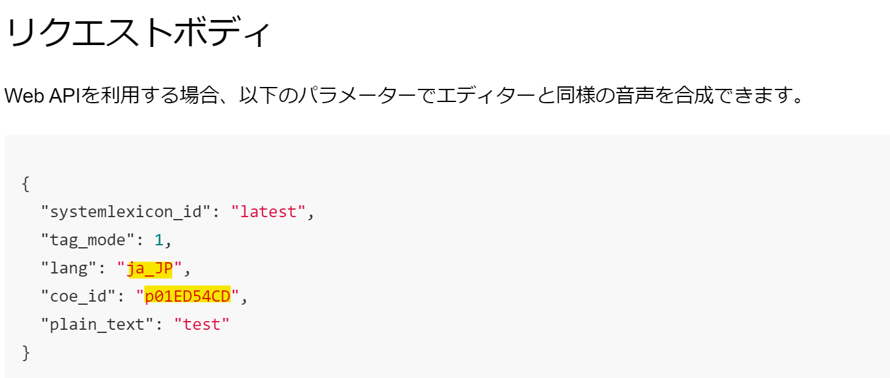
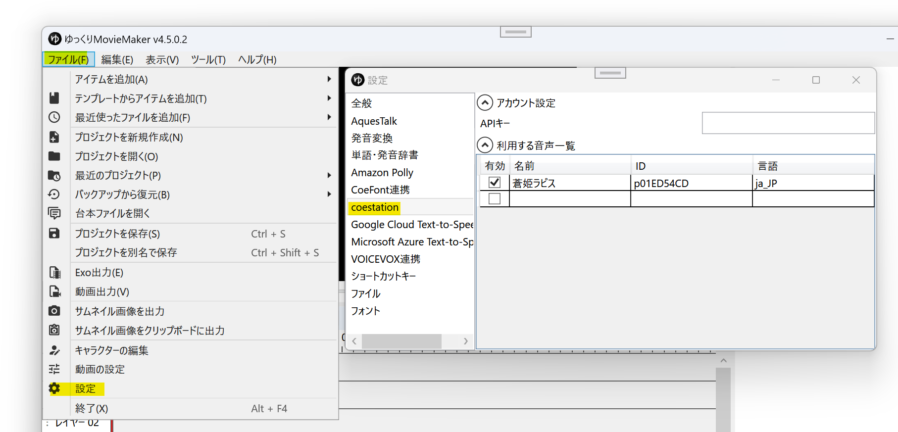
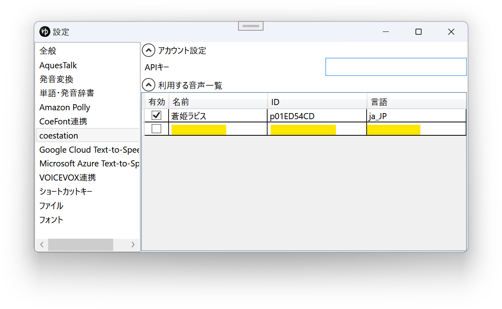

## CoeAvatarとは
コエステ株式会社の提供するクラウド音声合成サービスです。  

- [CoeAvatar](https://coeavatar.com/)

<CoeAvatarCards/>

## CoeAvatarの利用方法
1. [CoeAvatar](https://coeavatar.com/)のキャラクターを購入し、coestationに登録する
1. [コエステーションエディター](https://editor.coestation.jp/login)にログインする
1. *右上のアイコン*→*アカウント*をクリックする

1. *APIキー*をクリック後、表示されたキーをコピーする

1. YMM4を起動する
1. *ファイル(F)*→*設定*→*coestation*へ移動し、*APIキー*を設定する

1. APIキーを設定すると、キャラクター設定ウィンドウの声質欄に音声が表示されます。

## coestation / CoeAvatarの音声をYMM4に登録する
デフォルトでは「蒼姫ラピス」が登録されています。
「蒼姫ラピス」以外のキャラクターを使用したい場合、以下の方法でキャラクターをYMM4に登録する必要があります。

1. [コエステーションエディター](https://editor.coestation.jp/login)にログインする
1. *追加*ボタンをクリックする

1. *コエリスト*で使用したいキャラクターを選択する

1. *入力テキスト編集*欄に適当な文章を入力後、右上の*API*欄をクリックする

1. *lang*欄と*coe_id*欄右側の文字をコピーする

1. YMM4を起動する
1. *ファイル(F)*→*設定*→*coestation*をクリックする

1. *名前*欄にキャラクターの名前を入力し、*ID*、*言語*欄に上でコピーした文字を貼り付ける

1. *Enter*キーを押して入力を確定させる
1. 設定が完了すると、キャラクター設定ウィンドウの声質欄に音声が表示されます。

## 利用条件等
- [商用利用に関する注意表](https://coeavatar.com/assets/pdf/commercial_use.pdf)
- [FAQ](https://coeavatar.com/faq/)