## CoeFont とは
(株)CoeFontによって運営されている、クラウドAI音声合成サービスです。  
外部APIを使用して、ゆっくりMovieMaker4から直接音声合成を行うことができます。
- [CoeFont](https://coefont.cloud/)

## 利用方法
### 無料提供されているCoeFontを利用する場合
以下のCoeFontは(株)CoeFont様のご厚意により、無料で提供されています。  
ユーザー登録や、ゆっくりMovieMaker4側の設定なしに無料でご利用いただけます。
- アリアル（通常、喜、怒、哀、楽）
- ミリアル（通常）
1. キャラクター設定ウィンドウを開く
1. *ボイス*→*声質*から利用したい音声を選択する
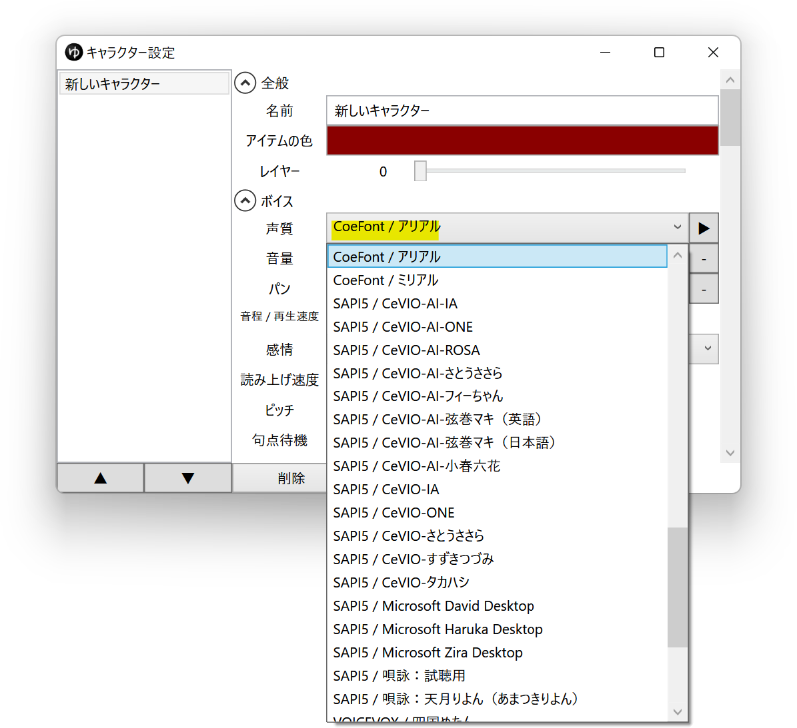
1. *ボイス*→*感情*から利用したい感情を選択する
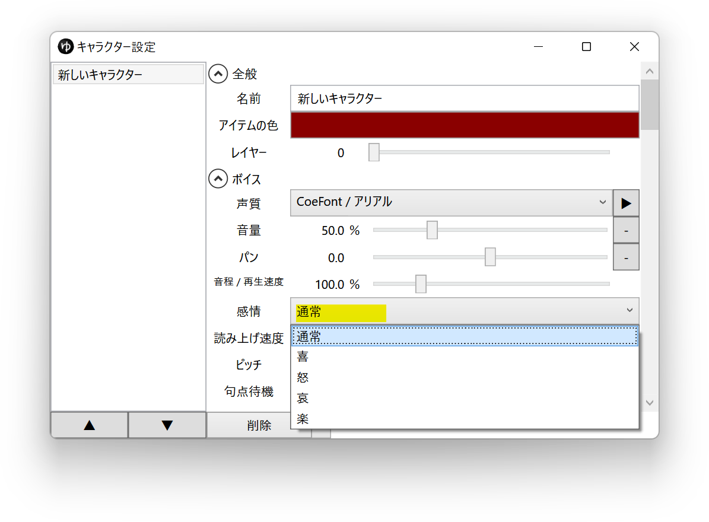

### その他のCoeFontを利用する場合
アリアル（通常、喜、怒、哀、楽）、ミリアル（通常）以外のCoeFontを利用する場合、Lite以上のプランに加入する必要があります。  
また、使用ポイントが1文字あたり5ポイント未満のCoeFont(無料期間中のAveruni等)に関しても、YMM4経由での利用の際は5pt消費されます。

### APIの設定をする
1. [CoeFont](https://coefont.cloud/)へアクセスし、ユーザー登録をする
1. エディタ画面にアクセスし、右上の「プランに入る」ボタンをクリックする
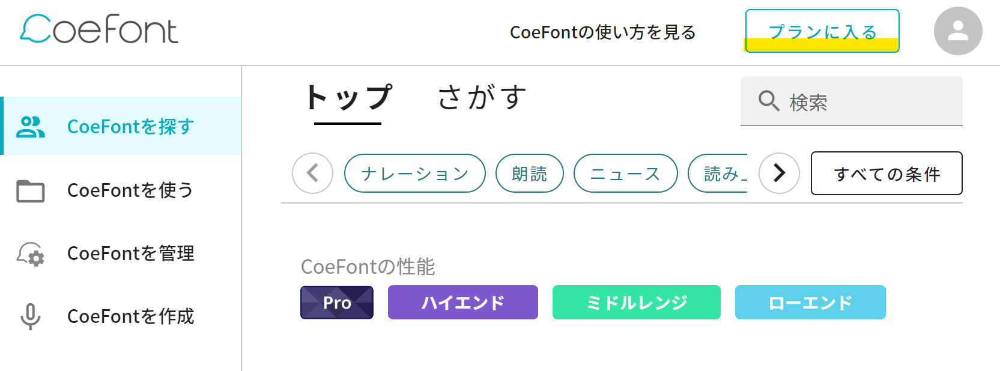
1. APIが利用できる「ライト」プラン以上に加入する
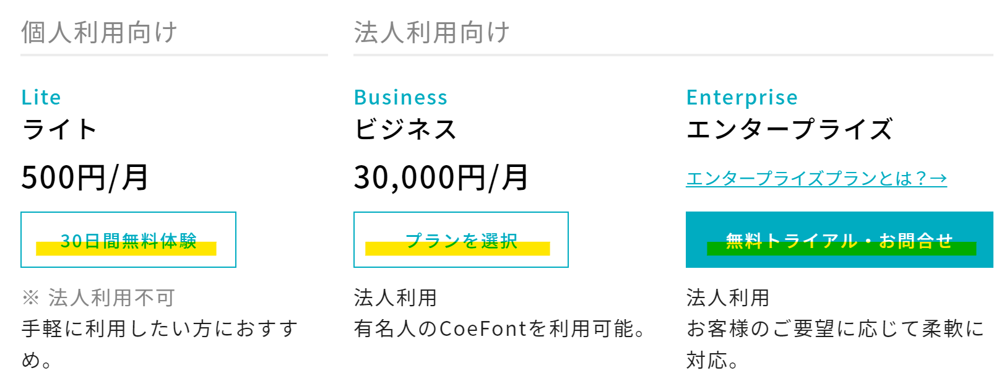
1. 右上のユーザーアイコンからアカウント設定画面へ移動する
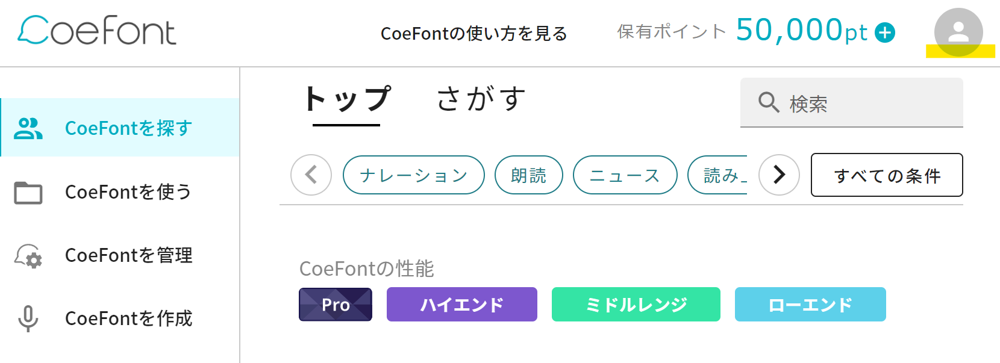
1. 左メニューの*API情報*からAPIページへアクセスし、*Access Key と ClientScecretを生成*ボタンをクリックする
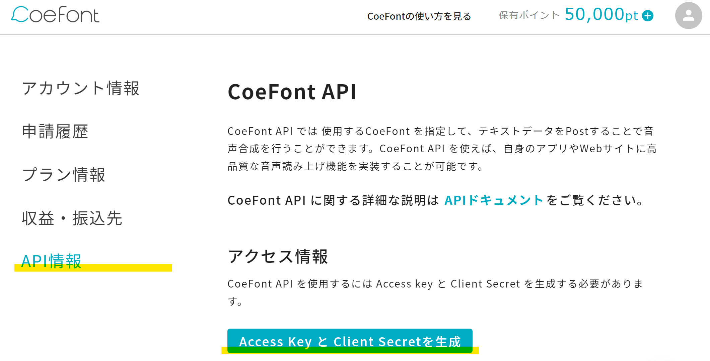
1. 表示されたAccessKeyとClientSecretをコピーし、メモ帳等に控えておく
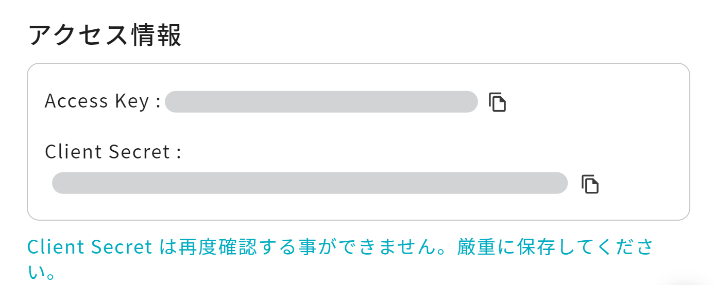
1. ゆっくりMovieMaker4を起動する
1. *ファイル(F)*→*設定*をクリックし、設定ウィンドウを開く
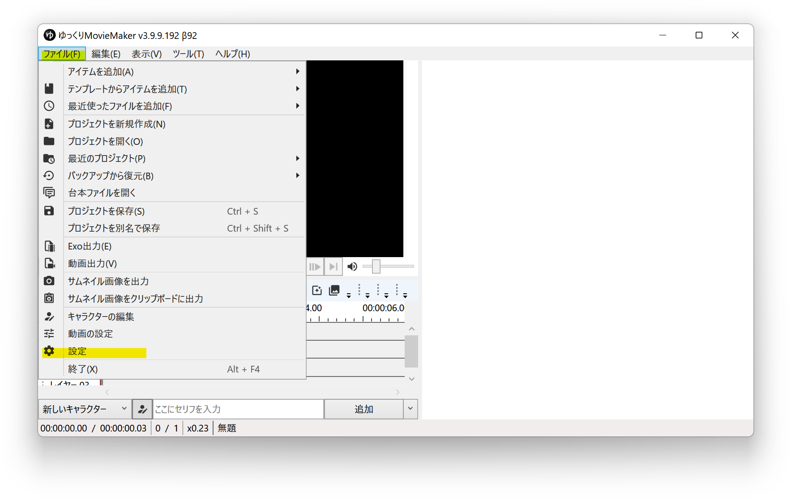
1. *CoeFont連携*→*API設定*の*Access Key*、*Client Secret*欄に*6.*で控えた内容を貼り付ける
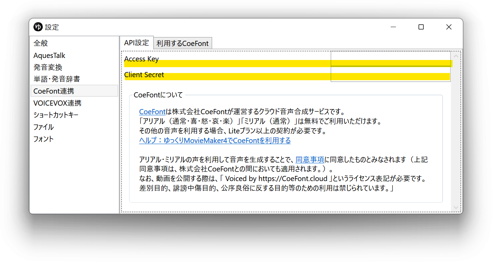

### 利用するCoeFontを設定する
ここでは*ミリアル(喜)*を例に説明します。
1. CoeFontのエディタ画面にアクセスし、利用したいCoeFont（ここでは*ミリアル(喜)*）をクリックする
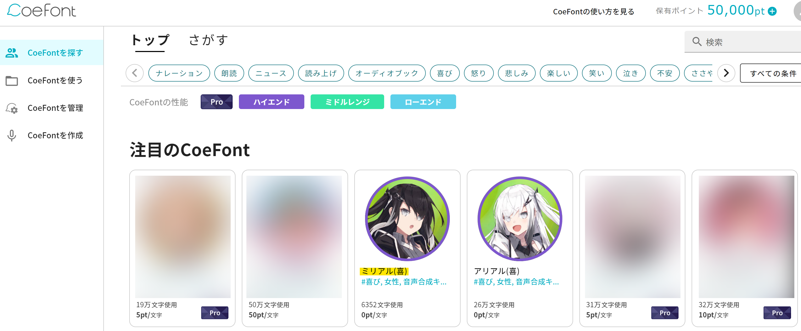
1. 表示されたページのURLをコピーする
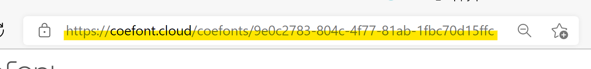
1. ゆっくりMovieMaker4を起動する
1. *ファイル(F)*→*設定*をクリックし、設定ウィンドウを開く

1. *CoeFont連携*→*利用するCoeFont一覧*タブをクリックする
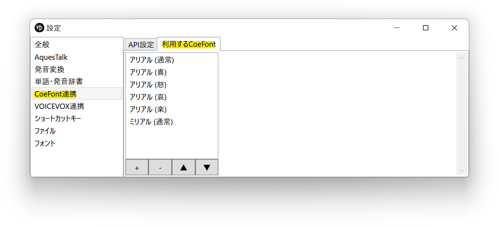
1. 左下の*+*ボタンをクリック後、各種項目を設定する
   - *表示名* *感情* : 利用するCoeFontの名前と感情名。任意の文字列を設定できます。
   - *IDまたはURL* : *2.*でコピーしたURLを貼り付ける
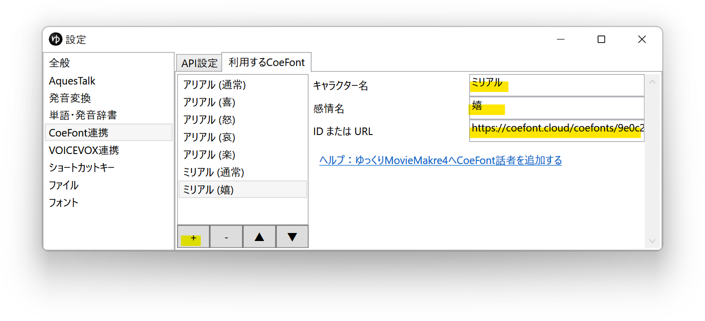
1. [声質を変更する](/ymm4/faq/ゆっくりボイス/声質を変更する/)のページを参考にし、*キャラクター編集ウィンドウ*→*ボイス*→*声質*欄で、*6.*で設定した表示名の声質を選択する

## 利用条件等
CoeFontを利用して作成した動画を公開する場合、「 Voiced by https://CoeFont.cloud 」というライセンス表記が必要です。  
差別目的、誹謗中傷目的、公序良俗に反する目的での利用は禁じられています。  

### 無償提供CoeFont同意事項
ゆっくりMovieMaker4アプリ内でご確認ください。
### CoeFont利用規約
- [CoeFont利用規約](https://coefont.cloud/termsOfUse)
