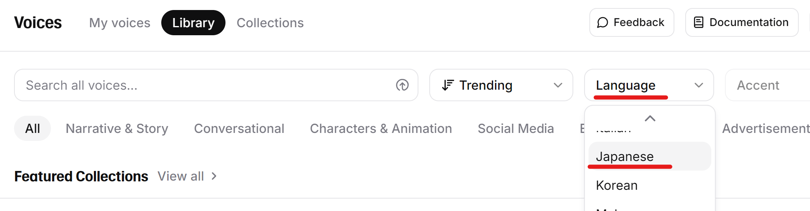
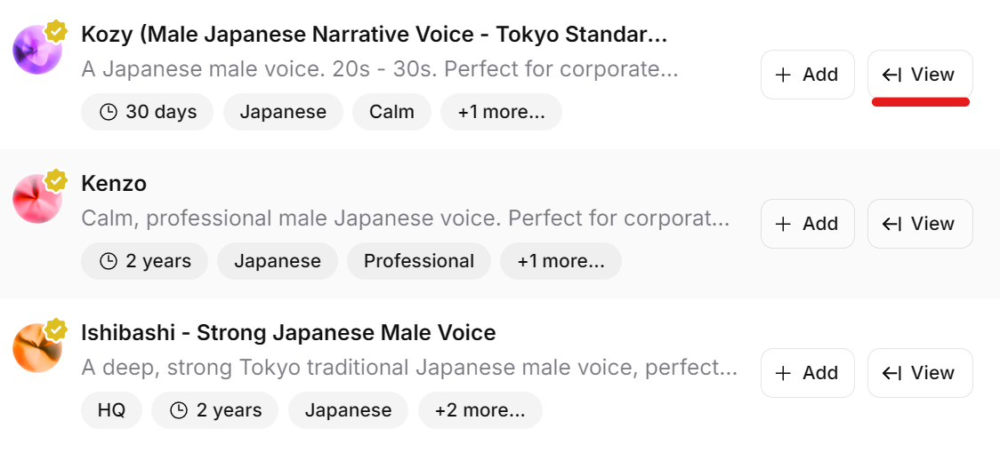
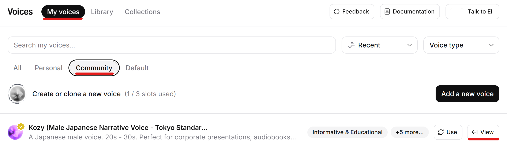

## ElevenLabsとは
[ElevenLabs](https://elevenlabs.io/)はElevenLabs社によって運営されているクラウド音声合成サービスです。  
外部連携APIを使用し、YMM4から直接音声を生成できます。  
利用には別途APIキーの設定が必要です。  
- [ElevenLabs](https://elevenlabs.io/)

## 利用方法
1. [ElevenLabs](https://elevenlabs.io/)のアカウントを作成する
1. [Settings / API Keys](https://elevenlabs.io/app/settings/api-keys)を開く
1．*Create API Key*→*Create*からAPIキーを作成する

1. *Copy to Clipboard*をクリックし、APIキーをコピーする

1. YMM4を起動し、*ファイル(F)*→*設定*→*音声合成*→*ElevenLabs*を開く
1. *APIキー*にコピーしたAPIキーを貼り付ける

## 話者の追加
YMM4からElevenLabsの音声を利用するためには、事前にYMM4へElevenLabsの話者を登録する必要があります。

1. [ElevenLabs VoiceLibrary](https://elevenlabs.io/app/voice-library)を開く
1. *Language*欄で利用したい言語（Japanese）を選択する

1. 利用したい音声右側の*Add*ボタンをクリックし、アカウントでこの音声を使用できるようにする

1. 利用したい音声右側の*View*ボタンをクリックする

1. *ID*ボタンをクリックし、IDをコピーする

1. YMM4を起動し、*ファイル(F)*→*設定*→*音声合成*→*ElevenLabs*を開く
1. *名前*に任意の名前、*ID*に*5.*でコピーしたIDを貼り付ける

## 話者の削除
ElevenLabsでは、契約しているプラン毎に利用可能な話者の数が制限されます。  
以下の手順で使用しない音声を削除することが可能です。

1. [音声一覧ページを開く](https://elevenlabs.io/app/voice-lab)
1. *My voices*→*Community*タブを開き、削除したい音声の*View*ボタンをクリックする

1. *Delete*ボタンをクリックする

1. YMM4を起動し、*ファイル(F)*→*設定*→*音声合成*→*ElevenLabs*を開く
1. *話者一覧*で*3.*で削除した音声を選択し、*削除*ボタンをクリックする

## 関連リンク
- [ElevenLabs](https://elevenlabs.io/)