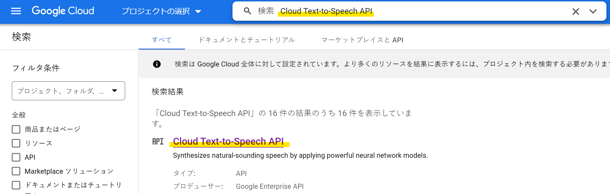
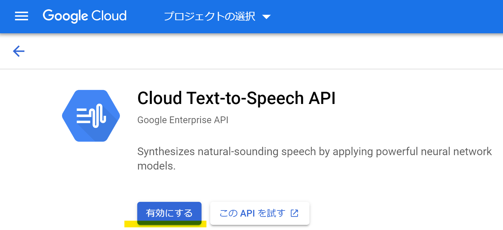
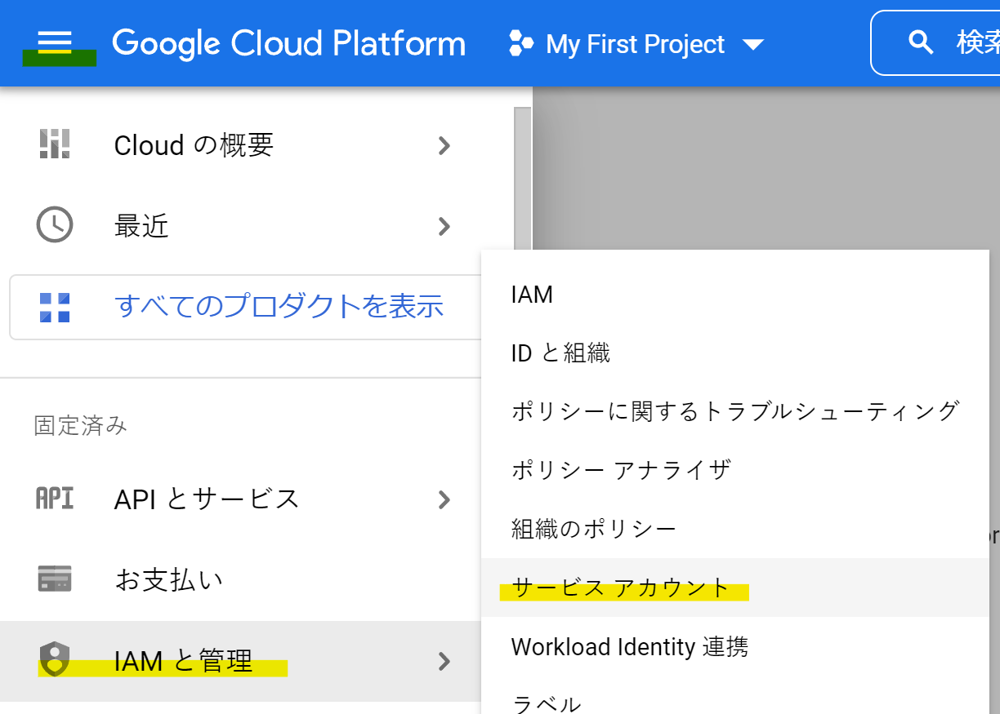
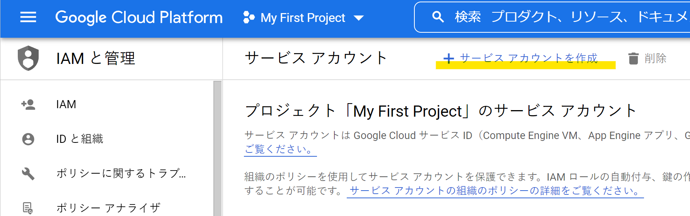
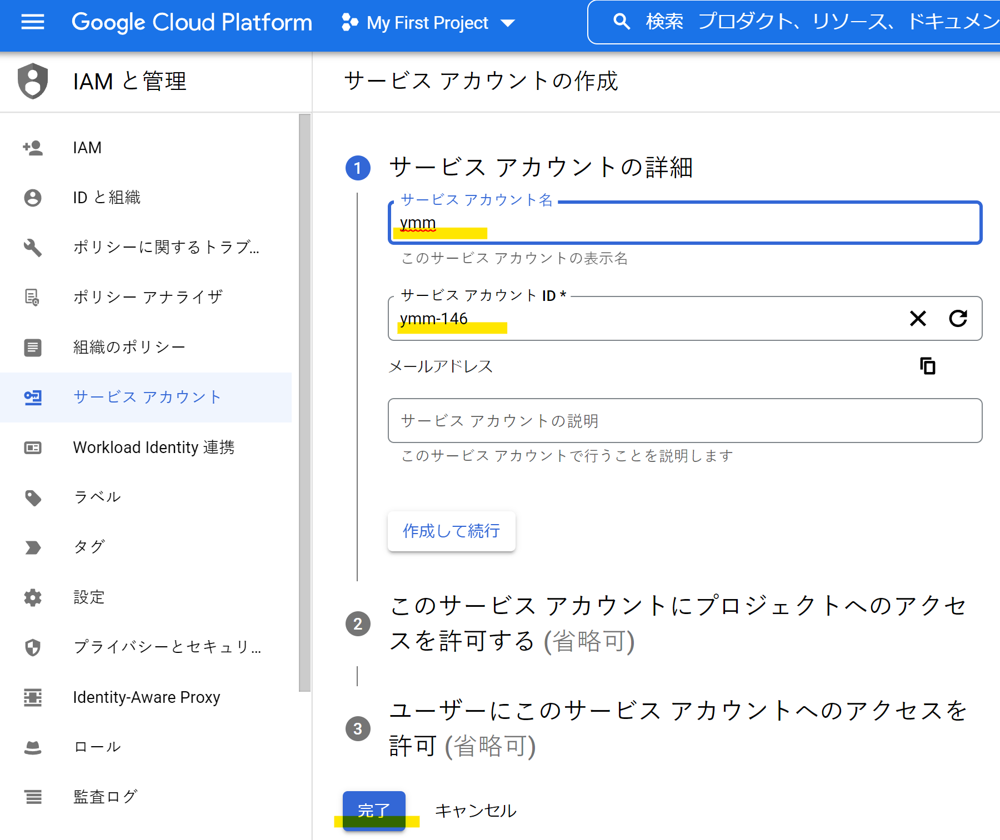
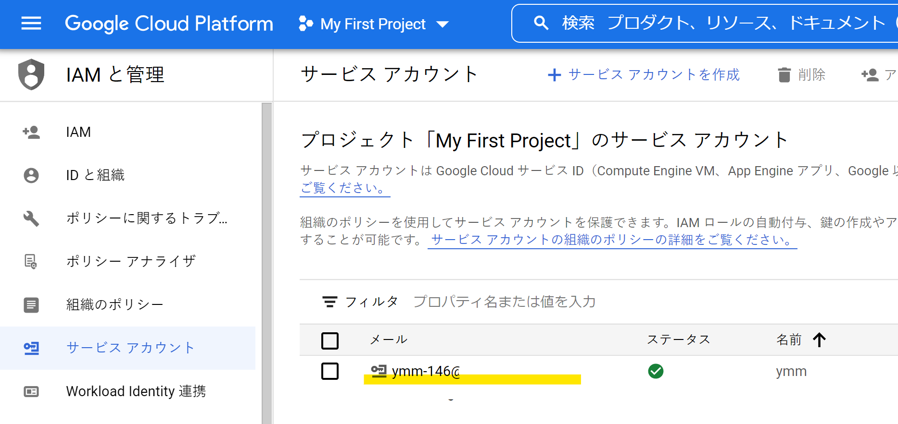
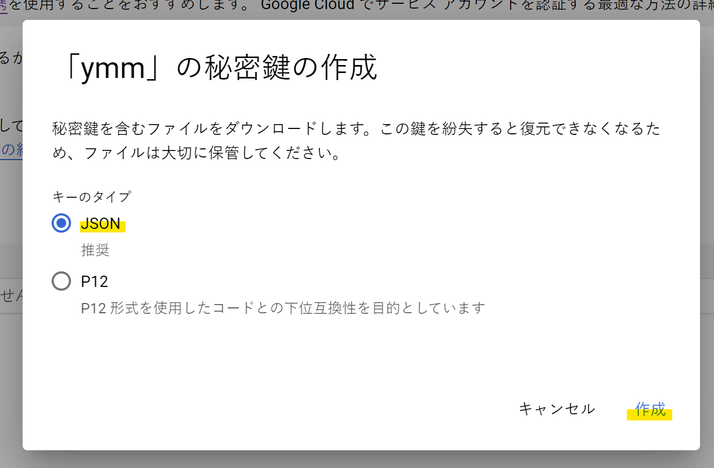
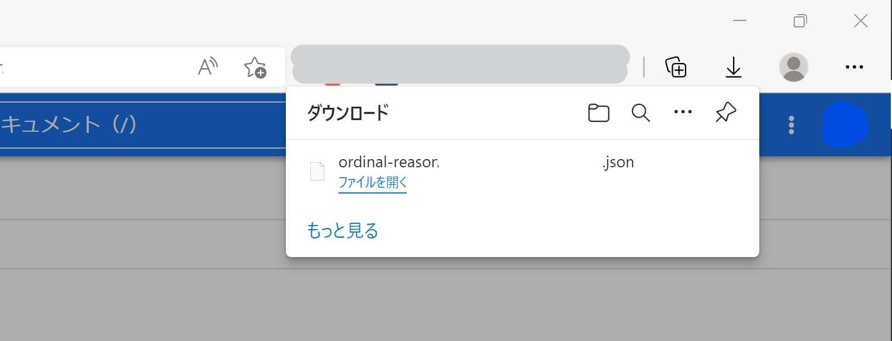
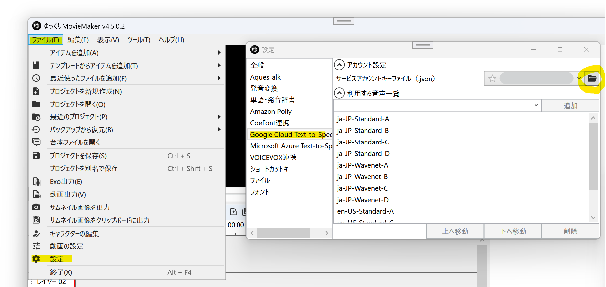
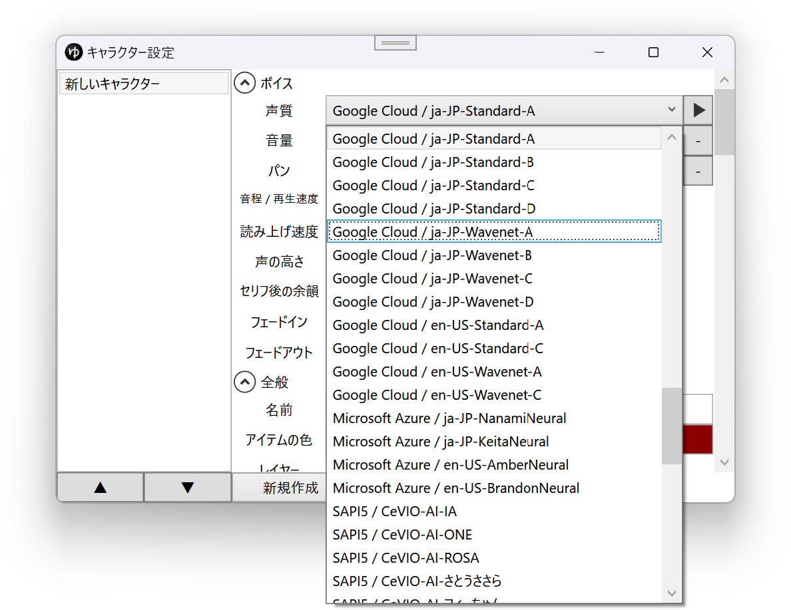

## Google Cloud Text-to-Speechとは
Googleの提供するクラウド音声合成サービスです。  
利用にはクレジットカードの登録が必要です。

- [Google Cloud Text-to-Speech](https://cloud.google.com/text-to-speech/)

## 利用方法
1. [Google Cloud](https://cloud.google.com/)アカウントを登録する
1. [Google Cloud Console](https://console.cloud.google.com/)にログインする
1. ページ上部の検索欄で*Cloud Text-to-Speech API*と検索し、ヒットした*Cloud Text-to-Speech API*をクリックする

1. 有効にするボタンをクリックする

1. *メニュー*→*IAMと管理*→*サービスアカウント*をクリックする

1. *サービスアカウントを作成*をクリックする

1. *サービスアカウント名*、*サービスアカウントID*に任意の名前をつけ、*完了*をクリックする

1. 作成したサービスアカウント名をクリックし、管理画面へ移動する

1. *キー*→*鍵を追加*→*新しい鍵を作成*をクリックする

1. *JSON*を選択し、*作成*をクリックする

1. 鍵を作成すると、JSONファイルが自動的にダウンロードされます。
  - このファイルは第三者と共有しないでください。

1. YMM4を起動する
1. *ファイル*→*設定*→*Google Cloud Text-to-Speech*→*サービスアカウントキーファイル*から、上で保存したjsonファイルを開く

1. 必要に応じて、利用する音声を追加します。[利用可能な音声一覧はこちら。](https://cloud.google.com/text-to-speech/docs/voices?hl=ja)
1. 設定が完了すると、キャラクター設定ウィンドウの声質欄にGoogle Cloud Text-to-Speechの音声が表示されます。
