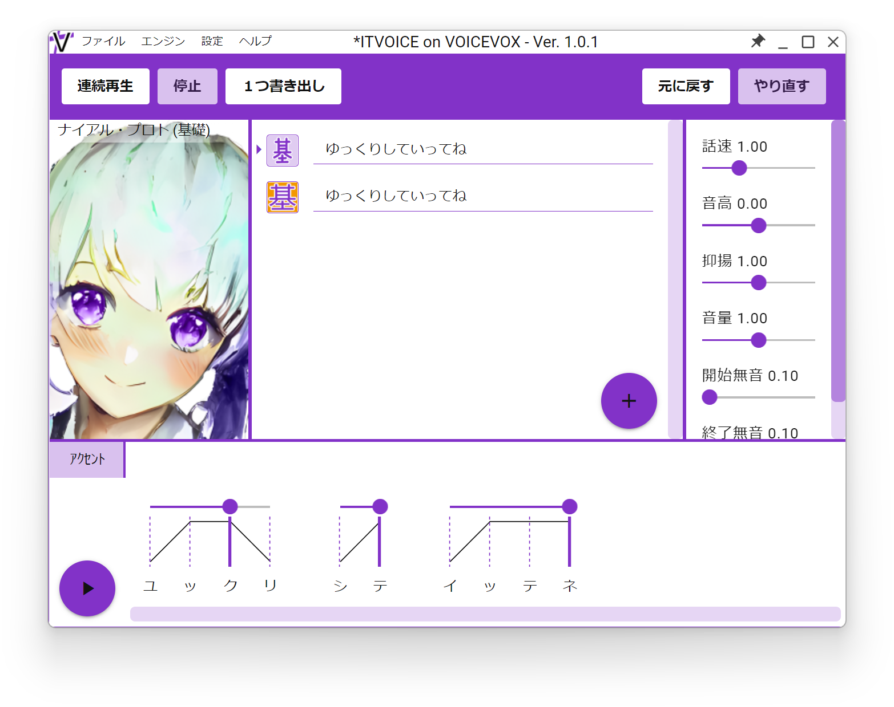
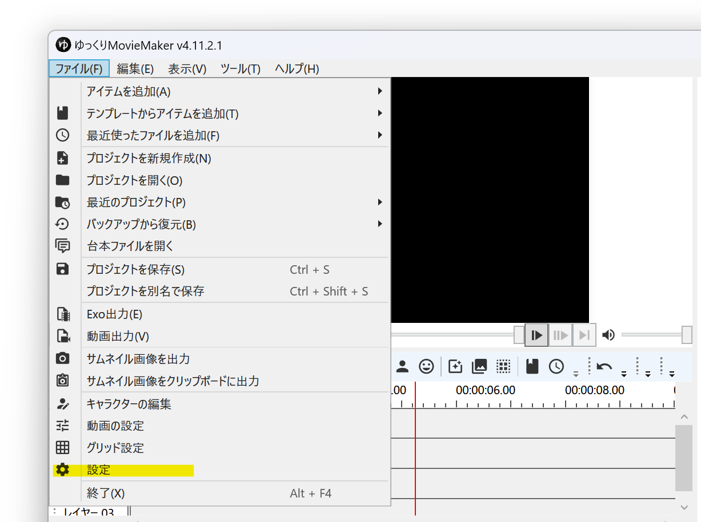
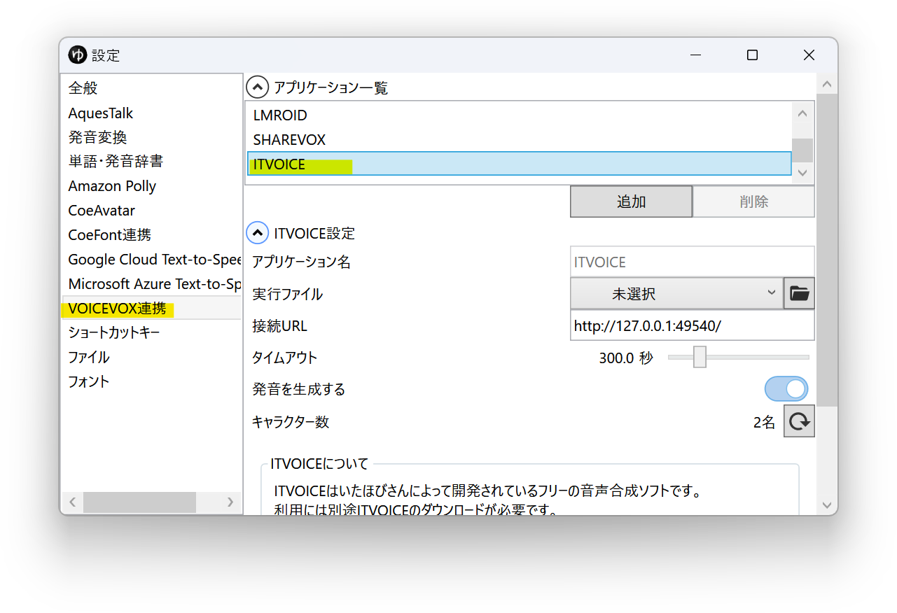
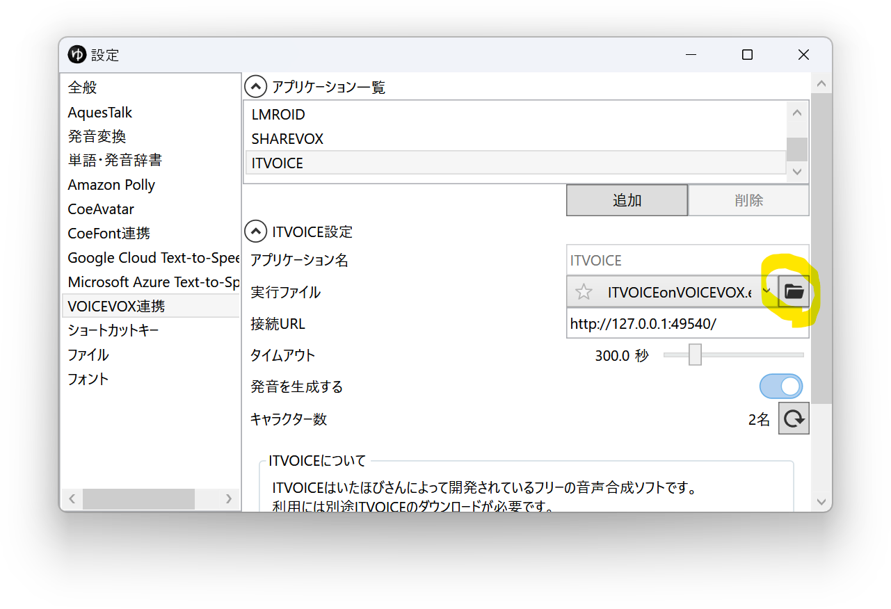
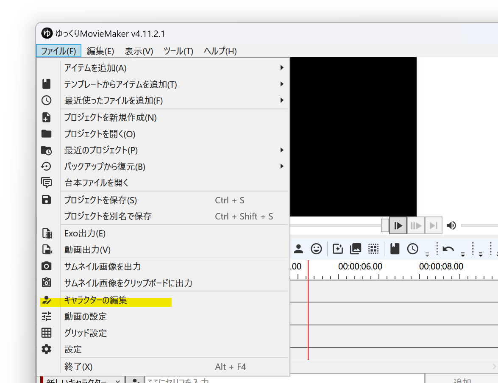
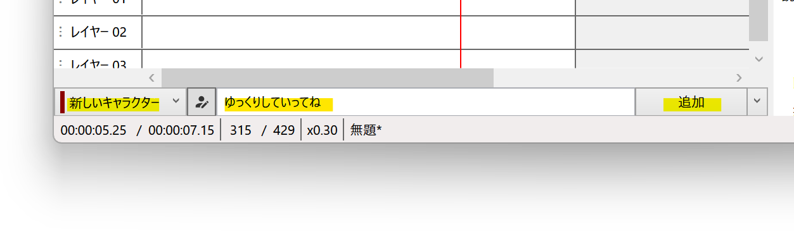

## ITVOICEとは

[ITVOICE](http://itvoice.starfree.jp/index.html)は[いたほび](https://twitter.com/iTahobi)さんが個人で開発されているフリーの音声合成ソフトです。  
VOICEVOX互換の外部連携APIを使用し、YMM4から直接音声を生成できます。  
※細かい利用規約は[ITVOICE公式サイト](http://itvoice.starfree.jp/index.html)をご確認ください。
- [ITVOICE](http://itvoice.starfree.jp/index.html)

## 利用方法
1. [ITVOICE](http://itvoice.starfree.jp/index.html)をインストールする
1. ゆっくりMovieMaker4を起動する
1. ITVOICEをYMM4に設定する  
   1. *ファイル(F)*→*設定*から設定ウィンドウを開く
   
   1. *VOICEVOX*→*アプリケーション一覧*から*ITVOICE*を選択する
   
   1. *実行ファイル*欄右側のフォルダボタンをクリックし、*1.*で保存したフォルダ内にある*ITVOICE.exe*を選択する  
   
1. *ファイル(F)*→*キャラクターの編集*からキャラクター編集ウィンドウを開く

1. *ボイス*→*声質*欄で、ITVOICEの音声を選択する

1. キャラクターを選択後、*ここに台詞を入力*欄にセリフを入力し、*追加*ボタンをクリックする

## 利用条件等
- [利用規約](http://itvoice.starfree.jp/terms.html)