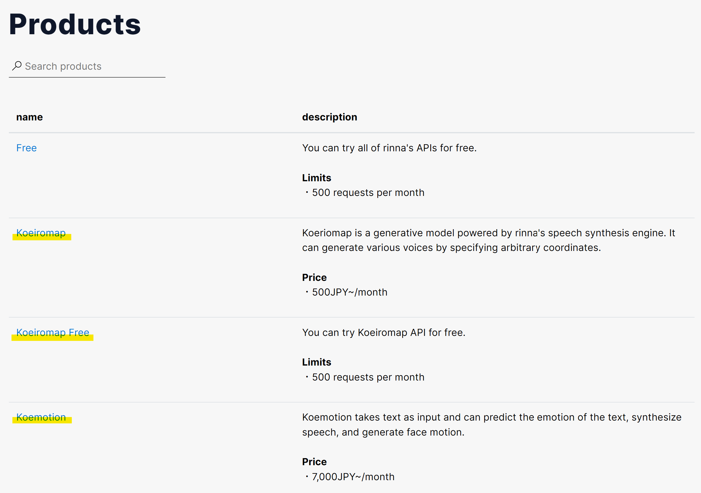
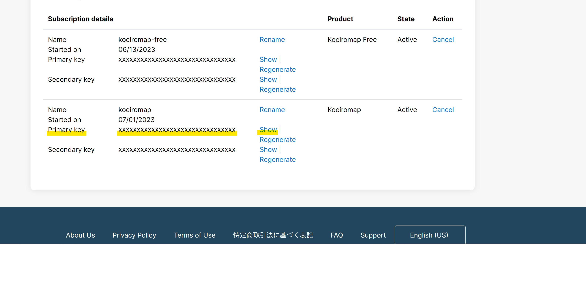
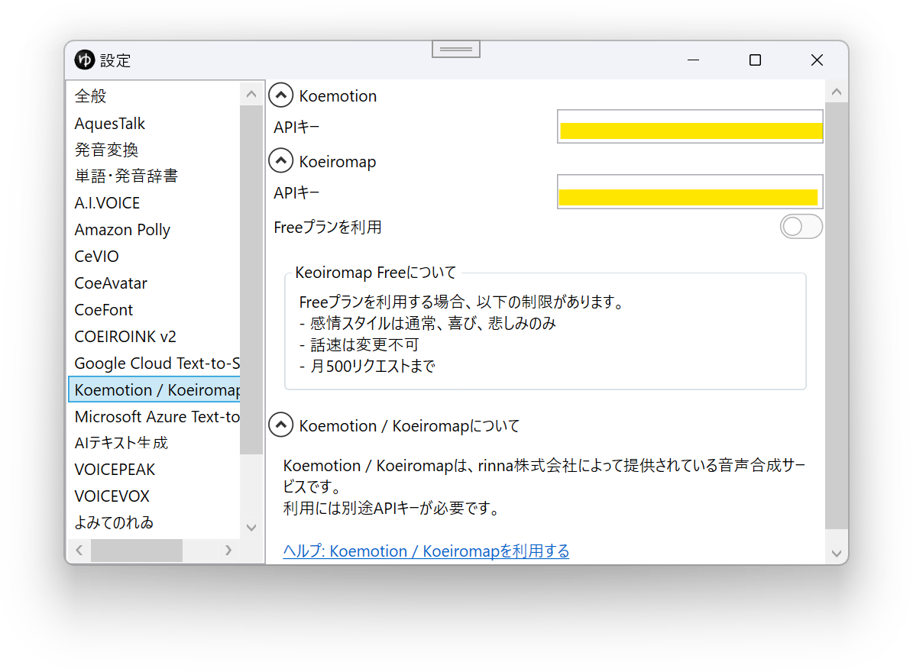
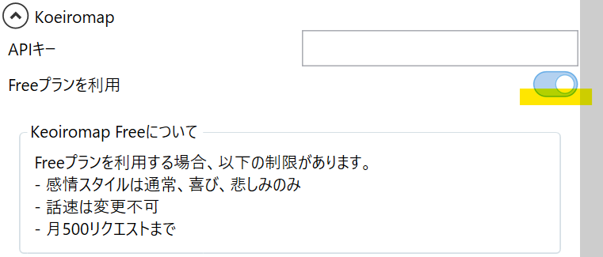

## Koemotion / Koeiromapとは

Koemotion / Koeiromapは、rinna株式会社が提供する音声合成サービスです。  
外部連携APIを使用し、YMM4から直接音声を生成できます。  
利用には別途APIキーの取得が必要です。  
- [Koemotion](https://koemotion.rinna.co.jp/)

## 利用方法
1. [rinna Developersに登録する](https://developers.rinna.co.jp/signin)
1. [API一覧ページ](https://developers.rinna.co.jp/products)へアクセスする
1. 利用したいAPIを選択する

1. `Buy now`ボタンをクリックし、支払い手続きを行う

1. [Profileページ](https://developers.rinna.co.jp/profile)へアクセスする
1. `Show`ボタンをクリックし、表示されたPrimary keyをコピーする

1. YMM4を起動する
1. `ファイル(F)`→`設定`→`Koemotion / Koeiromap`を開き、利用したいAPIの`APIキー`欄にPrimary keyを貼り付ける

1. KoeiromapのFreeプランを使用する場合、`Freeプランを利用`を有効化する

## 利用条件等
- [Koemotion（ページ下部に記載）](https://koemotion.rinna.co.jp/)