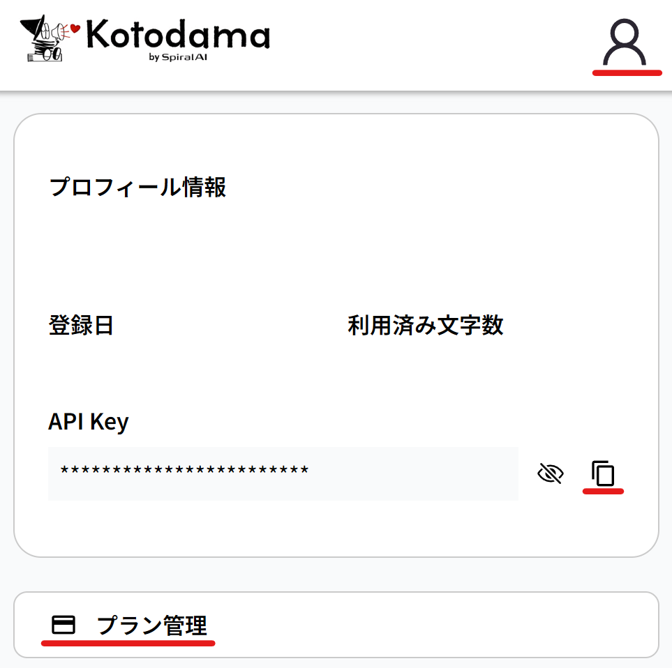
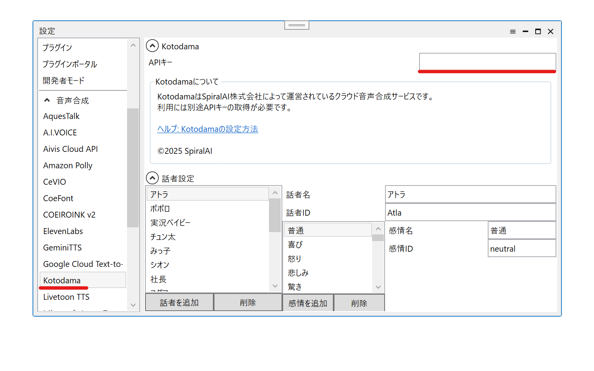
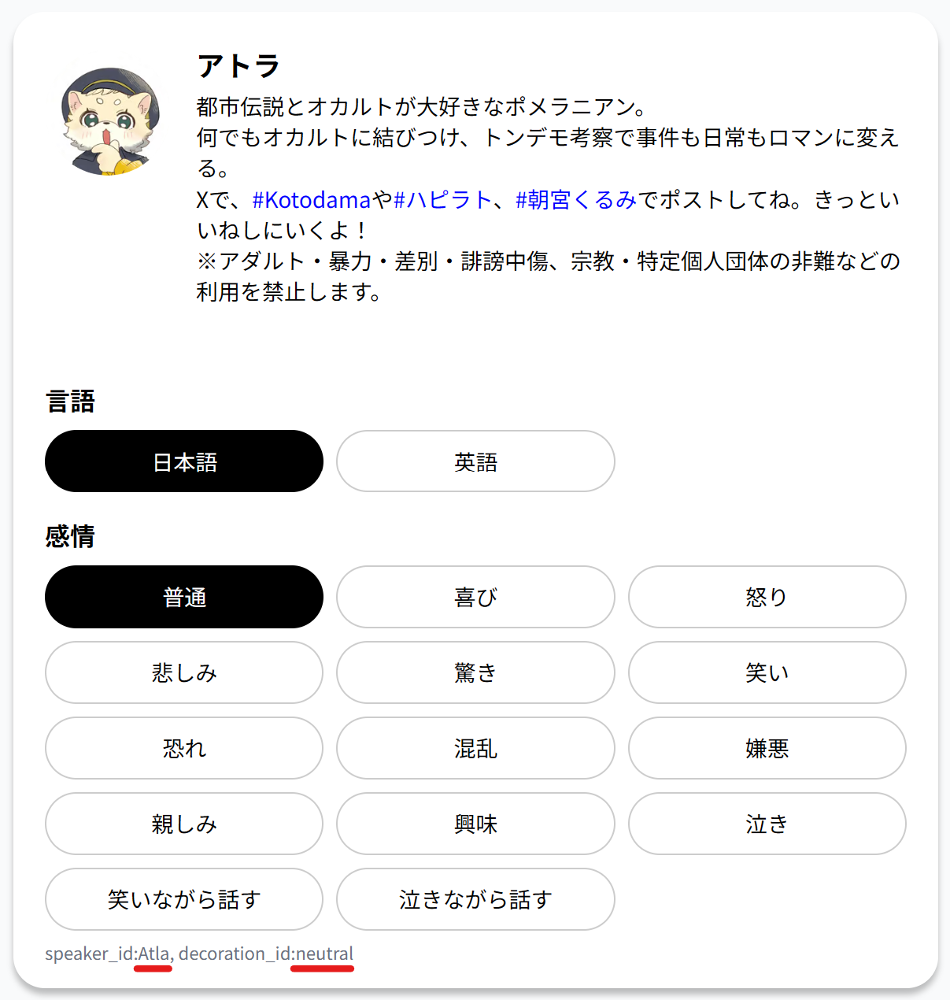

## Kotodamaとは

[Kotodama](https://lp.kotodama.go-spiral.ai/)はSpiralAI株式会社によって運営されているクラウド音声合成サービスです。  
外部連携APIを使用し、YMM4から直接音声を生成できます。  
- [Kotodama](https://lp.kotodama.go-spiral.ai/)

## 利用方法
1. [Kotodama](https://lp.kotodama.go-spiral.ai/)のアカウントを作成する
1. APIキーを取得する
   1. 右上のユーザーアイコンをクリックする
   1. *プラン管理*から、任意のプランを契約する
   1. *API Key*欄右側のコピーアイコンをクリックし、APIキーをコピーする
   
1. ゆっくりMovieMaker4を起動する
1. APIキーをYMM4に設定する  
   1. *ファイル(F)*→*設定*から設定ウィンドウを開く
   1. *音声合成*→*Kotodama*を選択する
   1. *APIキー*欄に、*2-3.*でコピーしたAPIキーを貼り付ける
   
1. *ファイル(F)*→*キャラクターの編集*からキャラクター編集ウィンドウを開く
1. *ボイス*→*声質*欄で、Kotodamaの音声を選択する
1. キャラクターを選択後、*ここに台詞を入力*欄にセリフを入力し、*追加*ボタンをクリックする

## 話者の追加方法
1. [Kotodama](https://lp.kotodama.go-spiral.ai/)にログインする
1. 使用したい話者を選択する
1. 話者詳細欄最下部の*speaker_id*と*decoration_id*をメモする
   - *言語*や*感情*ボタンをクリックすると、他の感情の*decoration_id*も確認できます。
   
1. ゆっくりMovieMaker4を起動する
1. *ファイル(F)*→*設定*から設定ウィンドウを開く
1. *音声合成*→*Kotodama*を選択する
1. 話者を追加する
   1. *話者を追加*ボタンをクリックする
   1. *話者名*欄に、任意の名前を入力する
   1. *話者ID*欄に、*3.*でメモした*speaker_id*を入力する
1. 感情を追加する
   1. *感情を追加*ボタンをクリックする
   1. *感情名*欄に、任意の名前を入力する
   1. *感情ID*欄に、*3.*でメモした*decoration_id*を入力する
   1. 他の感情も同様にして追加する

## 関連リンク
- [Kotodama](https://lp.kotodama.go-spiral.ai/)
- [利用規約](https://spiralai.notion.site/Kotodama-28e7fe6ac35380b7ad84ded491533c37)