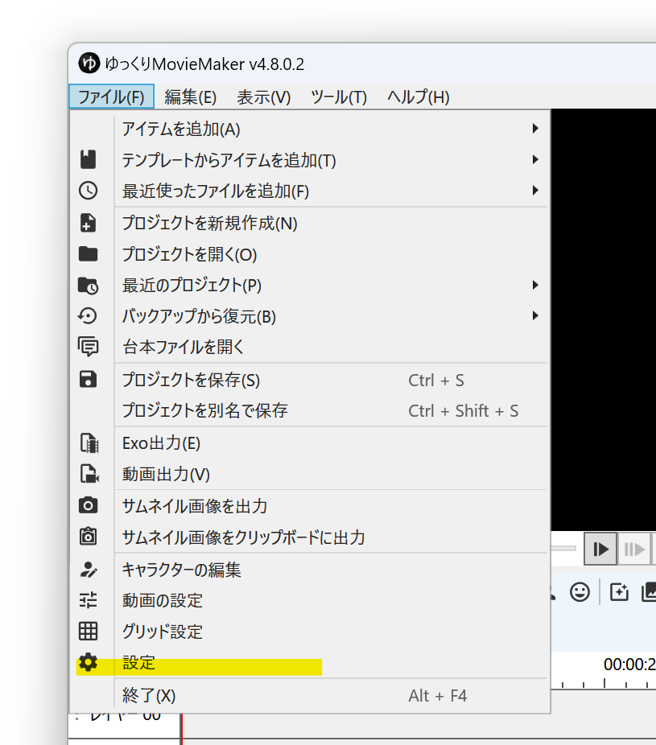
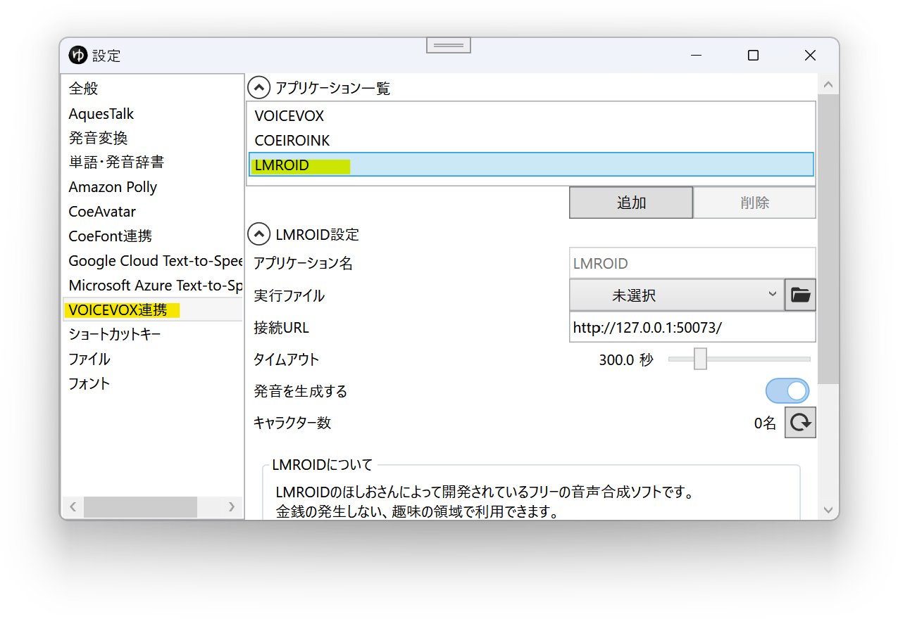
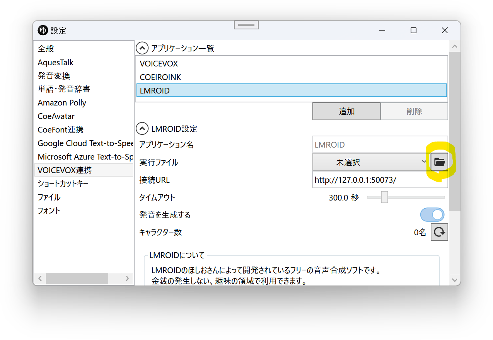
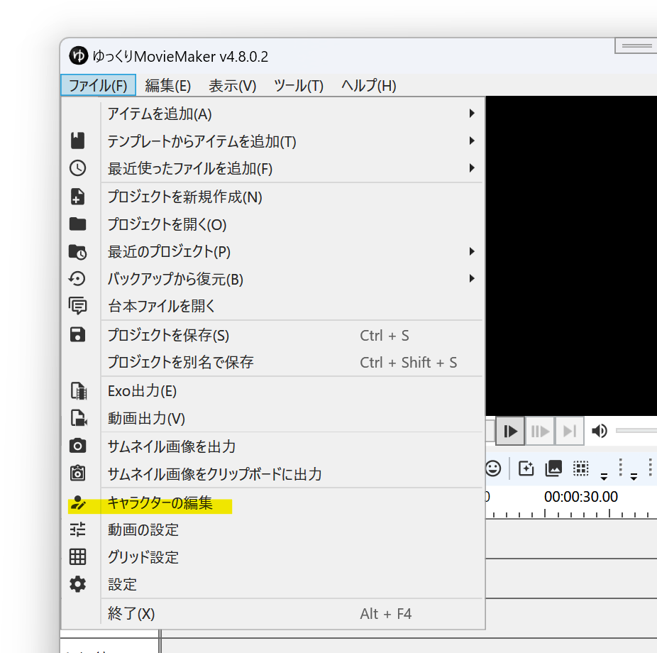
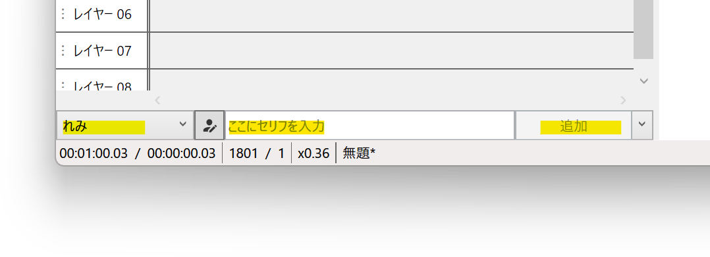

> **Warning**
> 現在、LMROIDの配布およびサポートは終了しており、新規インストールすることは出来ません。  
> 詳細は以下のリンクをご確認ください。  
> [LMROID 配布・サポート終了のお知らせ - nohoshio💫 / X.com](https://x.com/ssohsn/status/1995145807671222546)

## LMROIDとは

LMROIDは[のほしお](https://twitter.com/ssohsn)さんが個人で開発されている、金銭の発生しない趣味の領域で利用可能なフリーの音声合成ソフトです。  
VOICEVOX互換の外部連携APIを使用し、YMM4から直接音声を生成できます。  
※細かい利用規約はLMROIDアプリ内のヘルプをご確認ください。
- 旧配布ページ（リンク切れ）
  - lmroidsoftware.wixsite.com/nhoshio

## 利用方法
1. LMROIDをダウンロードし、任意のフォルダに展開する
1. ゆっくりMovieMaker4を起動する
1. *ファイル(F)*→*設定*から設定ウィンドウを開く

1. *VOICEVOX*→*アプリケーション一覧*から*LMROID*を選択する

1. *実行ファイル*欄右側のフォルダボタンをクリックし、*1.*で保存したフォルダ内にある*LMROID.exe*を選択する

1. *ファイル(F)*→*キャラクターの編集*からキャラクター編集ウィンドウを開く

1. *ボイス*→*声質*欄で、LMROIDの音声を選択する
1. キャラクターを選択後、*ここに台詞を入力*欄にセリフを入力し、*追加*ボタンをクリックする

## 声質一覧を再読み込みする
新しくキャラクターをインストールした場合、YMM4の声質一覧にキャラクターが表示されない場合があります。  
声質一覧を更新するとキャラクターが一覧に表示されるようになります。
1. キャラクター編集ウィンドウを開く
1. 声質一覧右側の更新ボタンをクリックする
1. *VOICEVOXの声質を再読み込み*をクリックする

