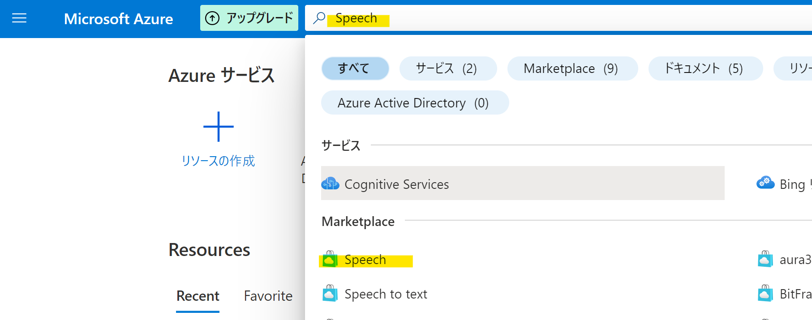
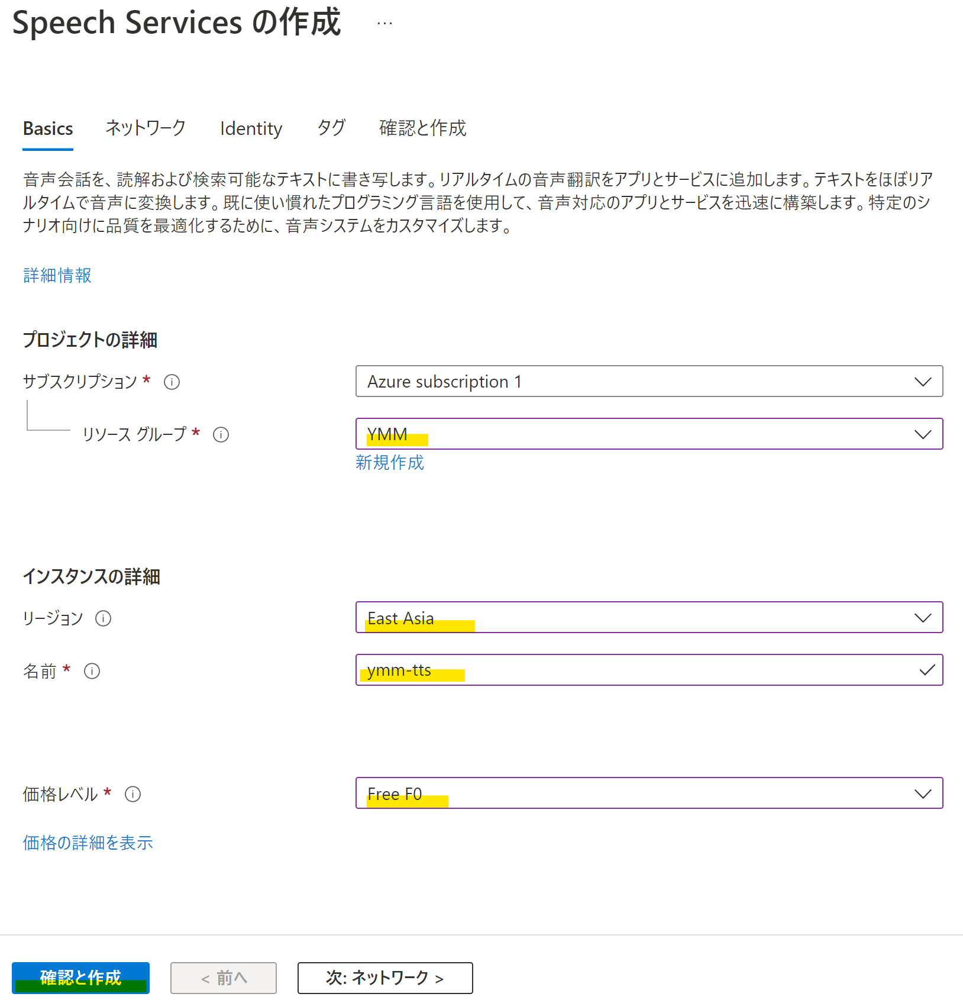
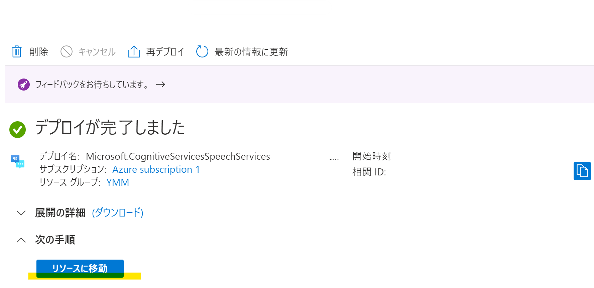
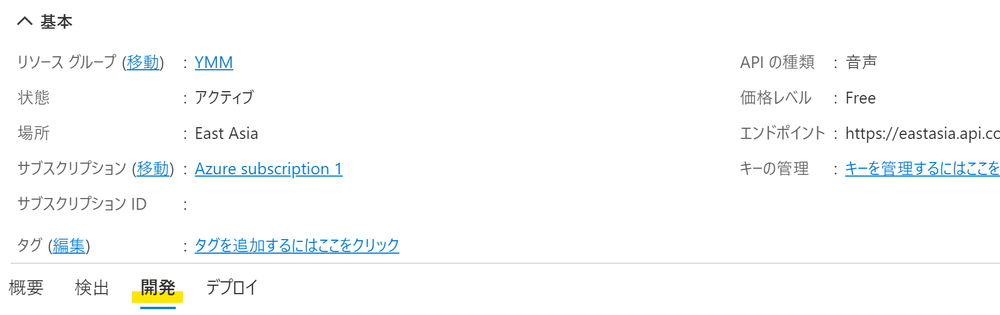
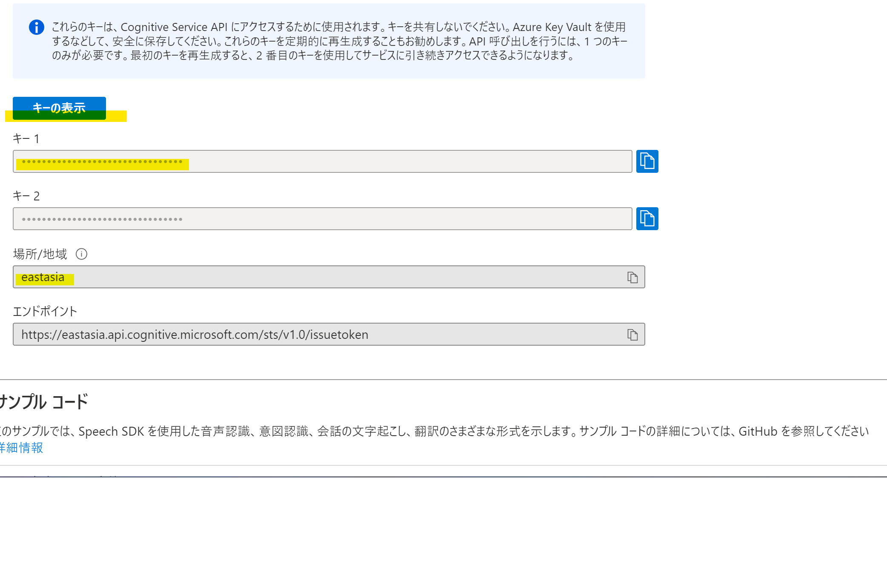
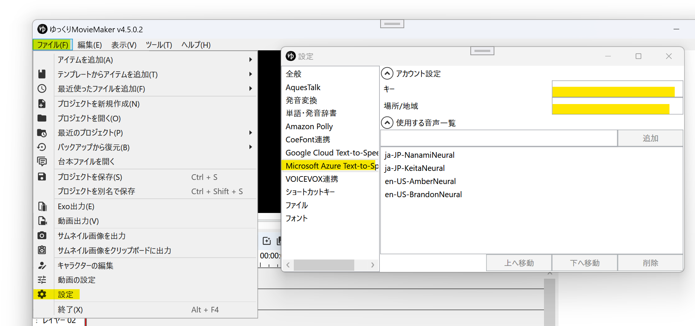
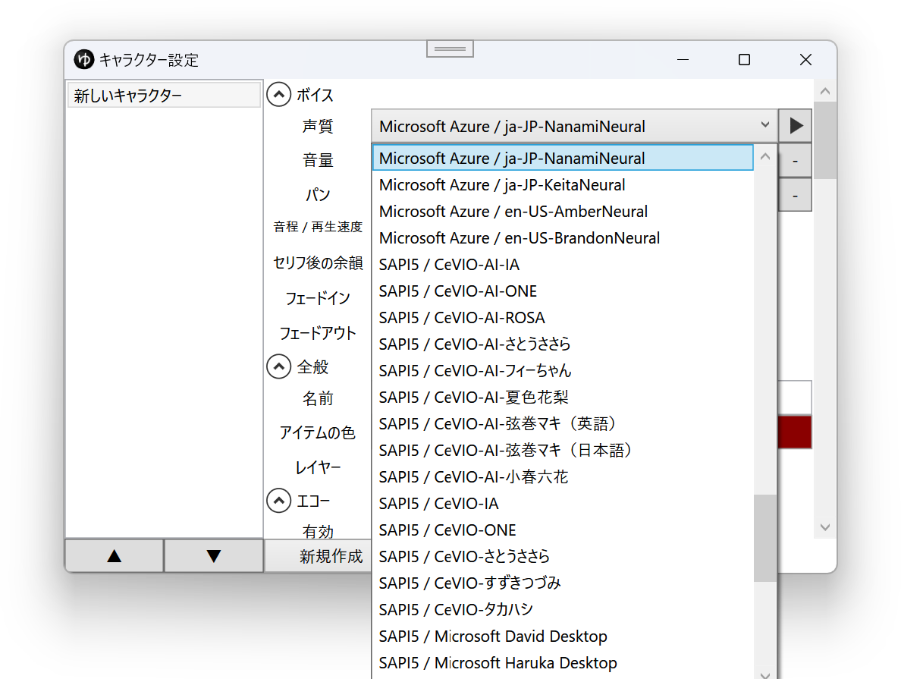

## Microsoft Azure Text-to-Speechとは
Microsoftの提供するクラウド音声合成サービスです。  
利用にはクレジットカードの登録が必要です。

- [Azure Text-to-Speech](https://azure.microsoft.com/ja-jp/services/cognitive-services/text-to-speech/)

## 利用方法
1. [Azure](https://azure.microsoft.com/ja-jp/)に登録する
1. Azure Portalにログインする
1. ページ上部の検索欄に*Speech*と入力し、検索結果の*Speech*をクリックする

1. *サブスクリプション*、*リソースグループ*、*リージョン*、*名前*、*価格レベル*を設定し、*確認と作成*をクリックする

1. *作成*をクリックする
1. デプロイが完了したら、*リソースに移動*をクリックする

1. *開発*をクリックする

1. *キーの表示*をクリックし、*キー1*と*場所/地域*をメモ帳に控えておく。
   - キー2は利用しません
   - このキーは第三者と共有しないでください

1. YMM4を起動する
1. *ファイル(F)*→*設定*→*Microsoft Azure Text-to-Speech*をクリックし、*キー*と*場所/地域*を設定する

1. 必要に応じて、利用する音声を追加します。[利用できる音声一覧はこちら。](https://docs.microsoft.com/ja-jp/azure/cognitive-services/speech-service/language-support?tabs=speechtotext#prebuilt-neural-voices)
1. 設定が完了すると、キャラクター設定ウィンドウの声質欄に音声が表示されます。
