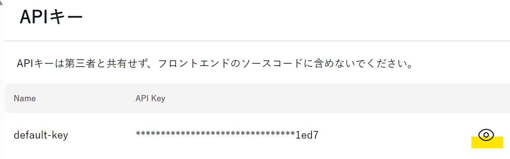
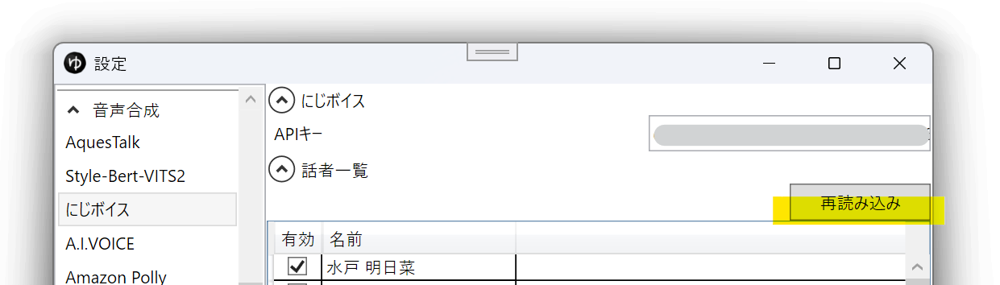

## にじボイスとは

[にじボイス](https://nijivoice.com/)は株式会社Algomaticによって開発されている音声合成サービスです。  
外部連携APIを使用し、YMM4から直接音声を生成できます。  
利用には別途アカウントの作成とクレジットの購入が必要です。（初回5000文字無料）  
- [にじボイス](https://nijivoice.com/)

## 利用方法
1. [にじボイス](https://nijivoice.com/)のアカウントを作成する
1. [APIキー](https://platform.nijivoice.com/api-keys)を取得する（目玉アイコンをクリックして表示）

1. *ファイル(F)*→*設定*→*にじボイス*を開く
1. *APIキー*欄に取得したAPIキーを入力する
1. *再読み込み*ボタンをクリックし、にじボイスの音声一覧を取得する

1. *ファイル(F)*→*キャラクターの編集*からキャラクター編集ウィンドウを開く
1. *ボイス*→*声質*欄で、にじボイスの音声を選択する
1. キャラクターを選択後、*ここに台詞を入力*欄にセリフを入力し、*追加*ボタンをクリックする

## クレジットの購入
音声の生成にはクレジットの購入が必要です（初回5000文字無料）
1. [にじボイスAPI](https://platform.nijivoice.com/)にログインする
1. *クレジットを追加購入*ボタンからクレジットを購入する

## 声質一覧を再読み込みする
声質一覧を更新するとキャラクターが一覧に表示されるようになります。
1. キャラクター編集ウィンドウを開く
1. 声質一覧右側の更新ボタンをクリックする
1. *にじボイスの声質を再読み込み*をクリックする

## 権利者表記について
コンテンツ内、もしくは、コンテンツ概要欄のいずれかに「にじボイス」または「NIJI Voice」が含まれるクレジットを記載してください。  
SNSの場合はコンテンツが含まれるツイートのリプ欄にクレジットを表記しても問題ありません。  
音声作品で概要欄がない場合は、クレジットの読み上げが必要となります。  
【クレジット表記例】「使用サービス: にじボイス」「Voiced by NIJI Voice」  
- [にじボイスAPI ご利用ガイド](https://docs.nijivoice.com/docs/getting-started)

## 関連リンク
- [にじボイス](https://aivis-project.com/)
- [にじボイス 利用規約](https://nijivoice.com/terms)
- [にじボイスAPI](https://platform.nijivoice.com/)
- [にじボイスAPI ご利用ガイド](https://docs.nijivoice.com/docs/getting-started)