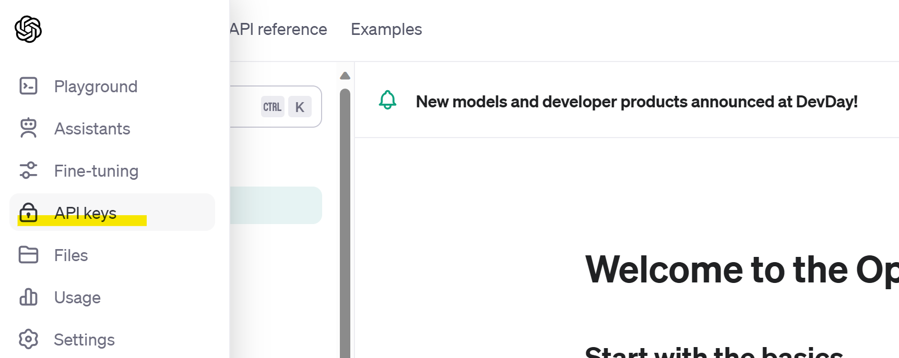
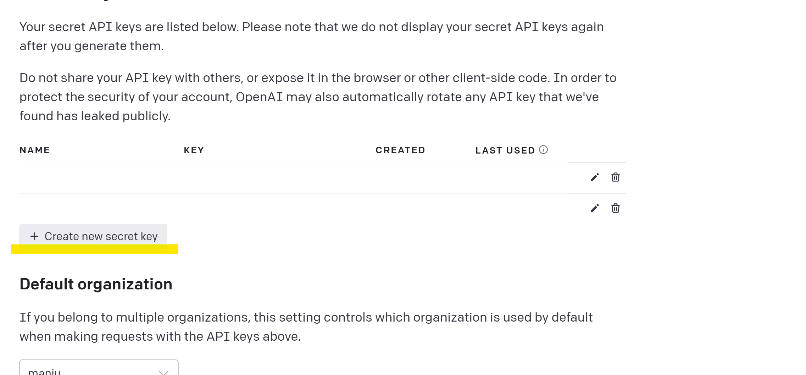
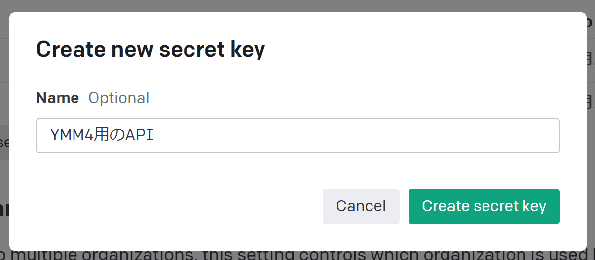
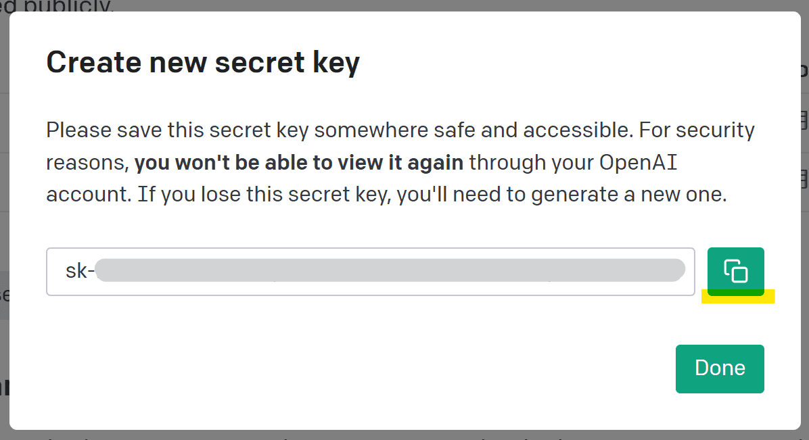
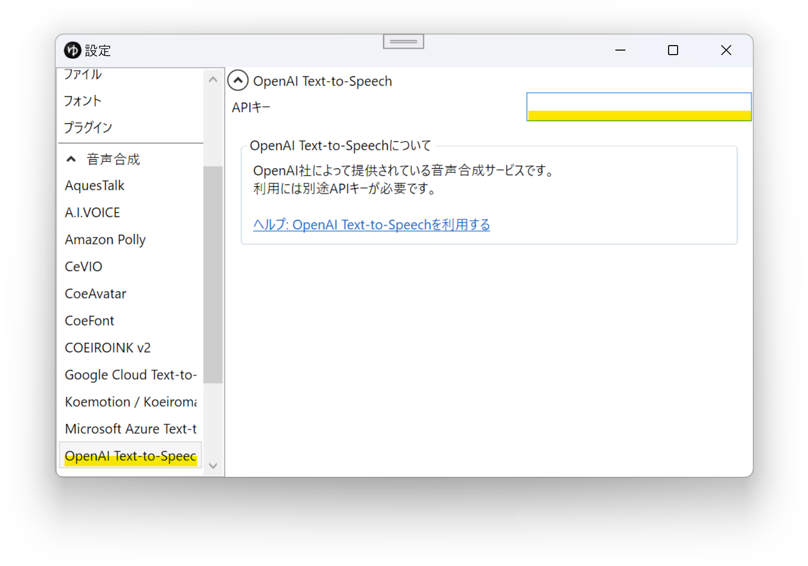
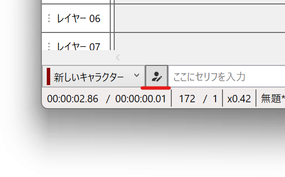
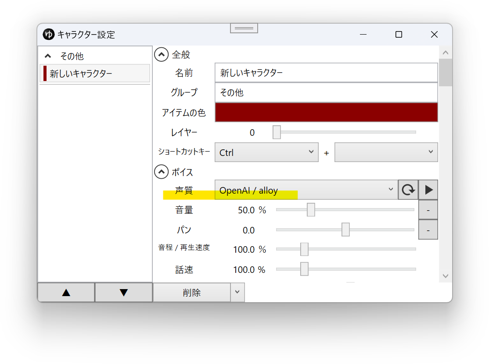

## OpenAI Text-to-Speechとは
OpenAI TTSは、OpenAI社が提供する音声合成サービスです。  
外部連携APIを使用し、YMM4から直接音声を生成できます。  
利用には別途APIキーの取得が必要です。  
- [OpenAIダッシュボード](https://platform.openai.com/)

## 利用方法
1. [OpenAIダッシュボード](https://platform.openai.com/)を開き、APIキーを取得する
   1. OpenAIのアカウントを作成する
   1. [API Keys](https://platform.openai.com/api-keys)をクリックする
   
   1. `Create new secret key`をクリックする
   
   1. 任意の名前を入力し、`Create secret key`をクリックする
   
   1. API Keyをコピーする
   
1. ゆっくりMovieMakerを起動し、`ファイル(F)`→`設定`→`音声合成`→`OpenAI Text-to-Speech`を開く
1. `APIキー`に、取得したAPIキーを設定する

1. タイムライン左下のボタンをクリックし、キャラクター設定ウィンドウを開く

1. `声質`からOpenAIのキャラクターを選択する

## 利用条件等
- [Usage policies](https://openai.com/policies/usage-policies)