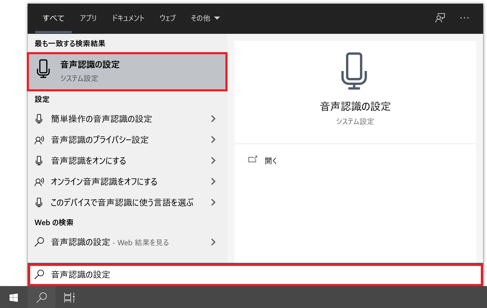
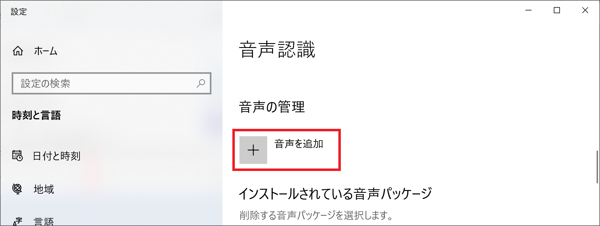
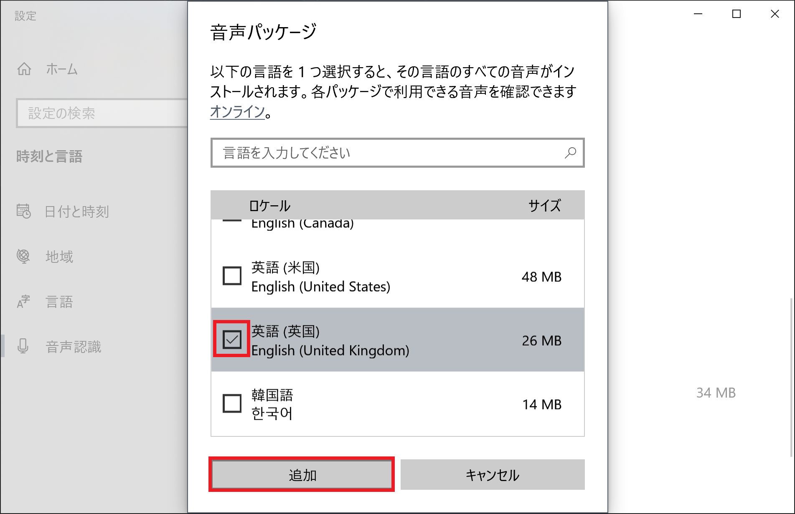
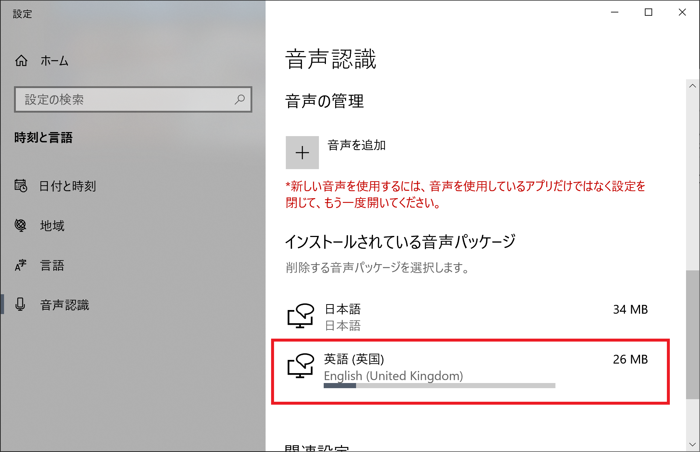

## SAPI5対応の音声合成エンジンをインストールする
SAPI5対応の音声合成エンジンをインストールすることで、YMM4の声質を追加可能です。

- [唄詠](http://shinta.coresv.com/software/utayomi_jpn/)
- Windowsが提供するSAPI5対応の音声をインストールする

## Windowsが提供するSAPI5対応の音声をインストールする

1. タスクバーの検索欄に*音声認識の設定*と入力する

1. ヒットした*音声認識の設定*アプリを起動する
1. *音声の管理*→*音声を追加*ボタンをクリックする

1. インストールしたい声質にチェックを入れ、*OK*ボタンをクリックする

1. インストールされている音声欄のゲージが貯まるまで待機する

1. YMM4を起動している場合は再起動する