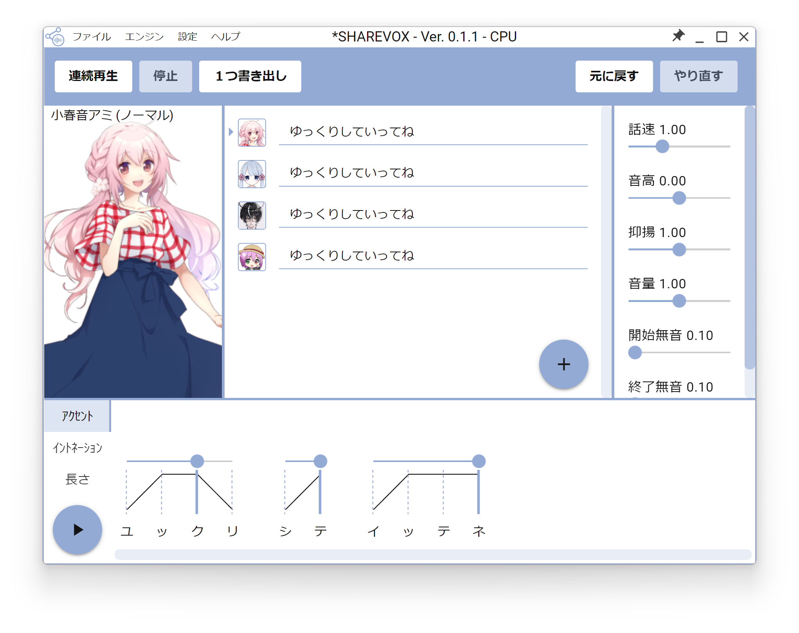
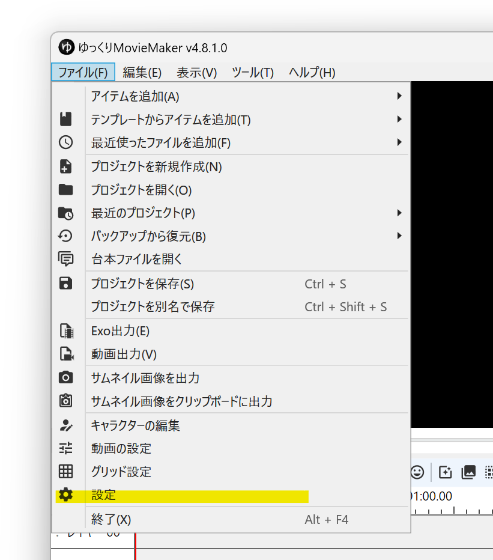
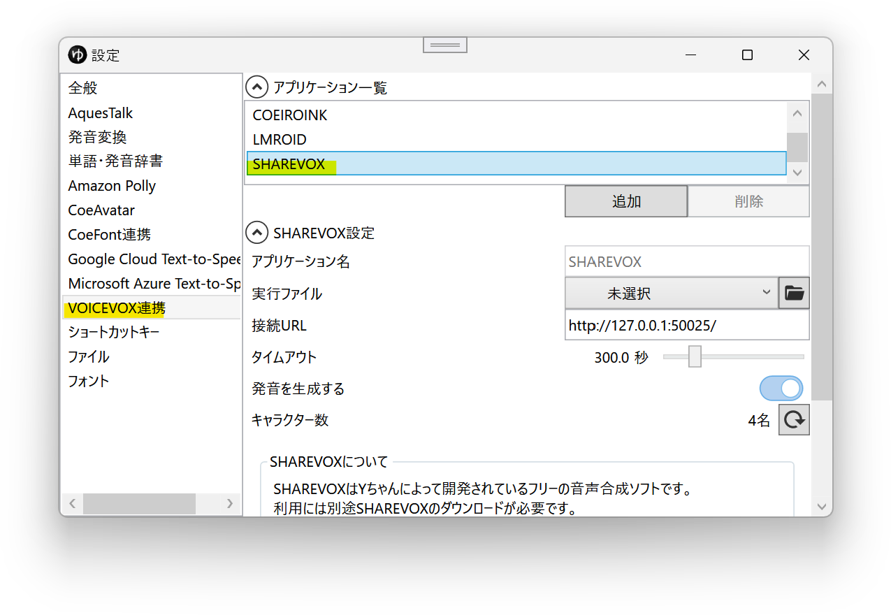
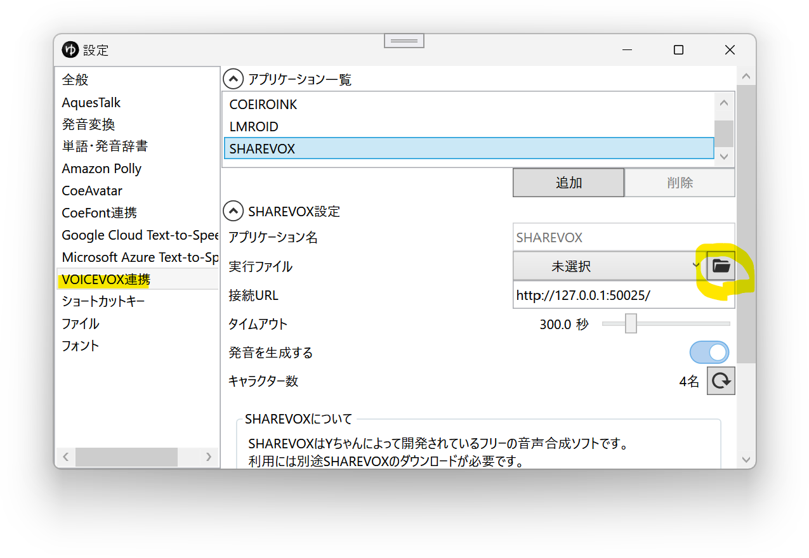
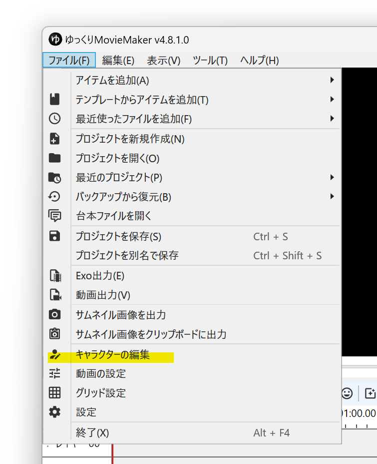
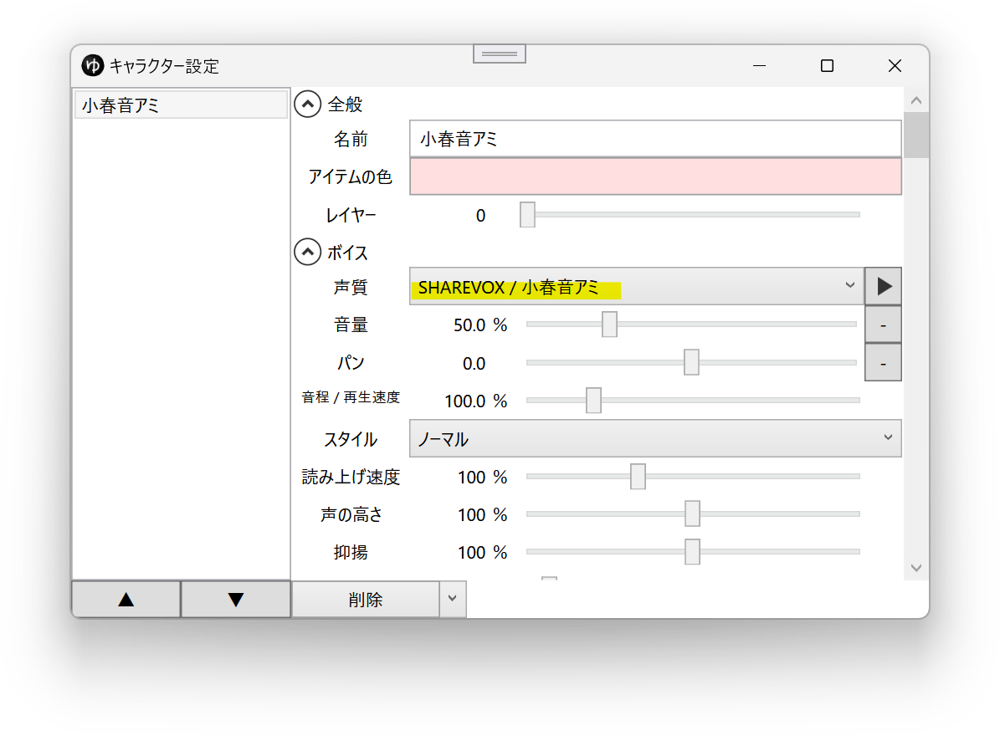
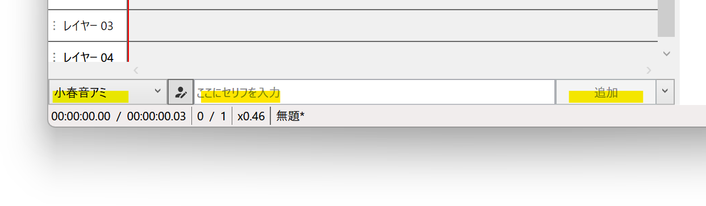

## SHAREVOXとは

[SHAREVOX](https://www.sharevox.app/)は[Yちゃん](https://twitter.com/y_chan_dev)が個人で開発されているフリーの音声合成ソフトです。  
VOICEVOX互換の外部連携APIを使用し、YMM4から直接音声を生成できます。  
※細かい利用規約は[SHAREVOX公式サイト](https://www.sharevox.app/)をご確認ください。
- [SHAREVOX](https://www.sharevox.app/)

## 利用方法
1. [SHAREVOX](https://www.sharevox.app/)をインストールする
1. ゆっくりMovieMaker4を起動する
1. SHAREVOXをYMM4に設定する  
※ インストーラーでデフォルトの位置にインストールいた場合は設定不要
   1. *ファイル(F)*→*設定*から設定ウィンドウを開く
   
   1. *VOICEVOX連携*→*アプリケーション一覧*から*SHAREVOX*を選択する
   
   1. *実行ファイル*欄右側のフォルダボタンをクリックし、*1.*で保存したフォルダ内にある*SHAREVOX.exe*を選択する  
   
1. *ファイル(F)*→*キャラクターの編集*からキャラクター編集ウィンドウを開く

1. *ボイス*→*声質*欄で、SHAREVOXの音声を選択する

1. キャラクターを選択後、*ここに台詞を入力*欄にセリフを入力し、*追加*ボタンをクリックする

## 利用条件等
- [共通利用規約](https://www.sharevox.app/terms)
- [音声ライブラリ利用規約](https://www.sharevox.app/characters)