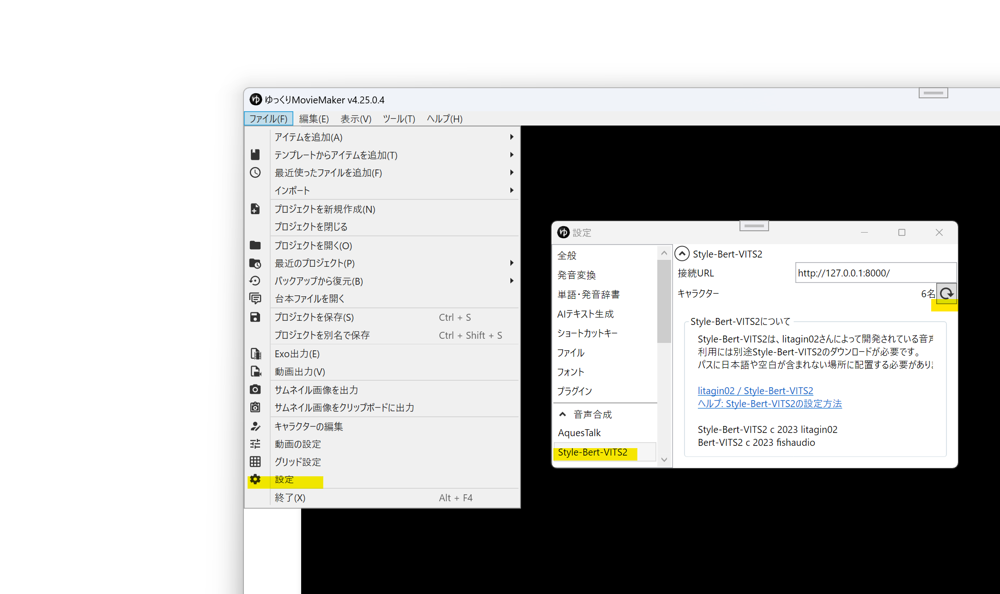
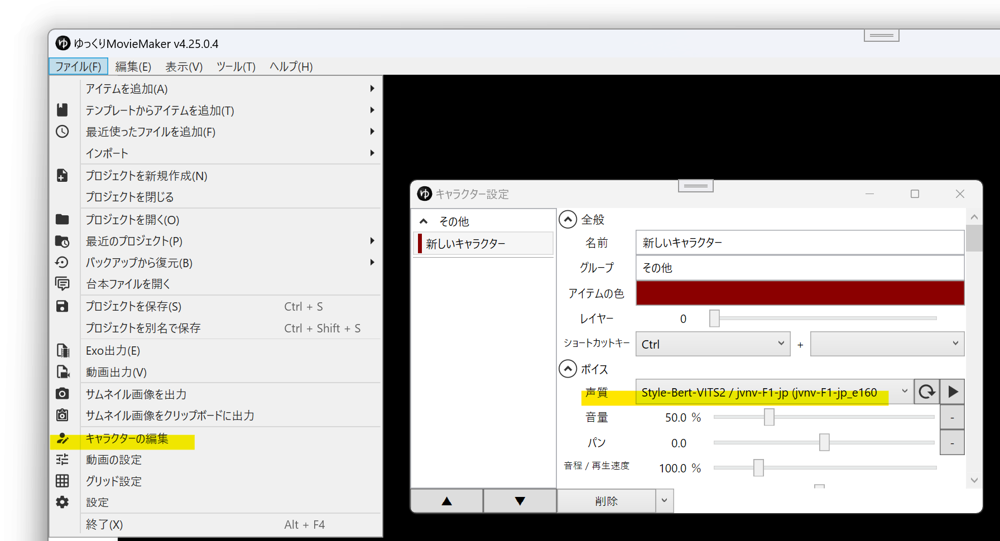
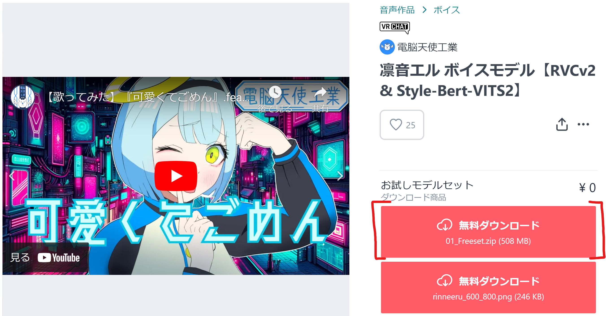

## Style-Bert-VITS2とは
Style-Bert-VITS2は、[litagin02](https://github.com/litagin02)さんが開発している音声合成ソフトです。  
外部連携APIを使用し、YMM4から直接音声を生成できます。  
- [litagin02/Style-Bert-VITS2](https://github.com/litagin02/Style-Bert-VITS2)

## 利用方法
1. [インストール方法](https://github.com/litagin02/Style-Bert-VITS2?tab=readme-ov-file#%E3%82%A4%E3%83%B3%E3%82%B9%E3%83%88%E3%83%BC%E3%83%AB)の指示に従ってStyle-Bert-VITS2をインストールする
1. インストールが完了すると、自動的にStyle-Bert-VITS2が起動します。次回以降は*Editor.bat*を実行して起動してください。
1. ゆっくりMovieMaker4を起動する
1. *ファイル(F)*→*設定*→*Style-Bert-VITS2*を開く
1. *接続URL*を設定し、キャラクター欄の更新ボタンをクリックする

1. *ファイル(F)*→*キャラクターの編集*を開く
1. *ボイス*→*声質*からStyle-Bert-VITS2の音声を選択する

## ユーザーモデルを追加する

> **Note**
> ファインチューニングに用いたデータセットの話者による許諾のないファインチューニングモデルまたはそのマージモデルは使用できません。

電脳天使工業さんが配布している[凛音エル ボイスモデル](https://booth.pm/ja/items/5475738)を例に解説します。

1. Style-Bert-VITS2を起動中の場合は終了させる
1. Style-Bert-VITS2のユーザーモデルをダウンロードし、任意の場所に展開（解凍）する

1. *01_Freeset\RinneElu_TTSfree*フォルダ内のファイル*config.json*、*RinneElu_s05000.safetensors*、*style_vectors.npy*を*Style-Bert-VITS2\Style-Bert-VITS2\model_assets\RinneElu*フォルダにコピーする
1. *Editor.bat*を実行し、Style-Bert-VITS2を起動する
1. ゆっくりMovieMaker4を起動する
1. *ファイル(F)*→*設定*→*Style-Bert-VITS2*を開き、キャラクター一覧の更新ボタンをクリックする
